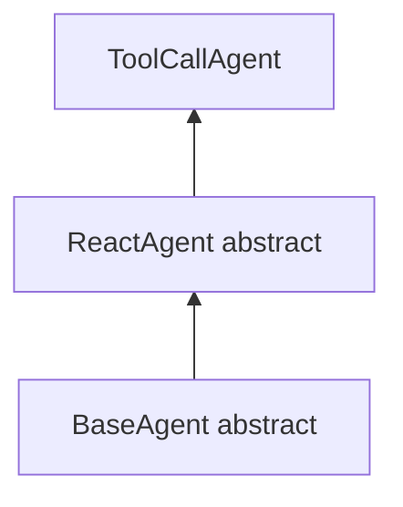
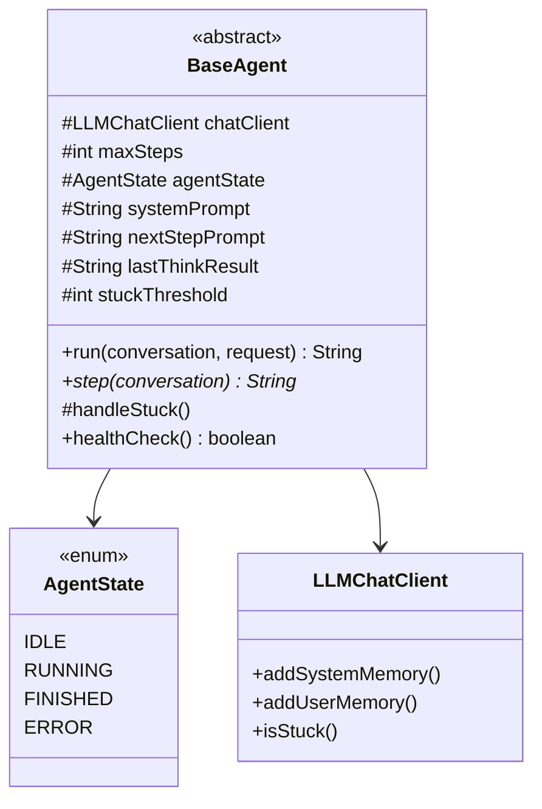
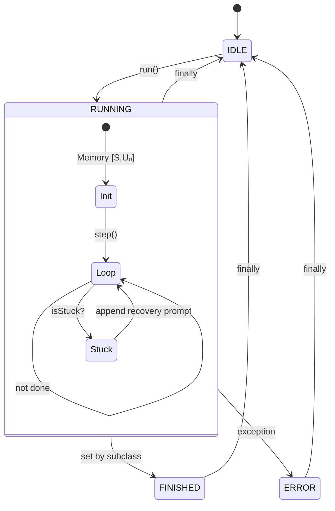
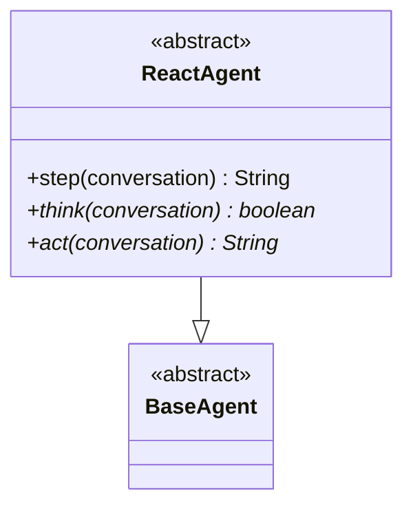
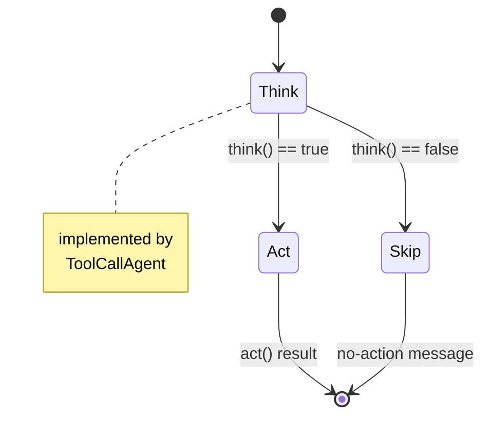
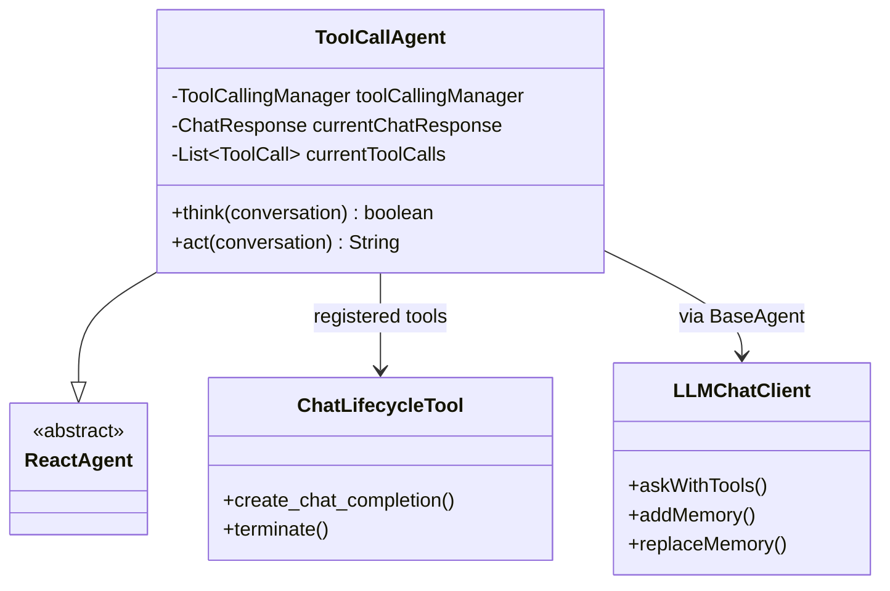
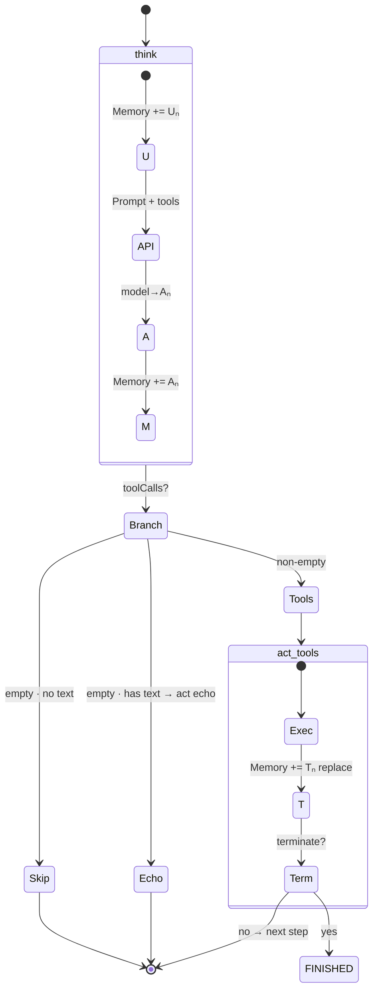

# Agent Architecture and Flow

> [中文](AGENT-FLOW.md) · Shell module: [shell/docs/SHELL.en.md](../../shell/docs/SHELL.en.md) · FAQ: [docs/FAQ.en.md](../../docs/FAQ.en.md) · `S` `U` `A` `T`

Inheritance: `BaseAgent` ← `ReactAgent` ← `ToolCallAgent` (created and run via [shell/docs/SHELL.en.md](../../shell/docs/SHELL.en.md) `ToolCallService`).



---

## BaseAgent

Abstract base: state machine, `run` loop, memory bootstrap, stuck handling. Subclasses implement `step()`.

### Architecture



| Role | Description |
|------|-------------|
| `run` | Public entry; drives `IDLE→RUNNING→…` |
| Memory init | `S` then `U₀` (fixed order) |
| Loop | `step()` up to `maxSteps`; `isStuck` after each step |
| `step` | Abstract; defined by subclasses |

### Flow



---

## ReactAgent

ReAct skeleton on top of `BaseAgent`: `step = think → act?`.

### Architecture



| Method | Role |
|--------|------|
| `think` | Reason; returns whether to call `act` |
| `act` | Execute; returns step result string |
| `step` | If `think` is false → `"Thinking complete…"` |

### Flow



---

## ToolCallAgent

Concrete agent: call model with tools, parse `Aₙ`, execute or echo. Default in Janus.

### Architecture



| Piece | Description |
|-------|-------------|
| `ChatLifecycleTool` | `create_chat_completion`, `terminate` exposed to model |
| `think` | `askWithTools` → persist `Aₙ` |
| `act` | Echo text if no tools; else `replaceMemory` |

### Flow



**Memory per step**

```text
[S,U₀] → +Uₙ → Aₙ → +Aₙ → (+Tₙ if tools)
```

| `toolCalls` | Memory after step | Ends run? |
|-------------|-------------------|-----------|
| `[]` + text | `…,Uₙ,Aₙ` | no |
| includes `terminate` | `…,Uₙ,Aₙ,Tₙ` | yes |

---

## Entry point

See [shell/docs/SHELL.en.md](../../shell/docs/SHELL.en.md): `ToolCallService.run` → `ToolCallAgent` → `agent.run`.
