# Agent Architecture and Flow

> [中文](AGENT-FLOW.md) · FAQ: [docs/FAQ.en.md](../../docs/FAQ.en.md)

**Reading order**: [Terminology](#terminology) → [Notation](#notation) → [UserContext](#usercontext) → Agent / ToolCall → [Flow](#flow-multi-agent-orchestration) → [Typical usage](#typical-usage).

**Inheritance**: `BaseAgent` ← `ReactAgent` ← `ToolCallAgent` (entry point `agent.run(context, prompt)`). Orchestration: `BaseFlow` ← `PlanningFlow`.

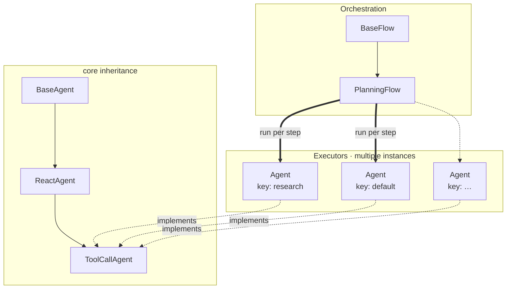

---

## Terminology

| Term | Definition |
|------|------------|
| **Agent** | Object that runs a multi-step task via `run(context, request)` and `step(context)`; includes a state machine (`AgentState`), prompts, tools, and `maxSteps`. |
| **BaseAgent / ReactAgent / ToolCallAgent** | Inheritance chain: run loop → ReAct (think/act) → Spring AI tool-calling implementation. |
| **UserContext** | Session carrier for one logical conversation: conversation id, `ChatMemory` reference, step count, and optional per-step scratch state. |
| **BaseUserContext** | Generic UserContext: partition read/write, `isStuck`, etc. |
| **ToolCallUserContext** | UserContext for `ToolCallAgent`; holds per-step tool-call fields. |
| **LLMChatClient** | Stateless model access: `askWithTools(context, …)` builds a prompt from context and calls `ChatModel`. |
| **ChatModel** | Spring AI LLM backend (e.g. SenseNova OpenAI-compatible API). |
| **ChatMemory** | Component that stores `Message` lists keyed by `conversation` (e.g. `MessageWindowChatMemory`). |
| **conversation** | Id on UserContext used as the ChatMemory partition key; set by the caller when creating the context (e.g. `demo`, `conv-1`). |
| **run** | Agent entry: `run(BaseUserContext, request)` loops `step` until finished or `maxSteps`. |
| **step** | One agent iteration; in `ReactAgent`, `think` then optional `act`. |
| **think / act** | ReAct phases: `think` calls the model; `act` runs tools or returns text. |
| **Flow** | Multi-agent orchestration (e.g. `PlanningFlow`: plan → execute steps → finalize). |

---

## Notation

Message sequences and diagrams use the following symbols (`n` = step index in the agent loop, starting at 1; `0` = initial user message in `run`).

| Symbol | Meaning | Spring AI type |
|--------|---------|----------------|
| **S** | System prompt (written once per partition on first run) | `SystemMessage` |
| **U₀** | User message from `request` in `run(context, request)` | `UserMessage` |
| **Uₙ** | User-side prompt before step `n` think (e.g. `nextStepPrompt`) | `UserMessage` |
| **Aₙ** | Assistant reply at step `n` | `AssistantMessage` |
| **Tₙ** | Tool result at step `n` (often after `replaceMemory`) | `ToolResponseMessage` |

**One ToolCallAgent step with tools**:

```text
…, Uₙ → Aₙ → Tₙ
```

**Typical prefix after first `run` on a partition**:

```text
[S, U₀] → … further steps …
```

`Memory +=` in diagrams means append or replace messages in the current `conversation` partition via UserContext.

---

## UserContext

### Definition

**UserContext** encapsulates state for **one logical conversation** when invoking an agent: partition name (`conversation`), `ChatMemory` reference, step counter, and subclass fields (e.g. tool-call scratch).

Standard call:

```text
agent.run(userContext, request)
```

`request` is the user text for this turn; history is read and updated through the ChatMemory partition referenced by `userContext`.

### Design rationale

| Rationale | Description |
|-----------|-------------|
| Multi-session isolation | Multiple conversations in one process, each with its own UserContext and Memory partition, sharing one agent instance. |
| Agent / data separation | Agent defines behavior; session data lives on UserContext + ChatMemory for reuse and testing. |
| Stateless client | `LLMChatClient` has no built-in memory; each call passes UserContext explicitly. |

### Component roles

| Component | Responsibility | Session state |
|-----------|----------------|---------------|
| **Agent** | `run` / `step`, think/act, termination | None (only runtime fields such as `AgentState`) |
| **LLMChatClient** | Prompt assembly, `ChatModel` calls, tools | None |
| **ChatMemory** | Persist `Message` lists | Per `conversation` partition |
| **UserContext** | Bind partition, step count, per-step scratch; memory API | Yes |

```text
request ──► UserContext
                 ├── ChatMemory[conversation]  ← S, U, A, T
                 └── Agent.run(context, request)
                          └── LLMChatClient.askWithTools(context, …) ──► ChatModel
```

### Implementation types

| Type | Use case | Main fields / behavior |
|------|----------|------------------------|
| **`BaseUserContext`** | Generic agents; Flow planning turns | `conversation`, `chatMemory`, `currentStep`; `addUserMemory`, `getAllMessages`, `isStuck` |
| **`ToolCallUserContext`** | `ToolCallAgent` | Extends base; `currentChatResponse`, `currentToolCalls`; `clearStepState()` after each act |

Factory: `BaseAgent.createUserContext(conversationId, chatMemory)`; `ToolCallAgent` returns `ToolCallUserContext`. `PlanningFlow.setupExecutors` calls this per executor.

### Lifecycle and reuse

| Mode | Practice |
|------|----------|
| One-shot | `new ToolCallUserContext(conversationId, chatMemory)` → `agent.run(context, prompt)`; optionally `chatMemory.clear(conversationId)` afterward. |
| Resume in-process | Reuse the same `ToolCallUserContext` (or same `conversation` on shared `ChatMemory`) across multiple `run` calls. |
| Parallel threads | Multiple `conversation` partitions; one `ToolCallAgent` may `run` against different contexts. |

Creating, caching, and disposing contexts is the **integrator’s** responsibility; core does not define a process-wide session map.

### Class structure

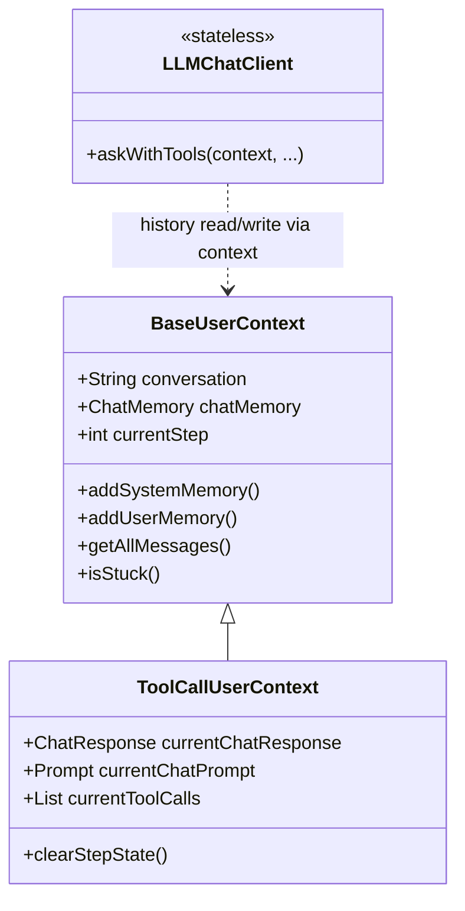

---

## BaseAgent

Base class for all agents: **`run(context, request)`** multi-step loop (state machine, writes **S** / **U₀** via context, `step(context)`, `isStuck`). Requires a UserContext matching the agent type (see [UserContext](#usercontext)).

### Architecture

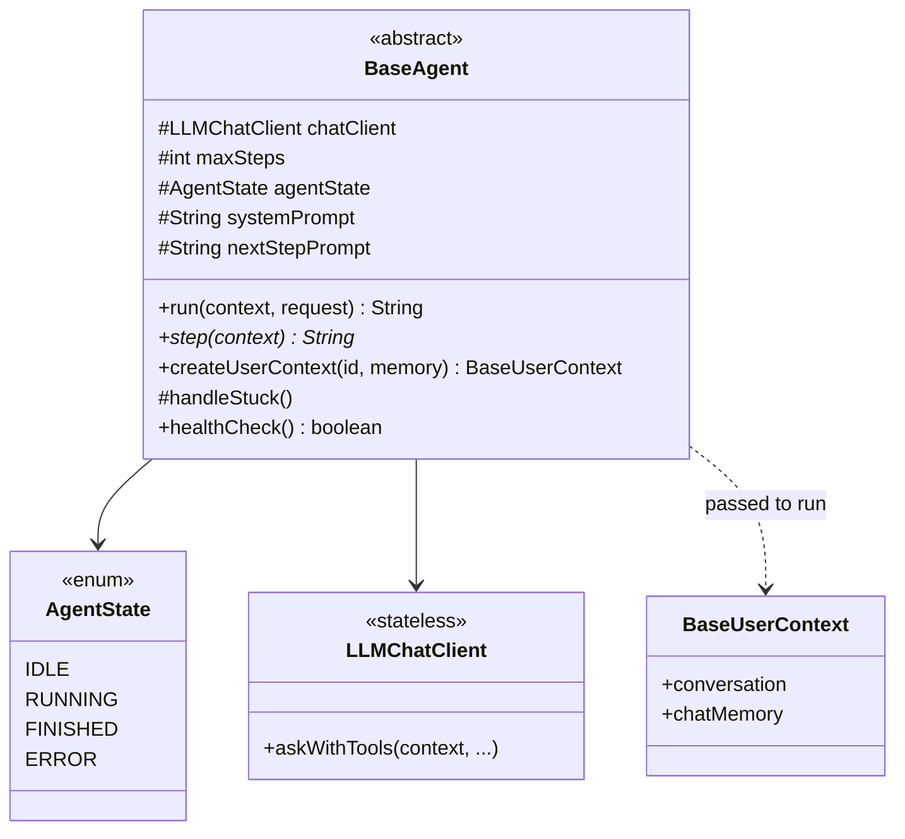

| Role | Description |
|------|-------------|
| `run` | `run(BaseUserContext, request)`; drives `IDLE→RUNNING→…` |
| Memory init | Via context: `S`, then `U` when `request` is non-blank |
| Loop | `step(context)` up to `maxSteps`; `context.isStuck` after each step |
| `step` | Abstract; defined by subclasses |

### Flow

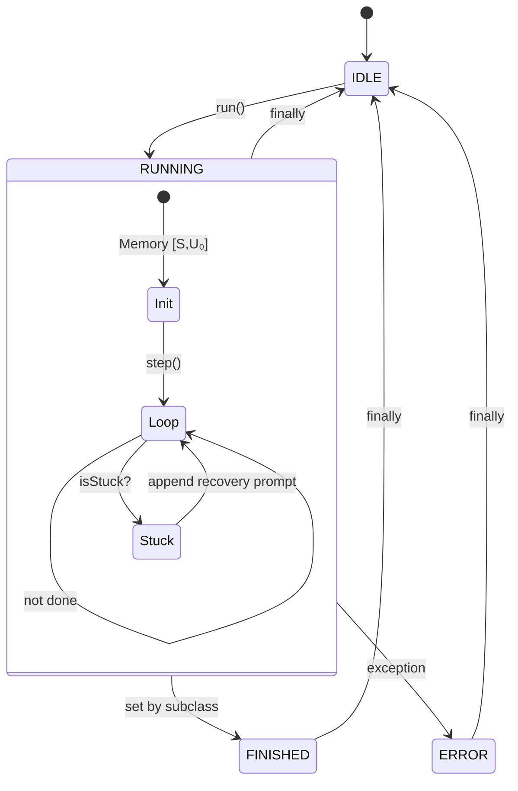

---

## ReactAgent

ReAct skeleton on top of `BaseAgent`: `step = think → act?`.

### Architecture

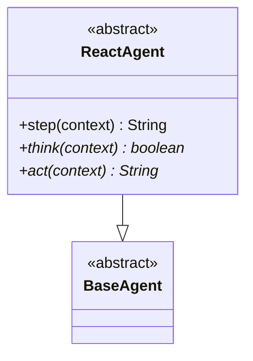

| Method | Role |
|--------|------|
| `think` | Reason; returns whether to call `act` |
| `act` | Execute; returns step result string |
| `step` | If `think` is false → `"Thinking complete…"` |

### Flow

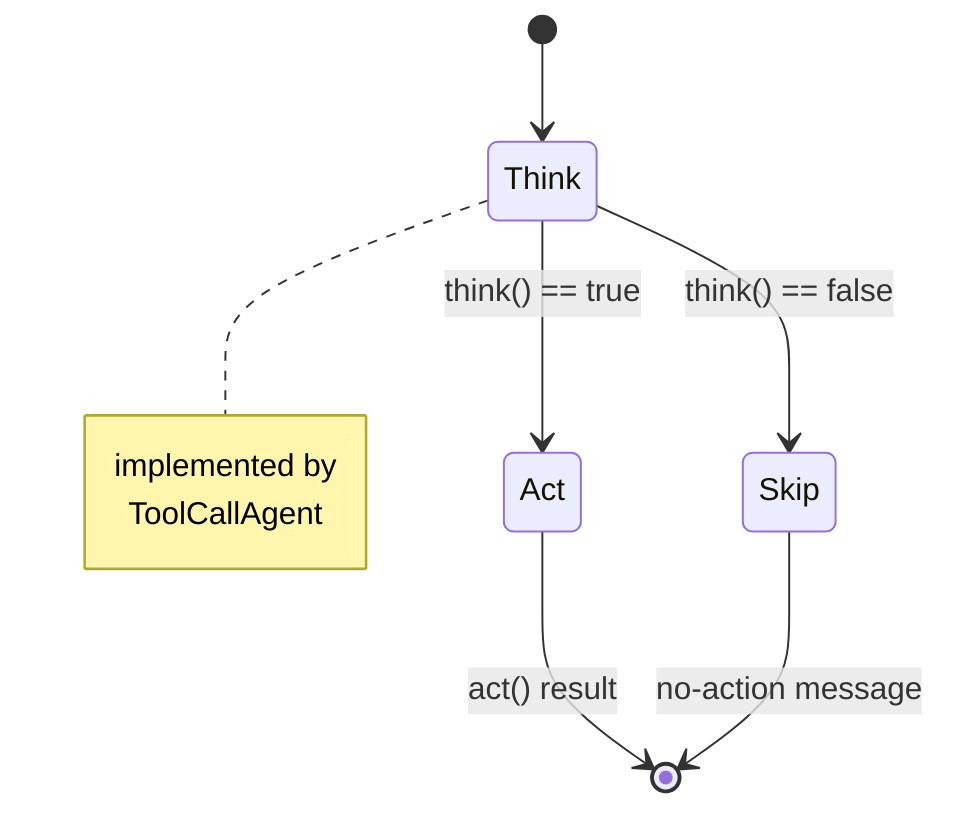

---

## ToolCallAgent

Concrete agent: call model with tools, parse `Aₙ`, execute or echo. Default in Janus.

### Architecture

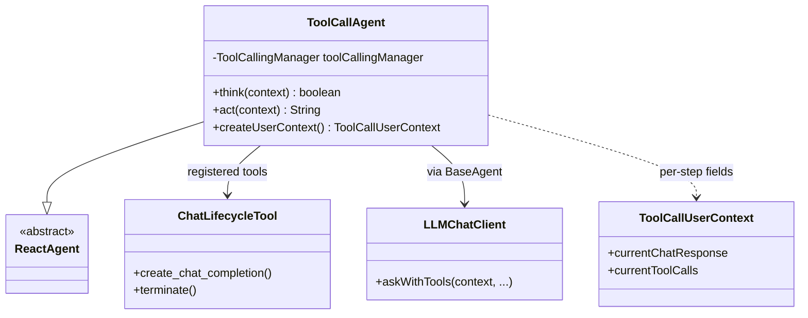

| Piece | Description |
|-------|-------------|
| `ChatLifecycleTool` | `create_chat_completion`, `terminate` exposed to model |
| `think` | `askWithTools(context, …)` → `Aₙ` on context memory partition; step fields on `ToolCallUserContext` |
| `act` | Echo text if no tools; else `context.replaceMemory` |

### Flow

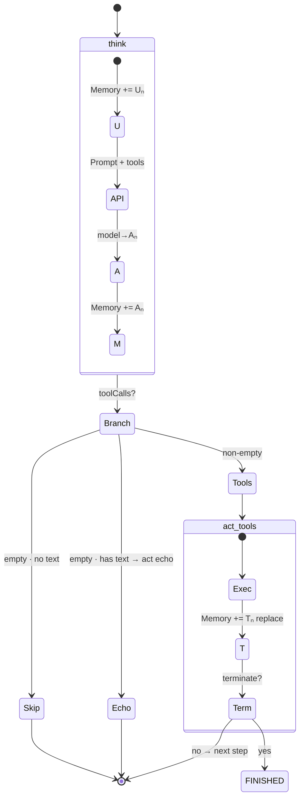

**Memory per step**

```text
[S,U₀] → +Uₙ → Aₙ → +Aₙ → (+Tₙ if tools)
```

| `toolCalls` | Memory after step | Ends run? |
|-------------|-------------------|-----------|
| `[]` + text | `…,Uₙ,Aₙ` | no |
| includes `terminate` | `…,Uₙ,Aₙ,Tₙ` | yes |

---

## Flow (multi-agent orchestration)

Flows live in **core**, aligned with OpenManus `app.flow`: orchestrate **plan → execute steps → finalize** on top of multiple `BaseAgent` instances; each step still uses an agent’s `run` / ReAct loop.

Construct `PlanningFlow` and `PlanningFlowUserContext`, then call `execute(context, input)`; single-agent use cases still call `agent.run` directly.

**Diagram legend**: **solid arrows** = calls / control; **dashed arrows** = data (messages, plan state, partition refs).

### BaseFlow: multiple agents

`BaseFlow` holds `Map<String, BaseAgent> agents`; `getExecutor(stepType)` picks one agent per plan step (from `[agent_key]` or `executorKeys`).

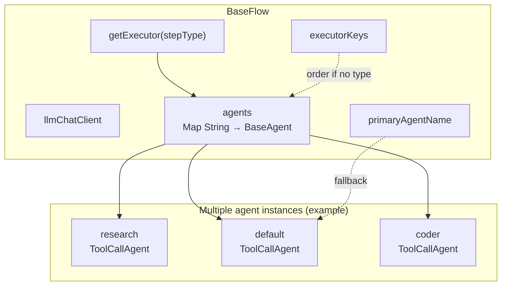

### PlanningFlow: component topology

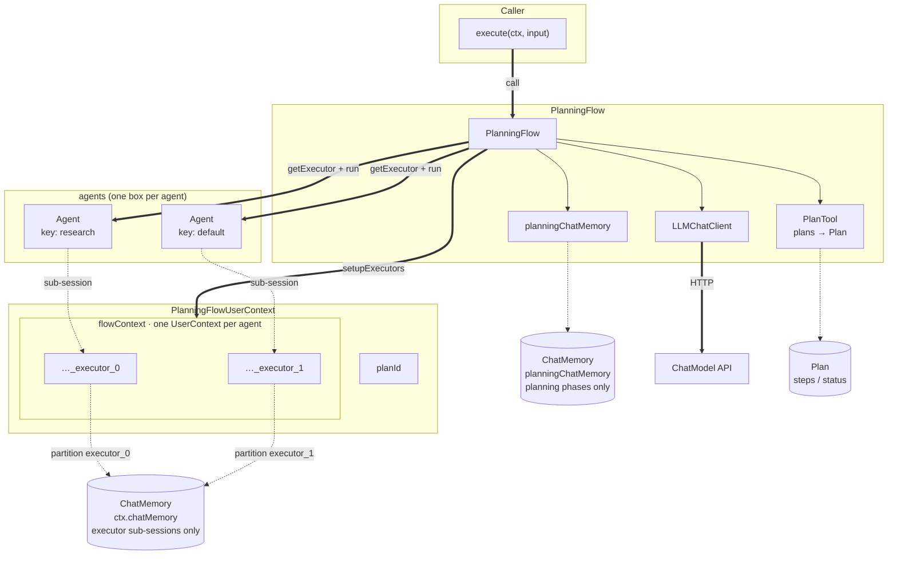

### PlanningFlow: control flow

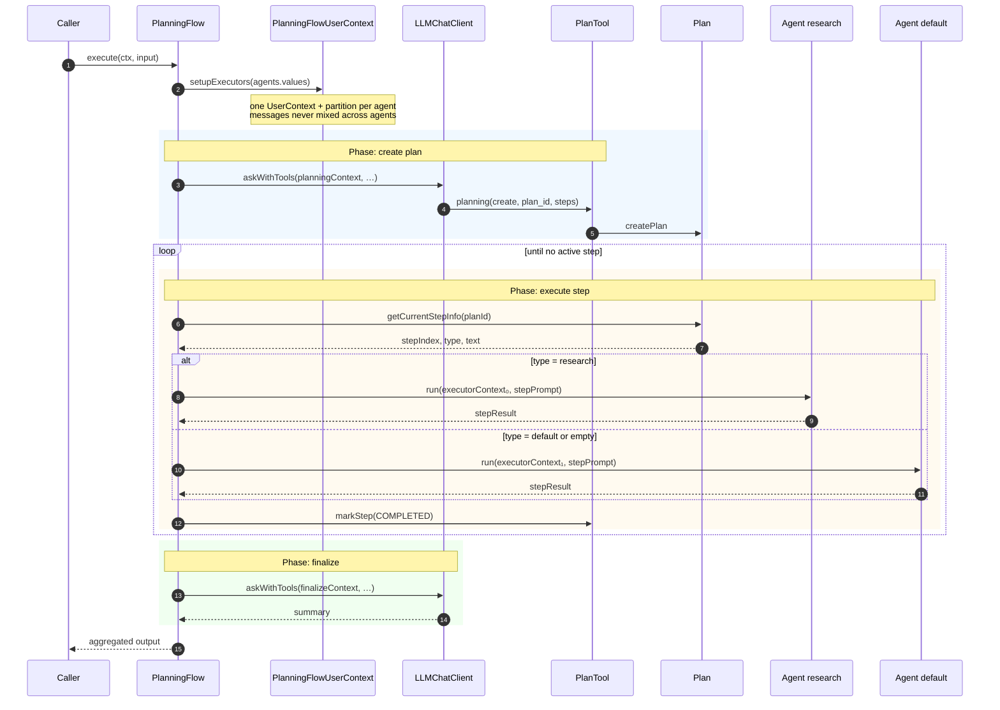

### PlanningFlow: data flow

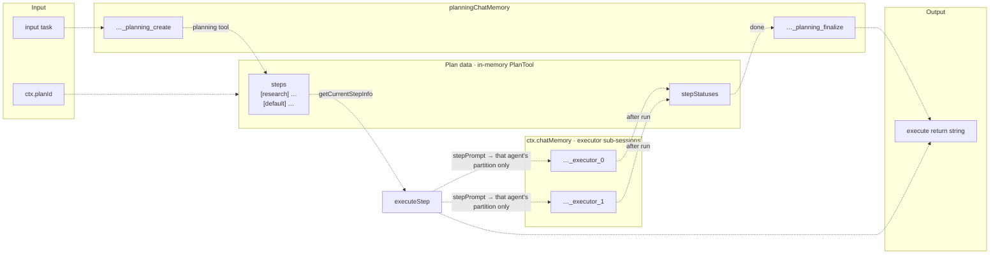

### Class relationships

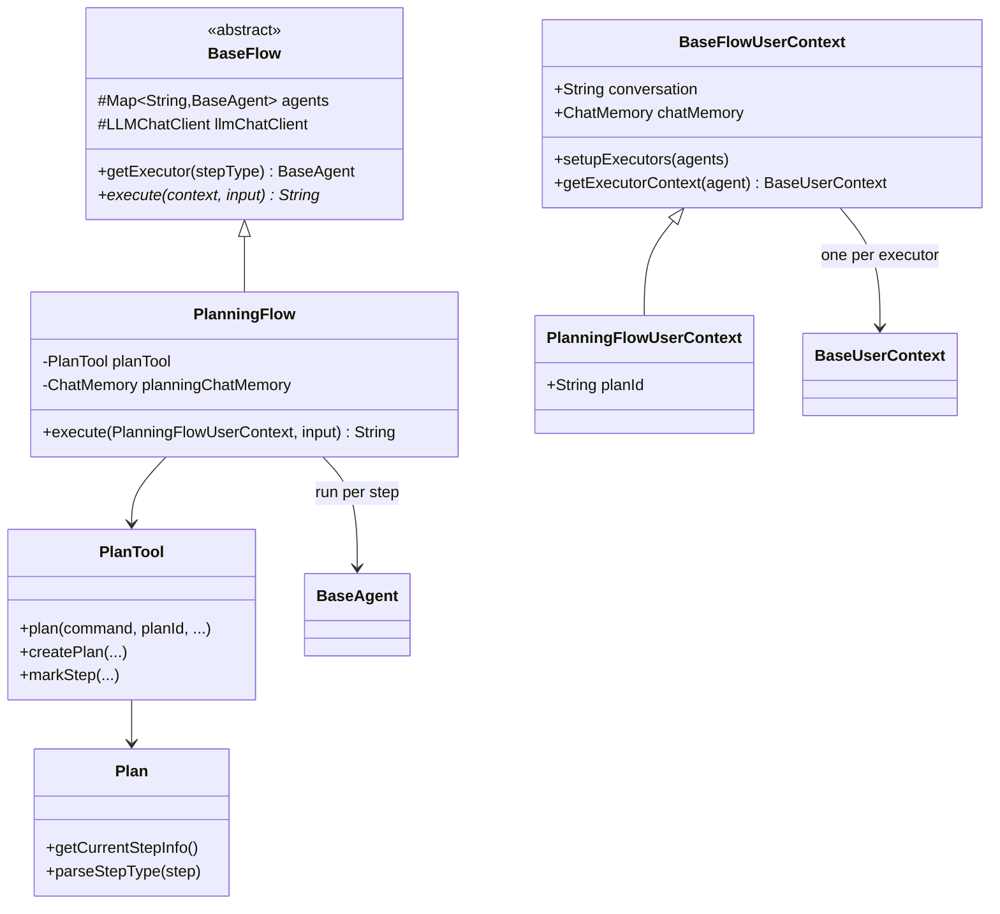

| Class | Role |
|-------|------|
| `BaseFlow` | Register agents, primary agent, `getExecutor(stepType)` |
| `PlanningFlow` | Create plan, loop steps, `finalizePlan` |
| `BaseFlowUserContext` | Flow `conversation`; `setupExecutors` builds one `UserContext` per executor (separate **sub-session partition**, same `chatMemory` ref) |
| `PlanningFlowUserContext` | Adds `planId` (default `{conversation}_plan`) and plan lifecycle flags |
| `PlanTool` | In-memory plans; `planning` tool for the planning LLM call |
| `Plan` | Steps, statuses, `getCurrentStepInfo()` |

### Execution phases (branches)

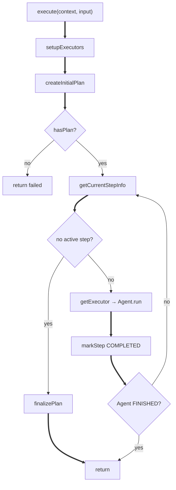

| Phase | Behavior |
|-------|----------|
| **Create plan** | Separate `planningChatMemory`; `askWithTools` + `PlanTool`; prompt requires matching `plan_id`. On failure, `createDefaultPlan` (three placeholder steps). |
| **Execute step** | `getCurrentStepInfo()` picks first active step, marks `in_progress`; builds step prompt for `executor.run`. |
| **Pick executor** | Optional `[agent_name]` in step text → `type` → `getExecutor(type)` (case-insensitive key); else `executorKeys` / primary. |
| **Finish** | No active steps → `finalizePlan`; or break early if executor hits `FINISHED`. |

### Plan and PlanTool

**`plan_id`**: required for every `planning` command except `list` (no “active plan” shortcut).

**Steps**: `List<String>`; prefix with **`[agent_key]`** when multiple agents are registered.

**Step statuses**: `not_started` · `in_progress` · `completed` · `blocked` (see `Plan.StepStatus`).

`getCurrentStepInfo()` returns `(stepIndex, {text, type?})`, or `(-1, {})` when done.

**PlanTool commands**: `create` · `update` · `list` · `get` · `mark_step` · `delete`.

### Context and executor sub-sessions (Memory)

**Different executor agents do not share one message history.** Implementation has two layers:

| Layer | Description |
|-------|-------------|
| **ChatMemory instance** | Executors use **`PlanningFlowUserContext.chatMemory`**. Plan create/finalize use **`PlanningFlow.planningChatMemory`** (a separate instance). Messages are not stored in the same object across those two roles. |
| **conversation partition (sub-session)** | Within one `ChatMemory` instance, each partition is a separate logical thread. `getAllMessages()` only reads the current context’s partition—**never another agent’s**. |

**Executor sub-sessions** (`setupExecutors`, shared `ctx.chatMemory` reference, non-overlapping partitions):

| Partition | Bound to | Contents |
|-----------|----------|----------|
| `{conversation}_executor_0` | First agent’s `UserContext` | That agent’s **S / U / A / T** across `run` calls |
| `{conversation}_executor_1` | Second agent’s `UserContext` | Isolated from `_executor_0` |
| … | `conversation + "_executor_" + i` | One partition per agent box |

`setupExecutors` calls `agent.createUserContext(executorConv, chatMemory)` (`ToolCallAgent` → `ToolCallUserContext`).

**Planning-phase sessions** (`planningChatMemory`, separate from executor storage):

| Partition | Phase |
|-----------|-------|
| `{conversation}_planning_create` | `createInitialPlan` |
| `{conversation}_planning_finalize` | `finalizePlan` |

```text
PlanningFlowUserContext.chatMemory          PlanningFlow.planningChatMemory
 ├── conv_executor_0  ← Agent A read/write only   ├── conv_planning_create
 ├── conv_executor_1  ← Agent B read/write only   └── conv_planning_finalize
```

When step type routes to `research`, only that agent’s `_executor_k` partition grows; other executor partitions are unchanged until their steps run.

### Relation to single-agent runs

```text
PlanningFlow.execute(context, userTask)
  ├─ createInitialPlan  → LLMChatClient + PlanTool + planningChatMemory
  └─ each executeStep  → BaseAgent.run(executorContext, stepPrompt)
```

Flow adds planning and step dispatch on top of `BaseAgent.run`; each step still runs the full agent loop.

---

## Typical usage

### Single agent (ToolCall)

```java
ChatMemory memory = MessageWindowChatMemory.builder().build();
LLMChatClient client = new LLMChatClient(chatModel, List.of());
ToolCallAgent agent = new ToolCallAgent(client, maxSteps);

ToolCallUserContext ctx = new ToolCallUserContext("conv-1", memory);
String out = agent.run(ctx, "user task");
```

```text
createUserContext / new ToolCallUserContext
  → agent.run(context, request)
       → step → think → LLMChatClient.askWithTools(context, …)
       → act  → tools / terminate
```

### Multiple agents (PlanningFlow)

```java
PlanningFlow flow = new PlanningFlow(
        llmChatClient,
        Map.of("research", researchAgent, "default", defaultAgent),
        "default");
PlanningFlowUserContext ctx = new PlanningFlowUserContext("conv-1", sharedChatMemory);
String result = flow.execute(ctx, "complete the task");
```

See [Flow (multi-agent orchestration)](#flow-multi-agent-orchestration).
