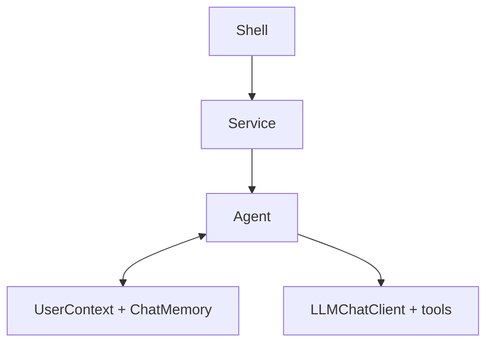
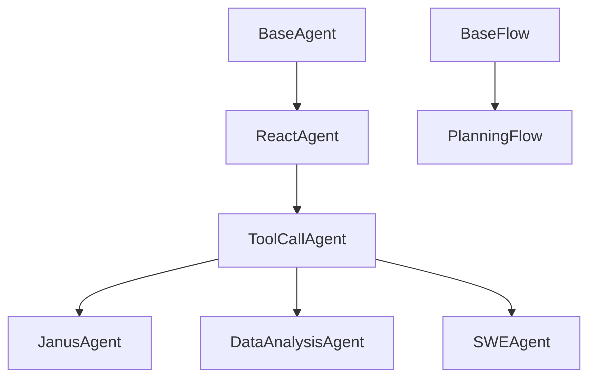
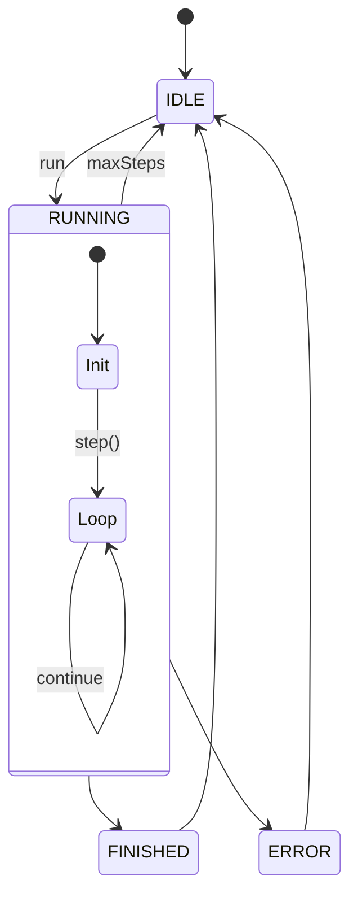
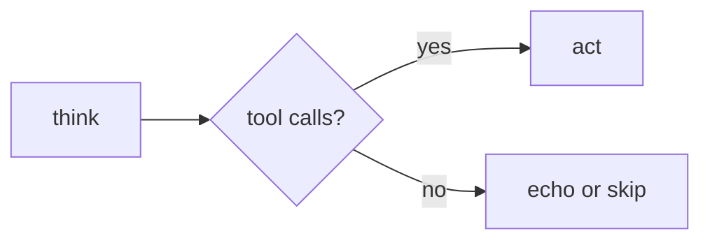
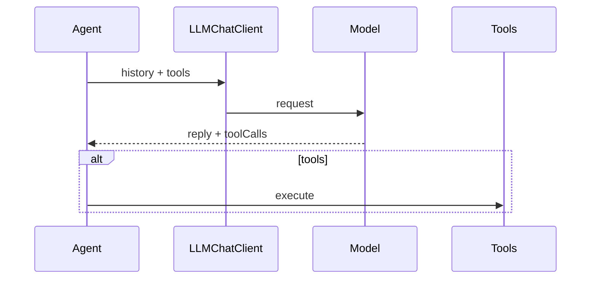
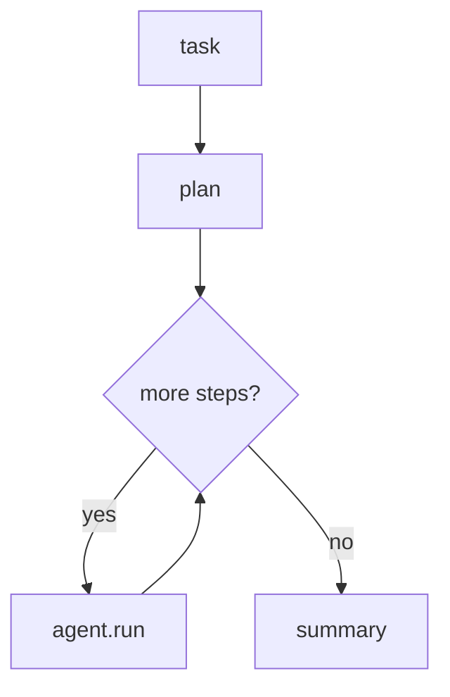

# Agent framework and flows

> [中文](AGENT-FLOW.md) · Shell usage: [shell/docs/SHELL.en.md](../../shell/docs/SHELL.en.md) · FAQ: [docs/FAQ.en.md](../../docs/FAQ.en.md)

Janus **core** ships agents and flows; **shell** is the CLI. Below: what an agent is, then structure and flow diagrams in execution order.

---

## What is an agent?

In Janus, an **agent** completes a user **request** in multiple steps: it talks to the LLM, optionally **calls tools** (Python, files, bash, charts, etc.), and stops when the task looks done or `maxSteps` is reached.

Each iteration follows the same pattern:

1. **Understand** the goal (system prompt + conversation history);
2. **Decide** this step’s action—reply only, or call a tool;
3. **Execute**, store results in memory, continue.

This is **ReAct** (reason then act). All task agents share that loop; they differ in **tools** and **prompts**.

A single call `agent.run(context, request)` returns lines like `Step 1:`, `Step 2:`—one per iteration. Integrators do not assemble model requests or parse tool calls themselves.

For work that must be **split across specialized agents**, core also provides **Flow** (see PlanningFlow below).

---

## Where agents sit in the stack

A typical path: **Shell command → Service → Agent → model and tools**. The agent handles reasoning and tool orchestration; the service picks the model and stores conversation history.

How the CLI calls `agent.run` is in [SHELL.en.md](../../shell/docs/SHELL.en.md).

---

## Code structure

Agents form an inheritance chain: upper layers control the run loop; lower layers handle tool calls.

- **BaseAgent**: `run` loop, state, step limit.
- **ReactAgent**: each step is `think` then optional `act`.
- **ToolCallAgent**: Spring AI tool calling; Janus / DA / SWE swap tools and prompts.
- **PlanningFlow**: schedules multiple agents from a plan—it does not replace them.

---

## Agent variants

| Agent | CLI group | Best for | Main tools |
|-------|-----------|----------|------------|
| **ToolCallAgent** | `tool-call` | Minimal chat | `create_chat_completion`, `terminate` |
| **JanusAgent** | `janus` | General work | `plan`, Python, file editor, `ask_human`, `terminate` |
| **DataAnalysisAgent** | `da` | Tables, stats, charts | Python, chart prep, visualization, `terminate` |
| **SWEAgent** | `swe` | Terminal coding | `bash`, `str_replace_editor`, `terminate` |

Optional **MCP tools**. Limits like `max-steps` are configured per agent (Shell: [SHELL.en.md](../../shell/docs/SHELL.en.md)).

---

## What one `run` does

After `agent.run(context, request)`, the agent writes the system prompt and user message on first use (**S**, **U₀**), then loops `step` until finished or out of steps.

**`terminate`** usually ends the run cleanly; otherwise the loop may stop at `maxSteps`. Repeated assistant text triggers a recovery hint to reduce spinning.

---

## Each step: think and act

**ReactAgent** splits a step into **think** then **act**.

- **think**: send history and tool definitions to the model; get text and optional tool calls (**Aₙ**).
- **act**: run tools and write results (**Tₙ**); **`terminate`** ends the whole run. With no tools, step text may be echoed as output.

A short **nextStepPrompt** (**Uₙ**) may be injected before each think; wording is per agent class.

---

## Message symbols

| Symbol | Meaning |
|--------|---------|
| **S** | System prompt |
| **U₀** | This run’s `request` |
| **Uₙ** | Next-step hint before think |
| **Aₙ** | Assistant reply |
| **Tₙ** | Tool result |

With tools: `… → Uₙ → Aₙ → Tₙ`.

---

## PlanningFlow

Use **PlanningFlow** when you need a **plan first**, then different agents per step (wired in code; no Shell command yet).

Build a **Plan** → for each pending step, pick an executor agent → `agent.run` for that step → mark done → finalize.

The plan drives **what** runs next and **which** agent runs it—not free-form tool picking inside one long `run`.

---

## Extending

| Goal | Approach |
|------|----------|
| New tool | `@Tool` method + `builtinTools` |
| New agent | Subclass `ToolCallAgent` |
| New CLI | `*Service` + `*Command` |

Packages: `com.wish.agent`, `com.wish.flow`, `com.wish.tools`, `com.wish.llm`.