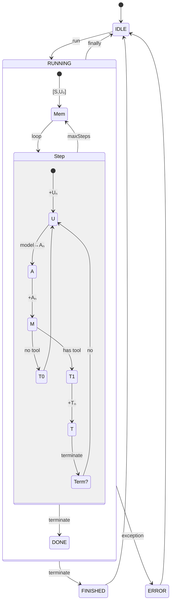

# ToolCallAgent

> [中文](AGENT-FLOW.md) · `S` `U` `A` `T`

```mermaid
stateDiagram-v2
    direction TB

    [*] --> IDLE
    IDLE --> RUNNING: run

    state RUNNING {
        [*] --> Mem: [S,U₀]

        Mem --> Step: loop

        state Step {
            [*] --> U: +Uₙ
            U --> A: model→Aₙ
            A --> M: +Aₙ

            M --> T0: no tool
            M --> T1: has tool

            T0 --> U
            T1 --> T: +Tₙ
            T --> Term?: terminate
            Term? --> U: no
        }

        Step --> DONE: terminate
        Step --> Mem: maxSteps
    }

    RUNNING --> FINISHED: terminate
    RUNNING --> ERROR: exception
    FINISHED --> IDLE
    ERROR --> IDLE
    RUNNING --> IDLE: finally
```
