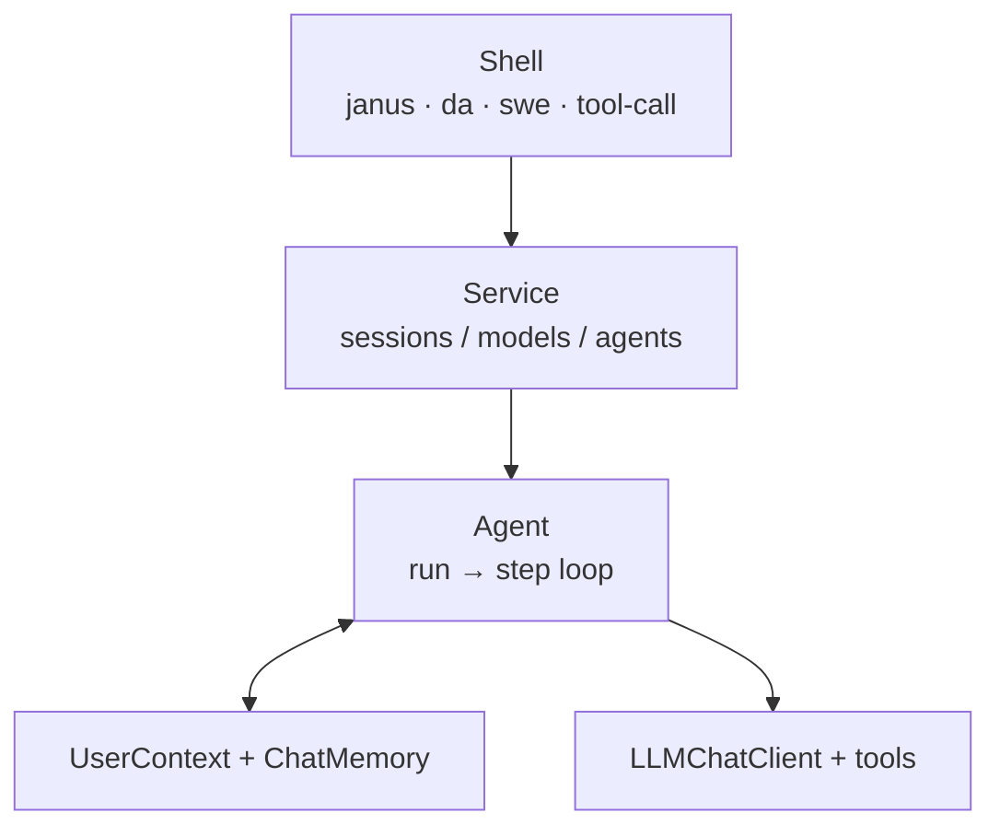
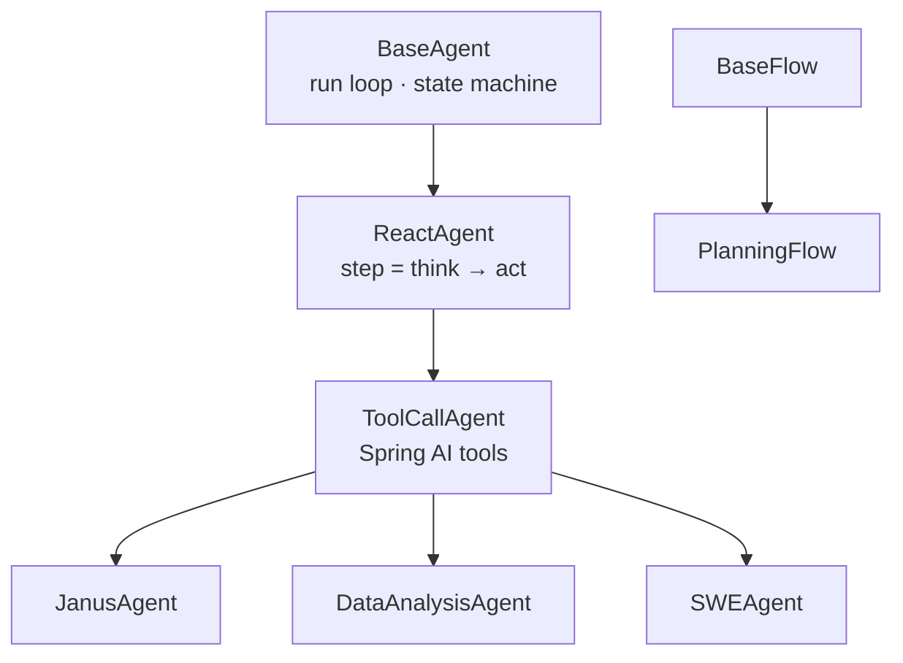
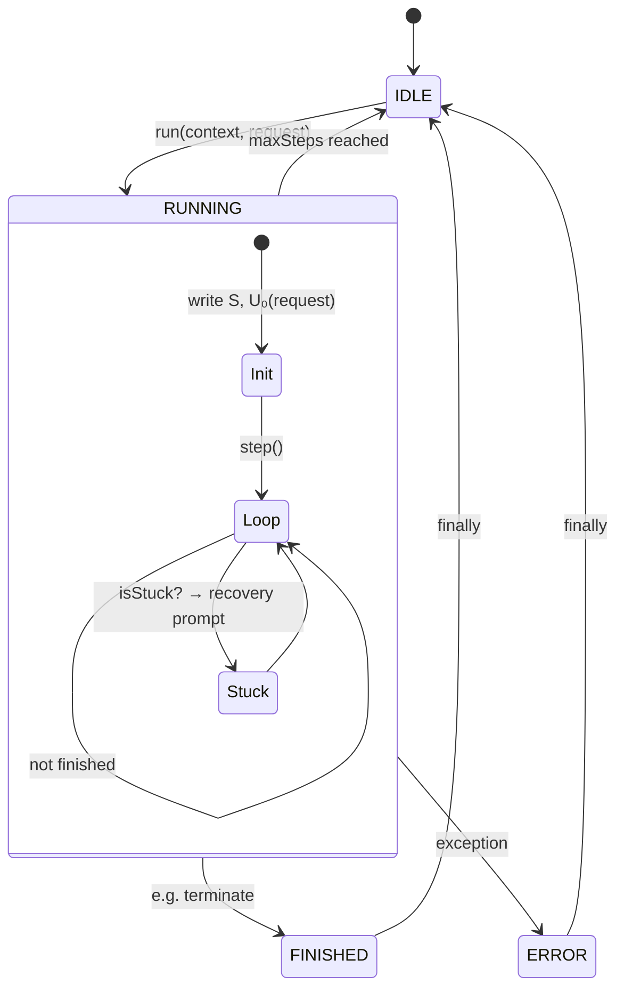
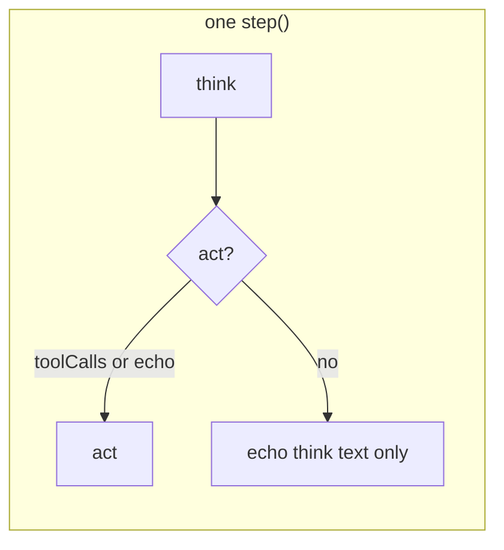
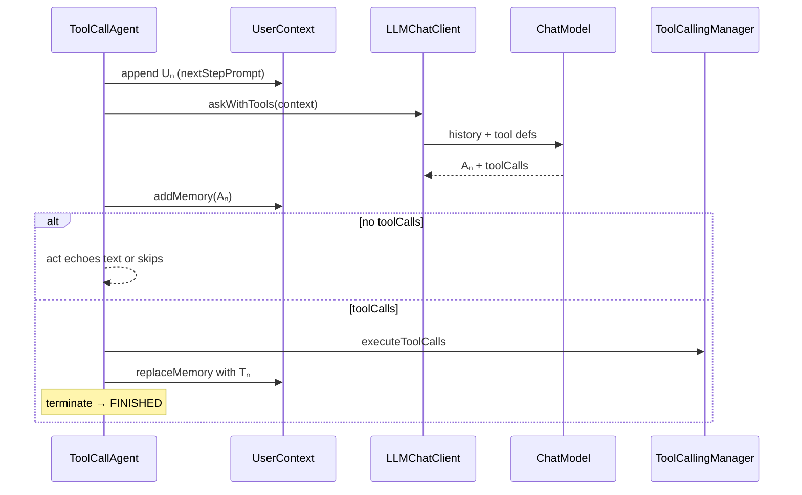
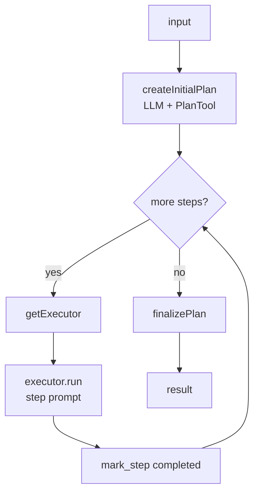

# Agent framework and flows

> [中文](AGENT-FLOW.md) · Shell usage: [shell/docs/SHELL.en.md](../../shell/docs/SHELL.en.md) · FAQ: [docs/FAQ.en.md](../../docs/FAQ.en.md)

Janus **core** provides agents and flows; **shell** is the CLI.

---

## Layers



| Layer | Role |
|-------|------|
| **Shell** | Parses `-p` / `-m` / `-c`, invokes service |
| **Service** | Registers agents per model; manages conversation memory |
| **Agent** | Multi-step `run`: each step `think` → optional `act` |
| **UserContext** | Conversation id, step counter, ChatMemory access |
| **LLMChatClient** | Stateless; builds prompt from context history |

---

## Class hierarchy



| Class | Role |
|-------|------|
| **BaseAgent** | `run(context, request)`: system/user messages, `step` until `FINISHED` or `maxSteps` |
| **ReactAgent** | `step` = `think` then optional `act` |
| **ToolCallAgent** | `think` gets toolCalls; `act` runs tools and updates memory |
| **PlanningFlow** | Plan first, then delegate each step to an executor agent |

---

## Agent types and tools

| Agent | CLI group | Use case | Built-in tools |
|-------|-----------|----------|----------------|
| **ToolCallAgent** | `tool-call` | Minimal chat + tools | `create_chat_completion`, `terminate` |
| **JanusAgent** | `janus` | General tasks | `plan`, `python_execute`, `str_replace_editor`, `ask_human`, `terminate` |
| **DataAnalysisAgent** | `da` | Analysis / charts | `python_execute`, `visualization_preparation`, `data_visualization`, `terminate` |
| **SWEAgent** | `swe` | Terminal coding | `bash`, `str_replace_editor`, `terminate` |

Optional **MCP tools**. Runtime options such as `max-steps` are set by the integrator (Shell: [SHELL.en.md](../../shell/docs/SHELL.en.md)).

---

## `run` lifecycle (BaseAgent)



---

## ReAct step: `think` → `act`



**ToolCallAgent** detail:



---

## Message symbols

| Symbol | Meaning |
|--------|---------|
| **S** | SystemMessage (once per conversation partition) |
| **U₀** | User `request` for this `run` (second argument to `run`) |
| **Uₙ** | nextStepPrompt before each think |
| **Aₙ** | Assistant reply |
| **Tₙ** | Tool results |

With tools per step: `… → Uₙ → Aₙ → Tₙ`.

---

## Public API

```text
agent.run(userContext, request) → "Step 1: …\nStep 2: …"
```

Callers (Shell service, tests, or your app) provide the context, the request string, and handle the `Step N` lines.

How CLI flags map to `run` is documented in [shell/docs/SHELL.en.md](../../shell/docs/SHELL.en.md).

---

## PlanningFlow (multi-agent)

Wire `PlanningFlow` with executor agents in application code (no Flow command in Shell today).



| Phase | What happens |
|-------|----------------|
| **Plan** | Planning memory; model creates steps via `PlanTool` (`[agent_name]` in step text) |
| **Execute** | Current step → pick agent → `run` on executor sub-context |
| **Finish** | No steps left → summary; early `FINISHED` may stop the loop |

Unlike a single `agent.run`, the **plan** picks the next step and executor instead of free-form tool choice inside one agent.

---

## Extending

| Goal | Approach |
|------|----------|
| New tool | `@Tool` + `builtinTools` |
| New agent | Subclass `ToolCallAgent` |
| New CLI | `*Service` + `*Command` |

Packages: `com.wish.agent`, `com.wish.flow`, `com.wish.tools`, `com.wish.llm`.
