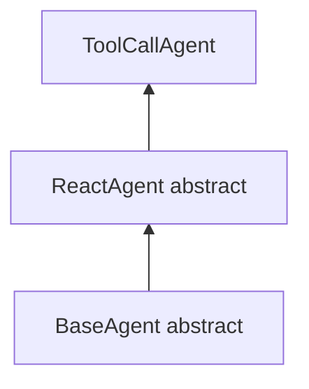
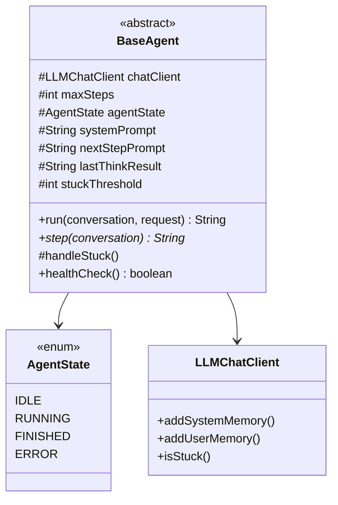
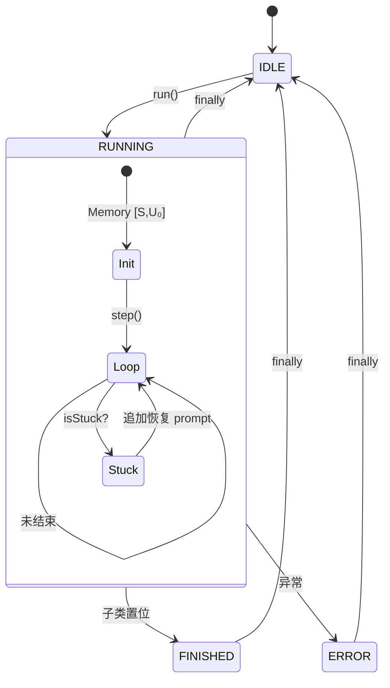
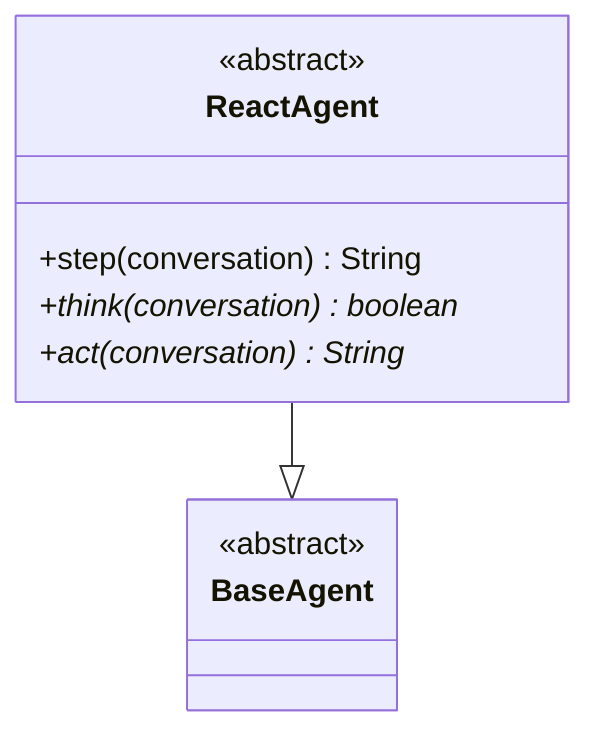
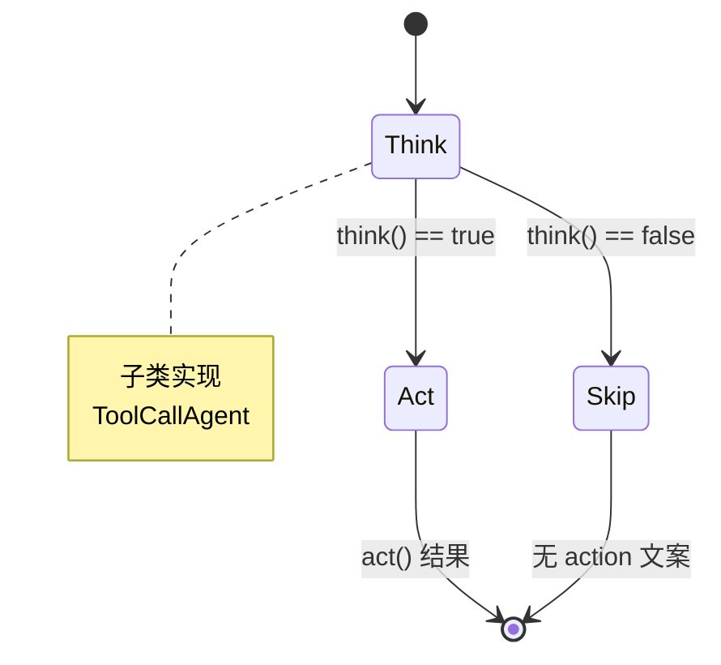
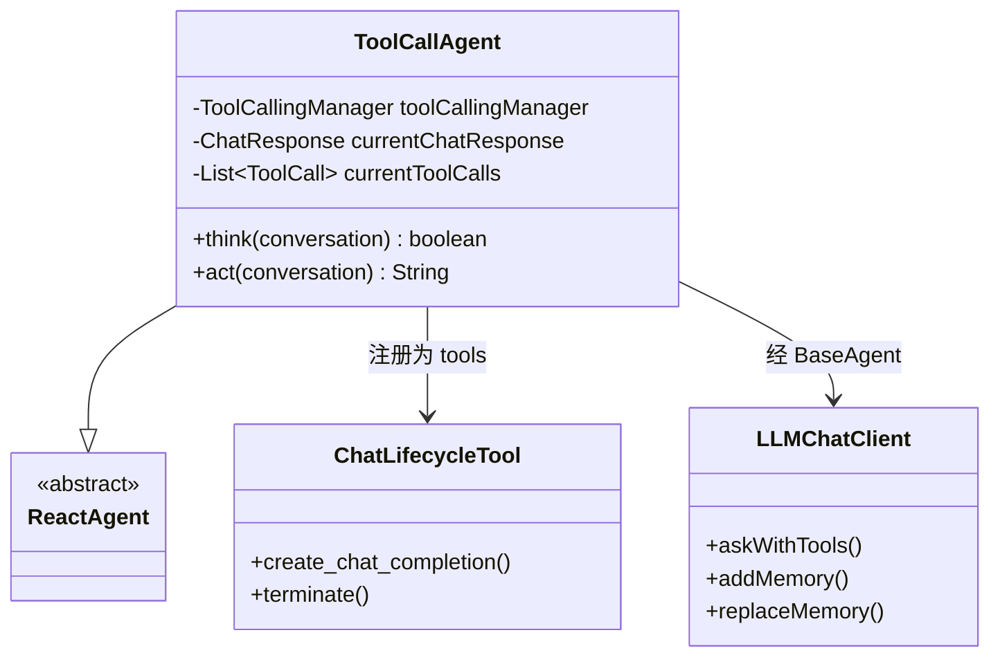
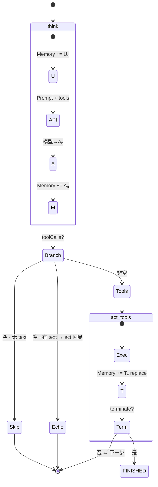

# Agent 架构与流程

> [English](AGENT-FLOW.en.md) · 符号：`S` system · `U` user · `A` assistant · `T` tool result

继承关系：`BaseAgent` ← `ReactAgent` ← `ToolCallAgent`（shell 里 `ToolCallService` 创建并 `run`）。



---

## BaseAgent

抽象基类：状态机、`run` 循环、memory 初始化、stuck 处理。子类实现 `step()`。

### 架构



| 职责 | 说明 |
|------|------|
| `run` | 唯一对外入口，管理 `IDLE→RUNNING→…` |
| memory 初始化 | 先 `S`，再 `U₀`（顺序固定） |
| 循环 | `step()` × `maxSteps`，步末 `isStuck` |
| `step` | 抽象，由子类定义 |

### Flow



---

## ReactAgent

在 `BaseAgent` 上固定 **ReAct 骨架**：`step = think → act?`。

### 架构



| 方法 | 作用 |
|------|------|
| `think` | 推理；返回是否进入 `act` |
| `act` | 执行；返回本步结果字符串 |
| `step` | `think` 为 false 时直接返回 `"Thinking complete…"` |

### Flow



---

## ToolCallAgent

具体实现：调模型（带 tools）、解析 `Aₙ`、执行或回显。Janus 默认使用的 agent。

### 架构



| 组件 | 说明 |
|------|------|
| `ChatLifecycleTool` | 模型可见的 `create_chat_completion`、`terminate` |
| `think` | `askWithTools` → 写 `Aₙ` 入 memory |
| `act` | 无 tool 回显 text；有 tool 则 `replaceMemory` |

### Flow



**Memory 一步**

```text
[S,U₀] → +Uₙ → Aₙ → +Aₙ → (+Tₙ 若有 tool)
```

| `toolCalls` | 本步后 Memory | 会结束吗 |
|-------------|---------------|----------|
| `[]` + text | `…,Uₙ,Aₙ` | 否 |
| 含 `terminate` | `…,Uₙ,Aₙ,Tₙ` | 是 |

---

## 入口

`ToolCallService.run` → `new ToolCallAgent(llmChatClient, maxSteps)` → `agent.run(conversationId, prompt)`。
