# Agent 框架与流程

> [English](AGENT-FLOW.en.md) · 排错：[docs/FAQ.md](../../docs/FAQ.md)

本文介绍 Janus **core** 中 Agent 的定义、分类与执行流程，不涉及 CLI 入口与实现细节。

---

## Agent 定义

在 Janus 中，**Agent** 指一类面向任务的多步执行单元：接收自然语言目标后，在限定 **max steps** 内反复 **think → act**，按需发起 **tool call**，直至任务完成或达到步数上限。

其核心行为模式为 **ReAct**（Reason + Act）：

1. **Reason（think）**：结合 **system prompt**、历史 **Memory** 与当前 **Context**，判断本步最优动作；
2. **Act**：执行 **tool call**（或输出 assistant 文本），将结果写回 **Memory**，供后续 step 使用。

除单 Agent 的 `run` 外，core 还提供 **PlanningFlow**：先将任务分解为 **Plan**，再按步骤分派至不同 Agent 执行。

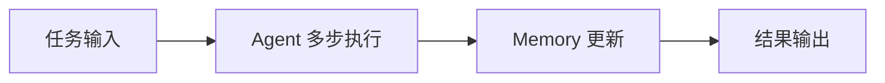

---

## 架构位置

从 core 视角，单次请求的处理链路为：**任务输入 → Agent step loop → Memory 沉淀 → 结果输出**。

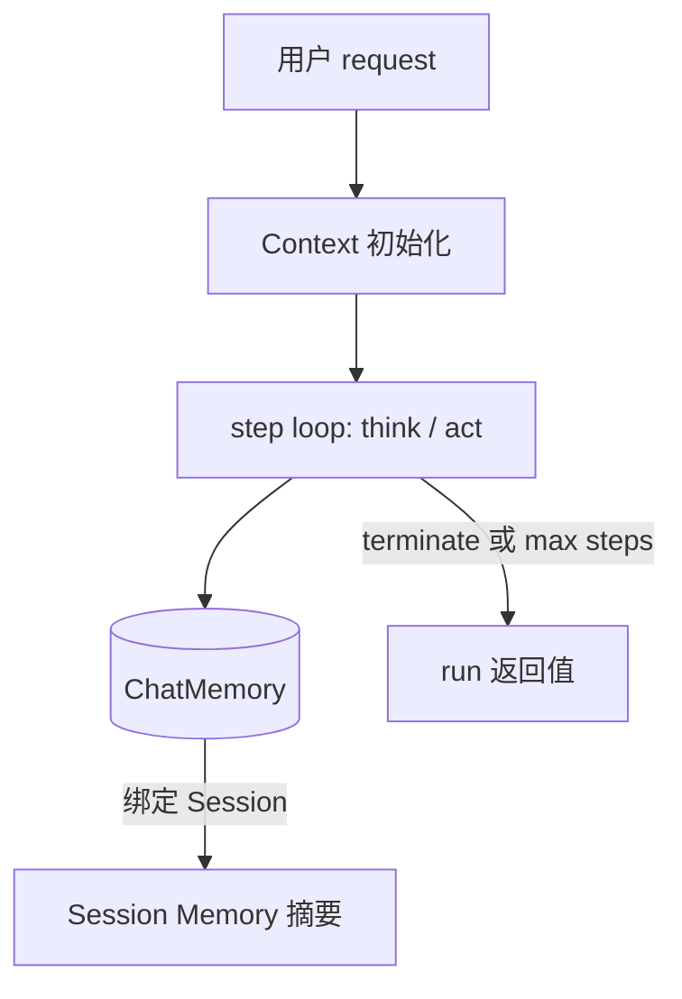

---

## Agent 分类

core 预置四类 Agent 实现，面向不同任务域；均继承 **ToolCallAgent** 的 multi-step 范式，差异体现在 **decision policy** 与 **built-in toolset**。

| 分类 | 实现类 | 适用场景 | Built-in Tools | 典型产出 |
|------|--------|----------|----------------|----------|
| 基础对话 | `ToolCallAgent` | 最小问答闭环 | `create_chat_completion`, `terminate` | 结构化答复并结束 |
| 通用任务 | `JanusAgent` | 规划、脚本、文件、人机协作 | `plan`, `python_execute`, `str_replace_editor`, `ask_human`, `create_chat_completion`, `terminate` | 分步执行后的汇总结论 |
| 数据分析 | `DataAnalysisAgent` | 统计、可视化 | `python_execute`（analysis）, `visualization_prepare`, `data_visualization`, `terminate` | 分析报告与图表文件 |
| 工程执行 | `SWEAgent` | 代码阅读、修改、命令验证 | `bash`, `str_replace_editor`, `terminate` | 可验证的工程变更 |

> **可选扩展**：各 Agent 均可叠加 **MCP tools**；当配置目录下存在 `SKILL.md` 时，还可注入 **skills tools**（`Skill`、`Read`、`Shell` 等）。详见 [Skills 机制](#skills-机制)。

---

## 执行生命周期与 Agent Flow

Agent 自 **IDLE** 接收任务后进入 **RUNNING**，在 **step loop** 中推进；正常结束为 **FINISHED**（通常由 `terminate` 触发），异常为 **ERROR**，或达到 **max steps** 后回到 **IDLE**。

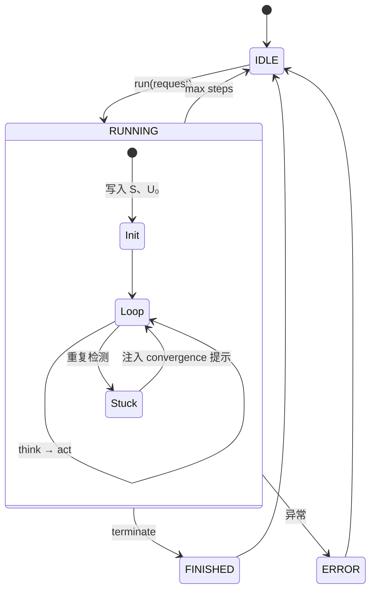

### 通用单步机制：think 与 act

每个 **step** 由 **think** 与 **act** 两阶段组成：

| 阶段 | 职责 | 写入 Memory |
|------|------|-------------|
| **think** | 调用 LLM，生成 `Aₙ`（含可选 tool calls） | 持久化 `Aₙ`（部分 Agent 对 assistant-only 有特殊策略） |
| **act** | 执行 tool calls 或返回 assistant 文本 | 有 tool 时写入 `Tₙ` 并更新 history |

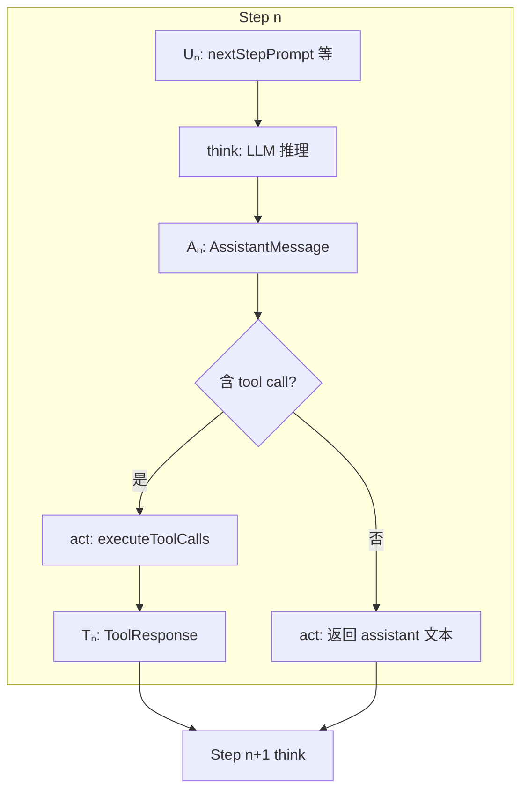

### 对话消息符号

阅读日志、Memory 或下文流程图时，采用下列符号指代消息类型：

| 符号 | 类型 | 说明 |
|------|------|------|
| **S** | SystemMessage | 系统提示（`systemPrompt`） |
| **U₀** | UserMessage | 本轮用户 **request** |
| **Uₙ** | UserMessage | 第 n 步 **nextStepPrompt**（ephemeral，默认不持久化） |
| **Aₙ** | AssistantMessage | 模型回复；可含 **tool calls** |
| **Tₙ** | ToolResponseMessage | **tool call** 执行结果 |

**单步含 tool 时的 Memory 序列**：

```text
… → Uₙ → Aₙ(tool_calls) → Tₙ
```

**与运行日志的对应关系**：

| 日志字段 | 对应符号 |
|----------|----------|
| `{Agent}'s thoughts` | `Aₙ` 文本部分 |
| `Tool prepared: {name}` | `Aₙ` 中的 tool call |
| `Tool {name} result` | `Tₙ` |
| `Step n: …`（CLI 输出） | 本 step **act** 返回值 |

### 按 Agent 分类的执行流程

以下给出各类 Agent 的典型 **message pattern** 与流程图；实际轨迹因模型决策而异，图中为最常见路径。

### ToolCallAgent（基础对话）

**目标**：通过 `create_chat_completion` 交付用户可见答案，再 `terminate` 结束。

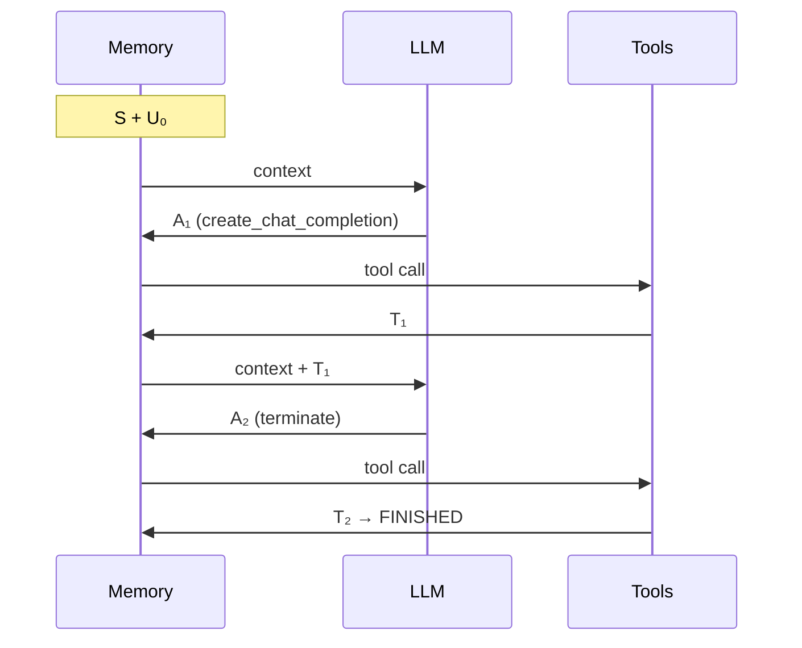

---

### JanusAgent（通用任务）

**目标**：在多工具间编排，最终以 `create_chat_completion` 收口。

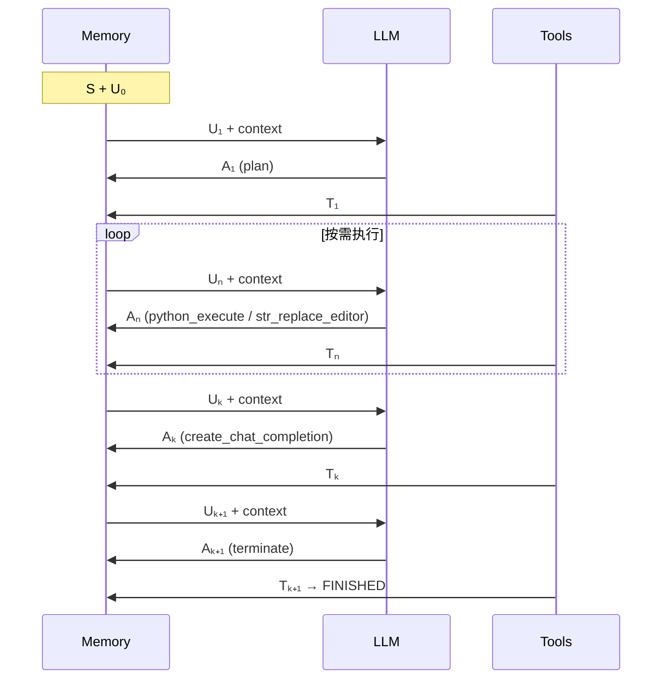

**说明**：`T₁…Tₙ₋₁` 多为中间产物（计划状态、脚本输出、编辑结果）；面向用户的最终交付集中在 `create_chat_completion` 对应的 **Tₖ**。

---

### DataAnalysisAgent（数据分析）

**目标**：完成数据处理与可视化后输出 **analysis conclusion**。

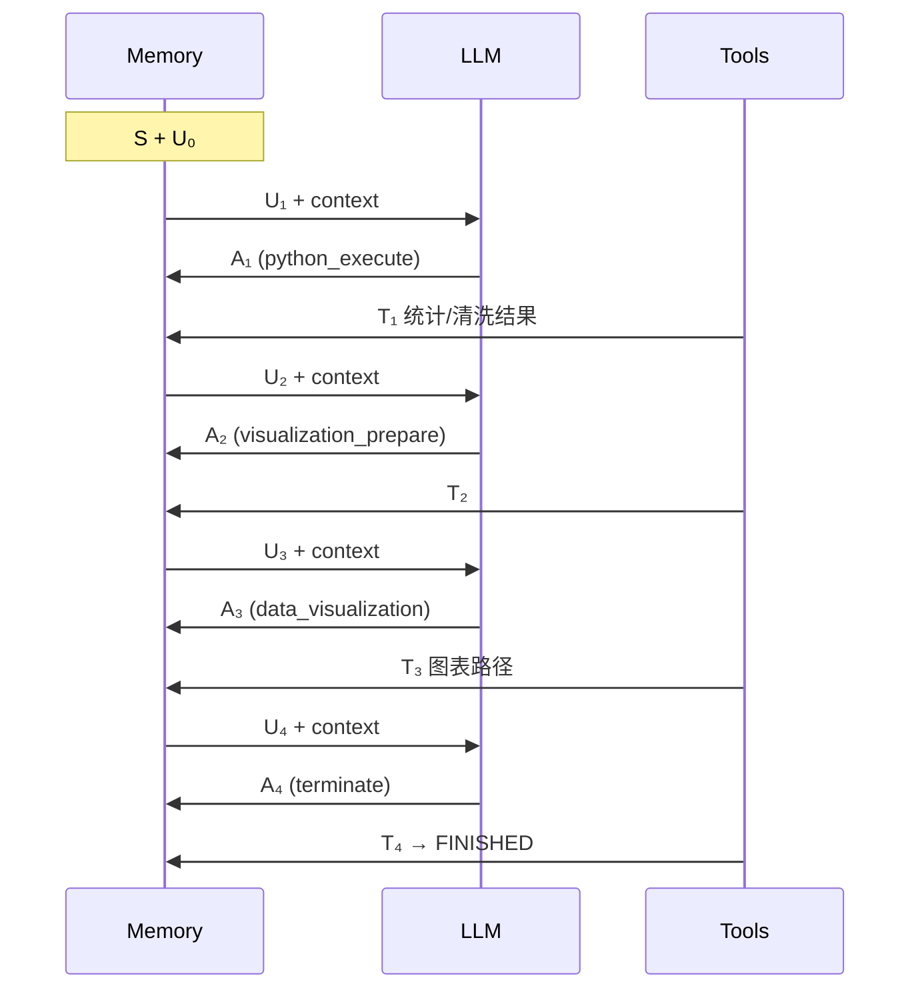

---

### SWEAgent（工程执行）

**目标**：在 **workspace** 内完成读文件、改代码、跑命令与验证；可选通过 **skills** 加载领域规则。

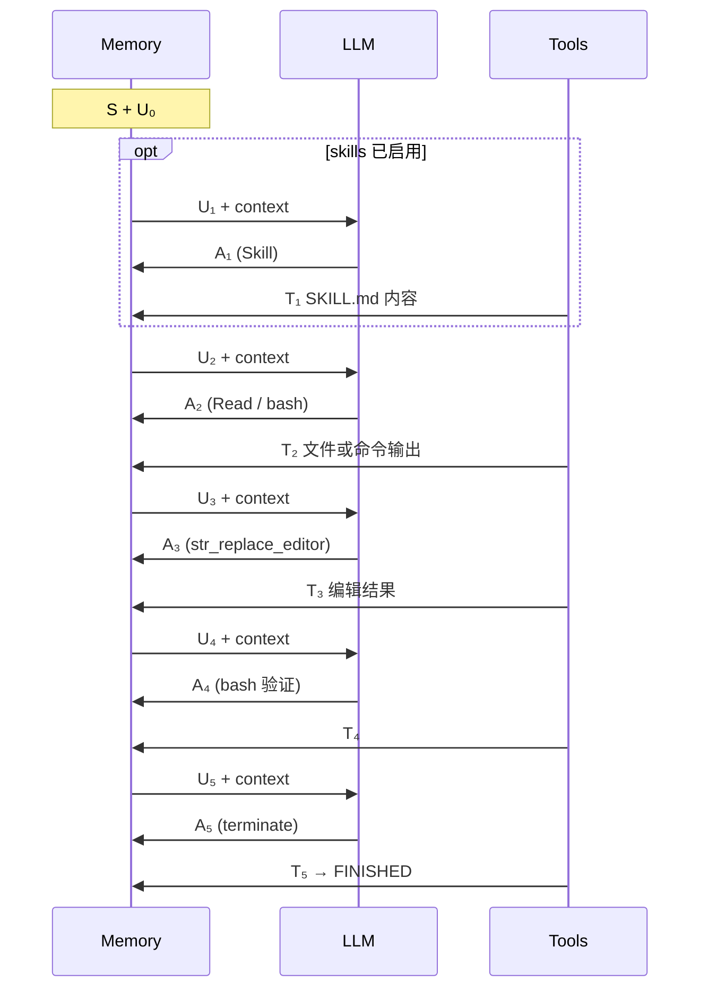

**说明**：若出现连续 **assistant-only** 的 `Aₙ`（无 tool call），表示模型在复述结论而未收敛；应通过 **nextStepPrompt** 约束「完成后仅调用 `terminate`」。工程 Agent 的 **NEXT_STEP_PROMPT** 已包含此类 **convergence** 规则。

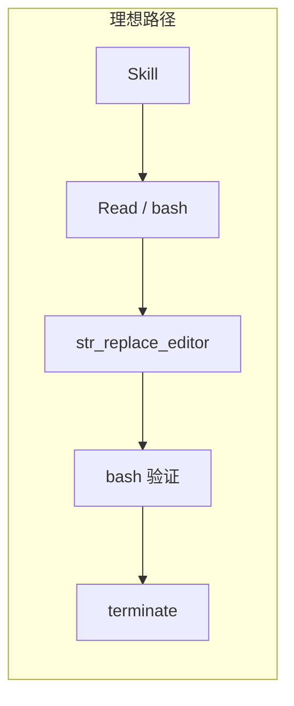

---

## Skills 机制

Janus 支持通过 **`SKILL.md`** 为 Agent 注入领域指令；当配置目录下存在至少一个 `SKILL.md` 时，自动注册 **skills tools**，否则 skills 能力整体关闭。

### 目录约定

采用「全局 + Agent 专属」两层配置：

| 配置项 | 含义 |
|--------|------|
| `janus.agent.default.skills.dir` | 全局通用技能（如 `.agent/default/skills`） |
| `janus.agent.<agent>.skills.dir` | 某 Agent 专属技能（如 `.agent/swe/skills`） |

每个技能子目录下需包含 **`SKILL.md`**。

### 注入的 Tools

| Tool | 来源 | 作用 |
|------|------|------|
| `Skill` | `SkillsTool` | 加载指定技能说明 |
| `Read` 等 | `FileSystemTools` | 读取文件 |
| Shell 相关 | `ShellTools` | 命令执行 |

skills 工具与 built-in tools 共用同一 **think → act** 链路，消息序列仍为 `Uₙ → Aₙ → Tₙ`。

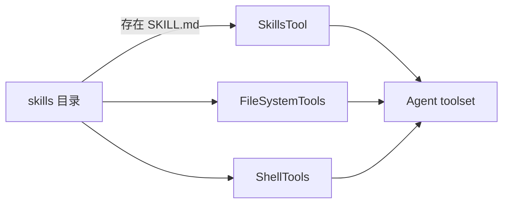

---

## 规划编排 Flow

当任务需**先分解计划、再分派至不同 Agent** 时，使用 **PlanningFlow**（与单 Agent `run` 并列）。

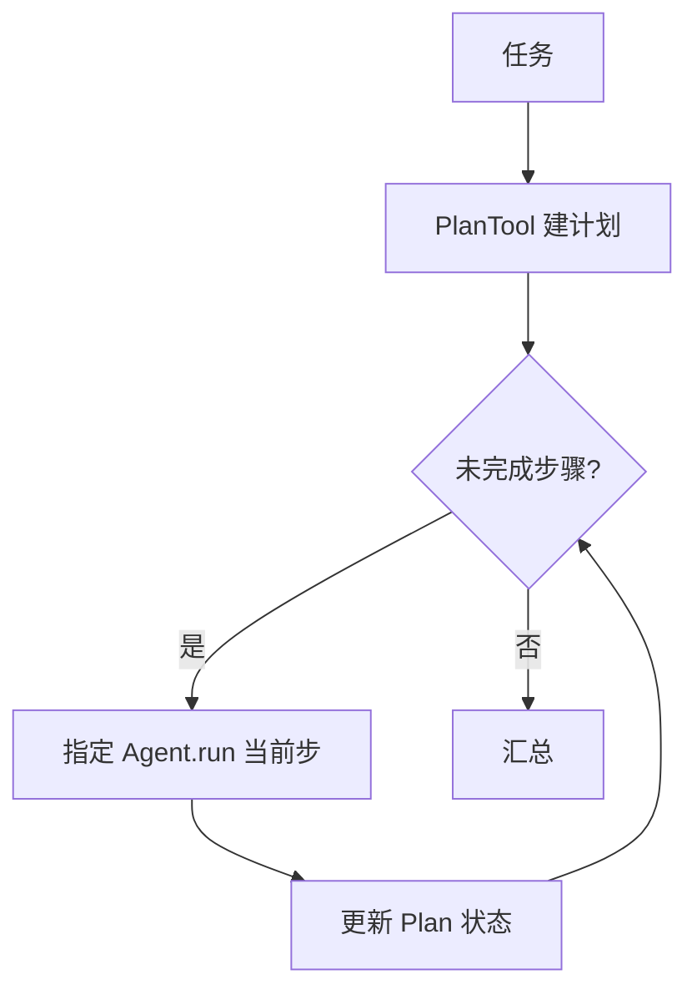

与单 Agent 的差异：**下一步执行者与动作**由 **Plan** 驱动，而非同一 Agent 在单步内连续自选多个 tool。

---

## Session、Context 与 Memory

| 概念 | 粒度 | 职责 |
|------|------|------|
| **Session** | 跨多次 request | 维持任务连续性；可写入 session-level 摘要 |
| **Context** | 单次 request | 承载本轮 think/act 中间状态（如 `currentChatPrompt`） |
| **Memory** | step / turn / session | 对话历史的分层沉淀 |

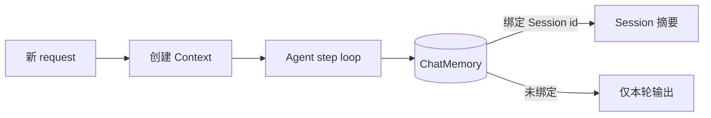

### Session 运行机制（更具体）

在 shell service 中，`sessionId` 是否传入会决定两条不同路径：

| 场景 | 运行路径 | 行为 |
|------|----------|------|
| 传入 `sessionId`（如 `-c demo`） | `runPersistent` | 复用/创建 `ToolCallSession`，结束后将本轮摘要写入 session memory |
| 未传入 `sessionId` | `runEphemeral` | 创建一次性 context，执行后立即清理 chat memory，不保留跨轮状态 |

#### 1) Session 的创建与复用

- `sessionId` 会先标准化（trim；空字符串视为无 session）；
- 持久会话的 key 由 `modelKey + ":" + sessionId` 组成；
- 同 key 会复用同一个 `ToolCallSession`，不同 model 或不同 sessionId 互相隔离；
- 首次创建会话时，会绑定当前 agent 的 `summarySystemPrompt`，用于后续摘要提取。

#### 2) 每轮请求如何“继承历史”

- `beginPrompt(request)` 会先把 session memory 中已沉淀的消息 hydrate 到本轮 `ToolCallUserContext`；
- 本轮 step loop 在此基础上继续追加 `U₀ / Aₙ / Tₙ`；
- 因此同一 session 的后续请求能够看到前序关键结论，而非从空白上下文开始。

#### 3) 每轮结束如何“写回 session”

- `endPrompt(runResult)` 会触发 `PromptRunSummarizer`：
  - 输入：本轮 request + 本轮 prompt messages + runResult；
  - 输出：精简的 user request / agent result 摘要；
- 仅当摘要非空时，才写入 session memory（通常是一对 `UserMessage + AssistantMessage`）；
- 目标是保留可复用结论，避免将每一步临时推理与噪声原样累积到长会话。

#### 4) 失败与清理

- 若本轮抛异常，仍会执行 `endPrompt()`（无 runResult 版本）做收尾；
- 显式清理会话（`clearSession`）会删除会话缓存与对应 memory，并清理该会话下的 bash session；
- ephemeral 路径每次执行后都会 `chatMemory.clear(contextId)`，确保一次性请求不残留状态。

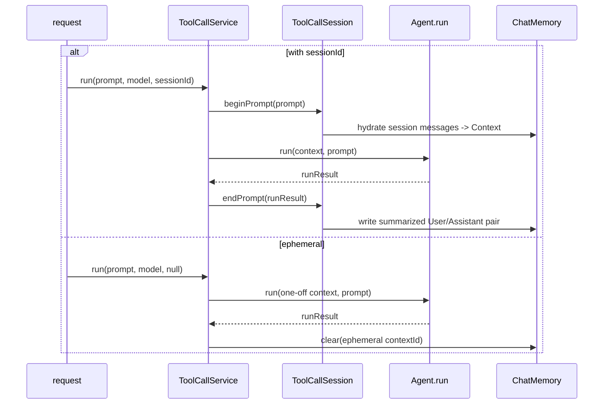

### Memory 分层

- **step-level**：服务于下一步 **think**，生命周期最短；
- **turn-level**：保留本轮关键 **U₀ / Aₙ / Tₙ**；
- **session-level**：跨轮保留结论与产物路径摘要。

**原则**：将可复用结论写入 **Session**，将 **nextStepPrompt** 等引导性内容限制在 **Context** 内（ephemeral），避免长会话被步骤噪声污染。
