# Agent 架构与流程

> [English](AGENT-FLOW.en.md) · 常见问题见 [docs/FAQ.md](../../docs/FAQ.md)

**阅读顺序**：[术语](#术语) → [符号](#符号) → [UserContext](#usercontext用户会话上下文) → Agent / ToolCall → [Flow](#flow多-agent-编排) → [典型调用](#典型调用)。

**类继承**：`BaseAgent` ← `ReactAgent` ← `ToolCallAgent`（入口为 `agent.run(context, prompt)`）。编排层：`BaseFlow` ← `PlanningFlow`。

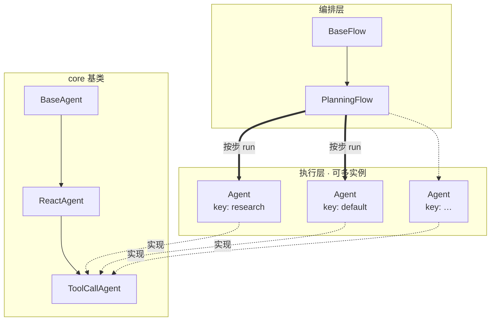

---

## 术语

| 术语 | 定义 |
|------|------|
| **Agent** | 执行多步任务的对象，实现 `run(context, request)` 与 `step(context)`；含状态机（`AgentState`）与策略（系统提示、工具、最大步数）。 |
| **BaseAgent / ReactAgent / ToolCallAgent** | Agent 继承链：基类循环 → ReAct（think/act）→ 带 Spring AI 工具调用的具体实现。 |
| **UserContext** | 单次用户对话在运行 Agent 时的会话载体：对话 id、对 `ChatMemory` 的引用、步计数及（可选）步内中间状态。 |
| **BaseUserContext** | 通用 UserContext，负责消息分区读写与 `isStuck` 等。 |
| **ToolCallUserContext** | `ToolCallAgent` 专用 UserContext，额外保存本步 `ChatResponse`、待执行 `ToolCall` 等。 |
| **LLMChatClient** | 无会话状态的模型访问层：`askWithTools(context, …)` 从 context 组装 Prompt 并调用 `ChatModel`。 |
| **ChatModel** | Spring AI 接入的大模型（如 SenseNova OpenAI 兼容 API）。 |
| **ChatMemory** | 按 `conversation` 字符串分区存储 `Message` 列表的组件（如 `MessageWindowChatMemory`）。 |
| **conversation** | UserContext 中的对话标识，用作 ChatMemory 分区 key；由调用方在创建 Context 时指定（如 `demo`、`conv-1`）。 |
| **run** | Agent 对外入口：`run(BaseUserContext, request)`，内部循环调用 `step` 直至结束或达到 `maxSteps`。 |
| **step** | Agent 单步逻辑；`ReactAgent` 中定义为 `think` 后可选 `act`。 |
| **think / act** | ReAct 两阶段：`think` 调用模型并决定是否执行工具；`act` 执行工具或回显文本。 |
| **Flow** | 在多个 Agent 之上编排任务阶段的组件（如 `PlanningFlow`：建计划 → 分步执行 → 总结）。 |

---

## 符号

文档中的消息序列与流程图使用下列缩写（下标 `n` 为 Agent 循环中的步序号，从 1 起；`0` 表示 `run` 开始时写入的初始用户消息）。

| 符号 | 含义 | Spring AI 类型 |
|------|------|----------------|
| **S** | 系统提示（每个 conversation 分区首次 run 时写入一次） | `SystemMessage` |
| **U₀** | `run(context, request)` 中 `request` 对应的用户消息 | `UserMessage` |
| **Uₙ** | 第 `n` 步 think 前追加的用户侧提示（如 `nextStepPrompt`） | `UserMessage` |
| **Aₙ** | 第 `n` 步模型助手回复 | `AssistantMessage` |
| **Tₙ** | 第 `n` 步工具执行结果（写入后常伴随 `replaceMemory` 整段替换） | `ToolResponseMessage` |

**单步 Memory 展开（ToolCallAgent，含工具时）**：

```text
…, Uₙ → Aₙ → Tₙ
```

**`run` 首次建立分区后的典型前缀**：

```text
[S, U₀] → … 后续各步 …
```

流程图节点中的 `Memory +=` 表示向当前 `conversation` 分区追加或替换消息，实际操作经 `UserContext` 完成。

---

## UserContext（用户会话上下文）

### 定义

**UserContext** 封装**一条逻辑对话**在调用 Agent 时的状态：分区名（`conversation`）、`ChatMemory` 引用、当前步序号，以及子类扩展字段（如工具调用的步内缓存）。

标准调用形式：

```text
agent.run(userContext, request)
```

其中 `request` 为本轮用户输入；历史消息通过 `userContext` 所指向的 ChatMemory 分区读取与更新。

### 设计动机

| 动机 | 说明 |
|------|------|
| 多会话隔离 | 同一进程内多条对话各自持有 UserContext 与独立 Memory 分区，共享同一 Agent 实例。 |
| Agent 与数据解耦 | Agent 描述行为策略；会话数据由 UserContext + ChatMemory 持有，便于复用与测试。 |
| 无状态 Client | `LLMChatClient` 不内置 Memory，每次调用显式传入 UserContext，避免会话绑定在客户端上。 |

### 组件协作

| 组件 | 职责 | 会话状态 |
|------|------|----------|
| **Agent** | 多步 `run` / `step`，think/act，终止条件 | 无（仅 `AgentState` 等运行期字段） |
| **LLMChatClient** | 组装 Prompt、调用 `ChatModel`、注册 tools | 无 |
| **ChatMemory** | 持久化多轮 `Message` 列表 | 按 `conversation` 分区 |
| **UserContext** | 绑定分区名、步计数、步内中间态；提供 memory API | 有 |

```text
request ──► UserContext
                 ├── ChatMemory[conversation]  ← S, U, A, T
                 └── Agent.run(context, request)
                          └── LLMChatClient.askWithTools(context, …) ──► ChatModel
```

### 实现类型

| 类型 | 适用场景 | 主要字段与行为 |
|------|----------|----------------|
| **`BaseUserContext`** | 通用 Agent；Flow 规划阶段临时对话 | `conversation`、`chatMemory`、`currentStep`；`addUserMemory`、`getAllMessages`、`isStuck` |
| **`ToolCallUserContext`** | `ToolCallAgent` | 继承基类；增加 `currentChatResponse`、`currentToolCalls` 等；`clearStepState()` 在每步 act 后清空步内字段 |

工厂方法：`BaseAgent.createUserContext(conversationId, chatMemory)`；`ToolCallAgent` 返回 `ToolCallUserContext`。`PlanningFlow.setupExecutors` 对每个 executor Agent 调用该工厂。

### 生命周期与复用

| 模式 | 做法 |
|------|------|
| 单次调用 | `new ToolCallUserContext(conversationId, chatMemory)` → `agent.run(context, prompt)`；若不再复用，可 `chatMemory.clear(conversationId)`。 |
| 同进程续聊 | 复用同一 `ToolCallUserContext` 实例（或相同 `conversation` 的新实例指向同一 `ChatMemory`），多次 `run` 追加 **U₀** 到同一分区。 |
| 多对话并行 | 多个 `conversation` 分区 + 可选多个 Context 实例；同一 `ToolCallAgent` 可依次或交替 `run`。 |

Context 的创建、缓存与销毁由**集成方**（应用服务、测试等）负责，core 不规定进程级 Map 结构。

### 类结构

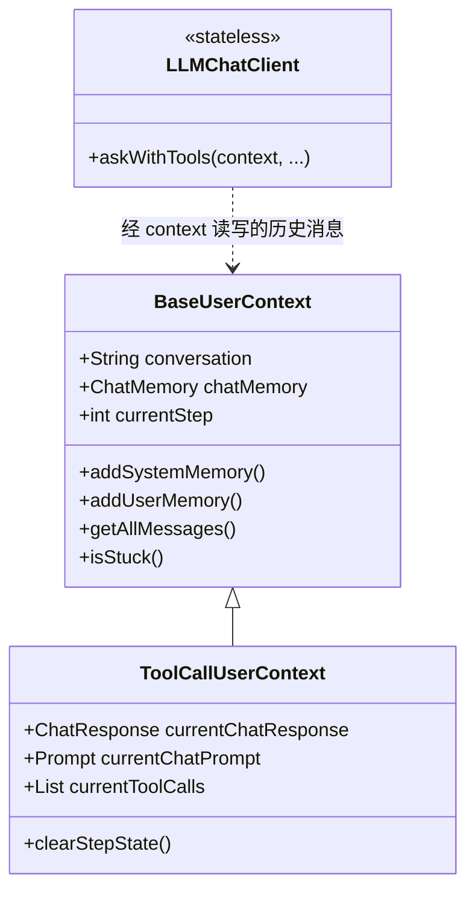

---

## BaseAgent

所有 Agent 的基类：实现 `run(context, request)` 多步循环（状态机、经 context 写入 **S** / **U₀**、调用 `step(context)`、`isStuck` 检测）。须传入与 Agent 类型匹配的 UserContext（见 [UserContext](#usercontext用户会话上下文)）。

### 架构

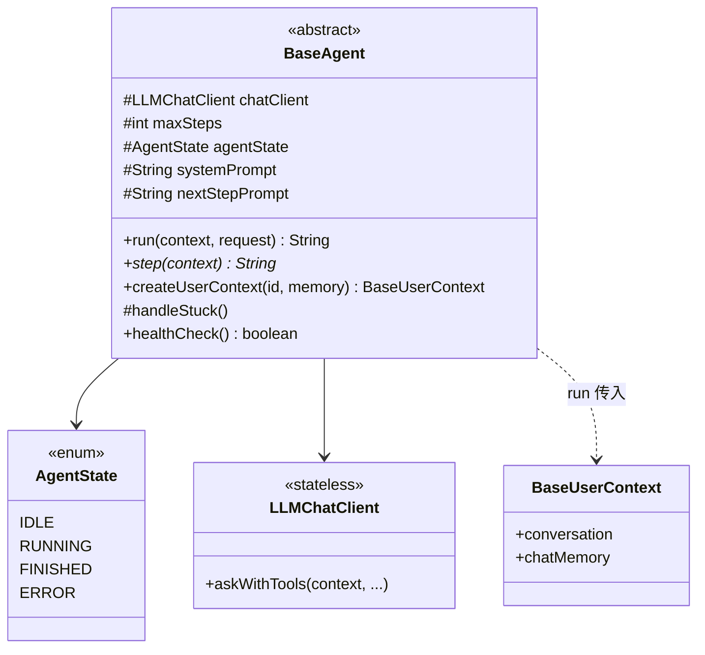

| 职责 | 说明 |
|------|------|
| `run` | `run(BaseUserContext, request)`；管理 `IDLE→RUNNING→…` |
| memory 初始化 | 经 `context`：先 `S`，再本轮 `U`（`request` 非空时） |
| 循环 | `step(context)` × `maxSteps`，步末 `context.isStuck` |
| `step` | 抽象，由子类定义 |

### Flow

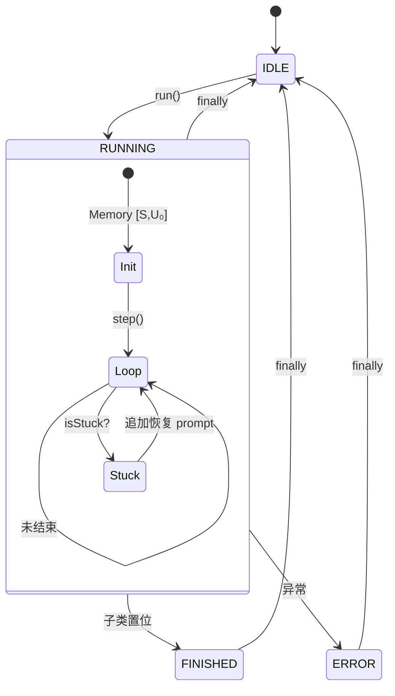

---

## ReactAgent

在 `BaseAgent` 上固定 **ReAct 骨架**：`step = think → act?`。

### 架构

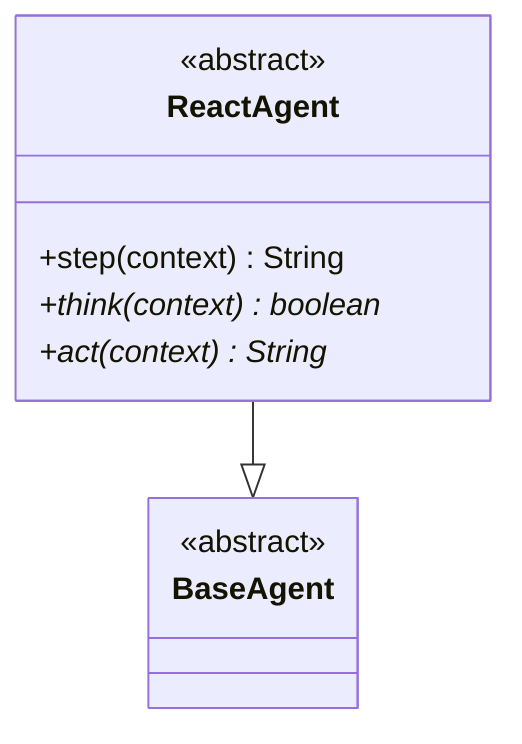

| 方法 | 作用 |
|------|------|
| `think` | 推理；返回是否进入 `act` |
| `act` | 执行；返回本步结果字符串 |
| `step` | `think` 为 false 时直接返回 `"Thinking complete…"` |

### Flow

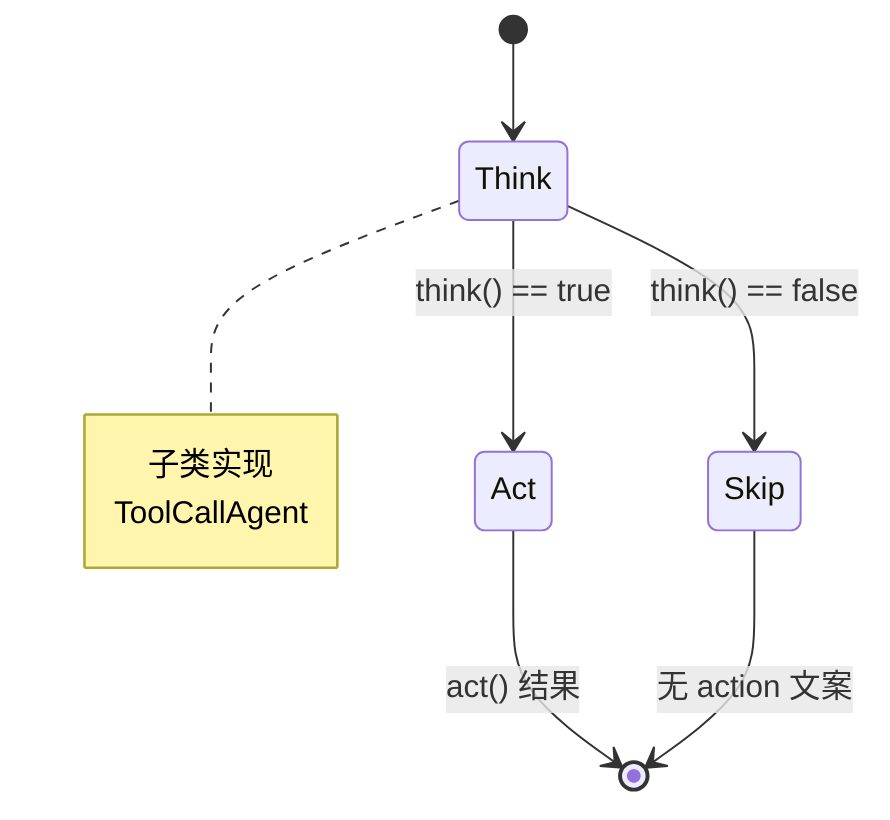

---

## ToolCallAgent

具体实现：调模型（带 tools）、解析 `Aₙ`、执行或回显。Janus 默认使用的 agent。

### 架构

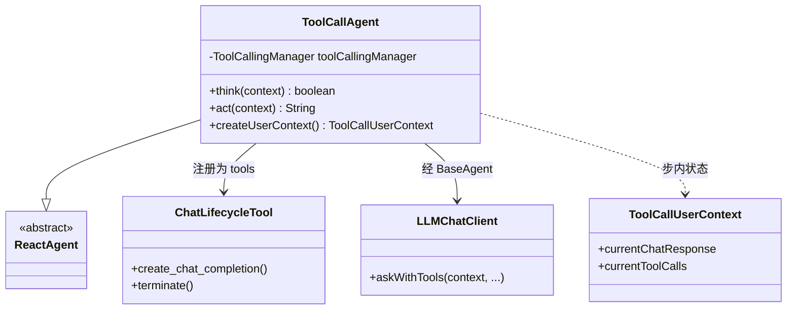

| 组件 | 说明 |
|------|------|
| `ChatLifecycleTool` | 模型可见的 `create_chat_completion`、`terminate` |
| `think` | `askWithTools(context, …)` → 写 `Aₙ` 入 context 的 Memory 分区；步内字段写入 `ToolCallUserContext` |
| `act` | 无 tool 回显 text；有 tool 则 `context.replaceMemory` |

### Flow

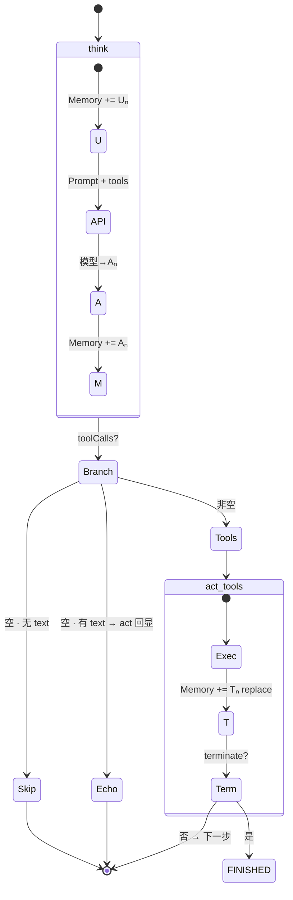

**Memory 一步**

```text
[S,U₀] → +Uₙ → Aₙ → +Aₙ → (+Tₙ 若有 tool)
```

| `toolCalls` | 本步后 Memory | 会结束吗 |
|-------------|---------------|----------|
| `[]` + text | `…,Uₙ,Aₙ` | 否 |
| 含 `terminate` | `…,Uₙ,Aₙ,Tₙ` | 是 |

---

## Flow（多 Agent 编排）

Flow 在 **core** 中实现，对齐 OpenManus `app.flow`：在多个 `BaseAgent` 之上编排「建计划 → 按步执行 → 总结」，单步仍走各 Agent 的 `run` / ReAct 循环。

调用方构造 `PlanningFlow` 与 `PlanningFlowUserContext`，执行 `execute(context, input)` 即可；单 Agent 场景仍可直接 `agent.run`。

下图约定：**实线箭头** 表示调用/命令传递，**虚线箭头** 表示数据（消息、计划状态、分区引用）流动。

### BaseFlow：多 Agent 注册

`BaseFlow` 持有 `Map<String, BaseAgent> agents`，由 `getExecutor(stepType)` 按步骤中的 `[agent_key]` 或 `executorKeys` 选择其中一个 Agent 执行。

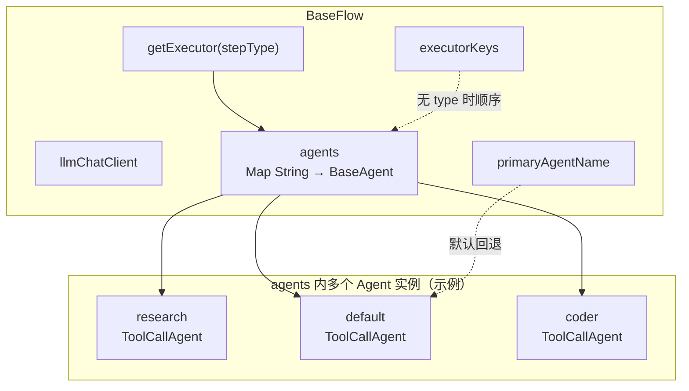

| 连接 | 含义 |
|------|------|
| `agents` → 各 Agent 方块 | 构造 Flow 时注册；key 与计划步骤 `[research]` 等前缀对应。 |
| `getExecutor` → `agents` | 根据 `Plan.parseStepType` 解析出的 `type` 选取 Agent。 |
| `llmChatClient` | Flow 级客户端；建计划 / 总结阶段调用模型（与各 executor Agent 内的 client 可共用同一 `ChatModel`）。 |

### PlanningFlow：组件拓扑

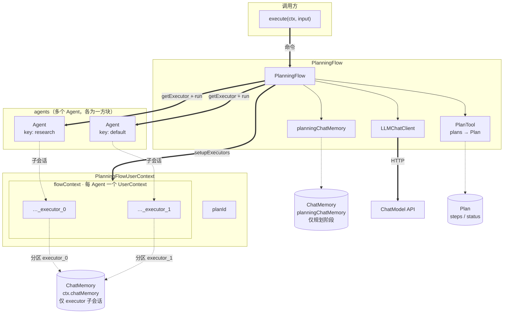

### PlanningFlow：命令流

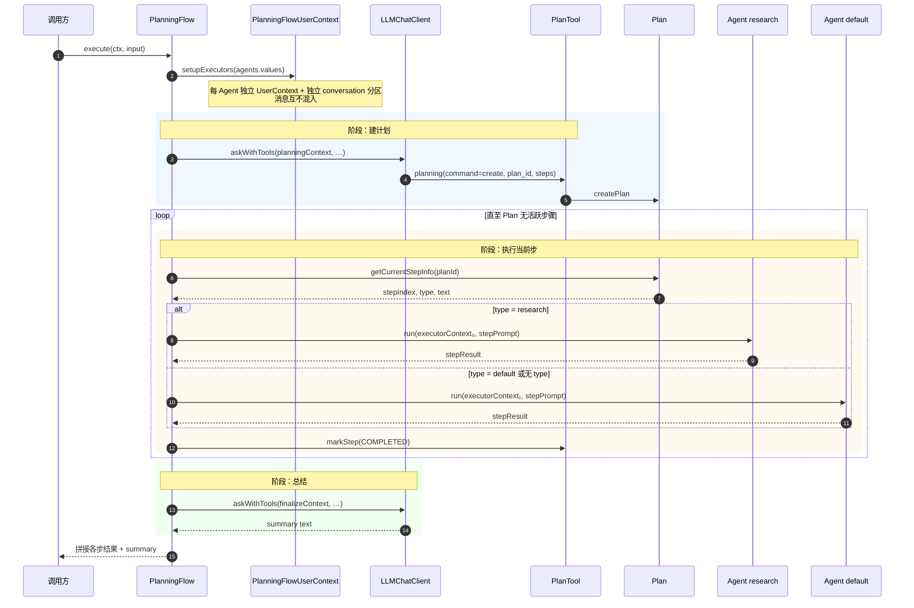

### PlanningFlow：数据流

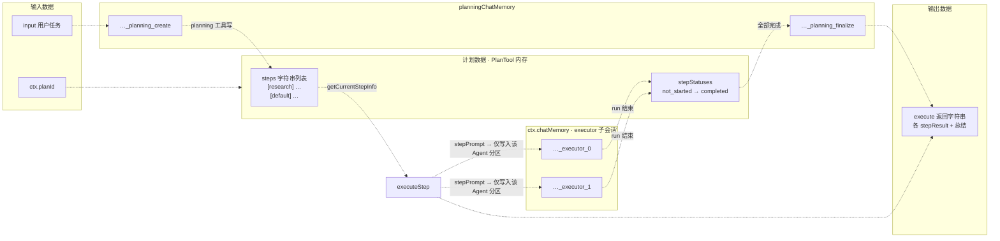

| 数据 | 路径 |
|------|------|
| 用户任务 `input` | 进入建计划 Prompt → 可能落入 `Plan.steps` |
| 计划步骤 | `PlanTool` / `Plan` 对象；`getCurrentStepInfo` 选出当前步文案与 `type` |
| 步骤执行 Prompt | `STEP_EXECUTION_PROMPT` + `plan.format()` → 写入对应 executor 分区的 **U**，再产生 **A/T** |
| 总结 | `finalize` 分区读 Plan 全文 → 模型生成 summary 文本 |

### 类关系

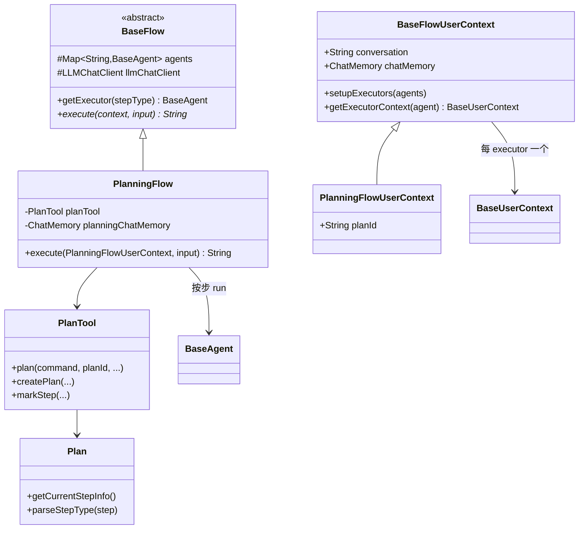

| 类 | 职责 |
|----|------|
| `BaseFlow` | 注册多个 Agent（`Map<String, BaseAgent>`）、主 Agent、`getExecutor(stepType)` |
| `PlanningFlow` | 建计划、循环执行当前步、`finalizePlan` |
| `BaseFlowUserContext` | Flow 级 `conversation`；`setupExecutors` 为每个 executor 建独立 `UserContext`（独立 **子会话分区**，共用 `chatMemory` 引用） |
| `PlanningFlowUserContext` | 增加 `planId`（默认 `{conversation}_plan`）及计划生命周期标记 |
| `PlanTool` | 内存计划存储；暴露 `planning` 工具给建计划阶段的 LLM |
| `Plan` | 步骤列表、状态、`getCurrentStepInfo()` |

### 执行阶段（控制分支）

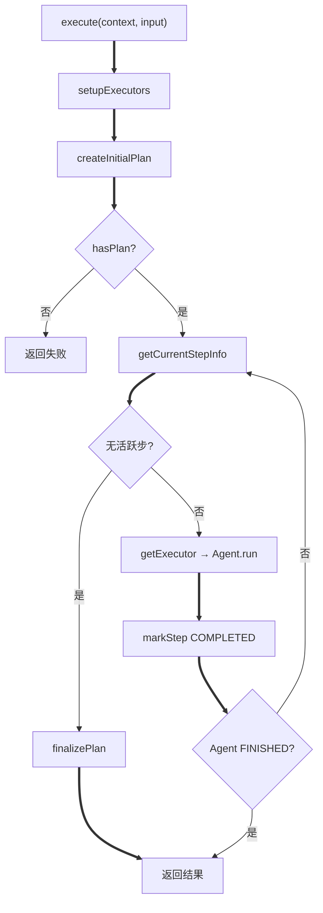

阶段说明：

| 阶段 | 行为 |
|------|------|
| **建计划** | 使用 **`planningChatMemory`**（非 executor 的 `chatMemory`）；分区 `{conversation}_planning_create`。`askWithTools` + `PlanTool`；须带 `plan_id`。失败则 `createDefaultPlan`。 |
| **执行步** | `Plan.getCurrentStepInfo()` 取第一个 `not_started` / `in_progress` 步，并标为 `in_progress`；拼 `STEP_EXECUTION_PROMPT` 交给对应 executor 的 `run`。 |
| **选执行者** | 步骤文案若含 `[agent_name]`，经 `Plan.parseStepType` 得到 `type`，`BaseFlow.getExecutor(type)` 匹配 `agents` 的 key（忽略大小写）；否则按 `executorKeys` 顺序或 primary agent。 |
| **结束** | 无活跃步时 `finalizePlan`；某步 executor 进入 `FINISHED` 时提前跳出循环。 |

### Plan 与 PlanTool

**`plan_id`**：除 `list` 外，所有 `planning` 命令都必须带显式 `plan_id`（无「当前活跃计划」概念）。

**步骤 `steps`**：`List<String>`，每条为短描述；多 Agent 时建议在文案前加 **`[agent_key]`**（与 `BaseFlow` 里注册的 key 一致，如 `[default]`、`[agent_0]`），供 `getExecutor` 路由。

示例：

```text
[research] 收集需求与约束
[default] 实现核心逻辑
[default] 自检并整理输出
```

**步骤状态**（`Plan.StepStatus`）：

| id | 符号 | 是否「待执行」 |
|----|------|----------------|
| `not_started` | `[ ]` | 是 |
| `in_progress` | `[→]` | 是 |
| `completed` | `[✓]` | 否 |
| `blocked` | `[!]` | 否 |

`getCurrentStepInfo()` 返回 `(stepIndex, {text, type?})`；全部非活跃步时返回 `(-1, {})`，Flow 进入总结。

**PlanTool 命令**：`create` · `update` · `list` · `get` · `mark_step` · `delete`（见 `PlanTool.plan` 的 `@Tool` 描述）。

### Context 与子 Agent 会话（Memory）

PlanningFlow 中**不同 executor Agent 不会共用同一条消息历史**。实现上分两层：

| 层级 | 说明 |
|------|------|
| **ChatMemory 实例** | Executor 使用 `PlanningFlowUserContext` 传入的 **`chatMemory`**；建计划 / 总结使用 `PlanningFlow` 内部的 **`planningChatMemory`**（另一实例）。二者消息**物理上不在同一存储对象里**。 |
| **conversation 分区（子会话）** | 在同一 `ChatMemory` 实例内，用不同 **分区名** 区分逻辑会话；`getAllMessages()` 只读当前 Context 的分区，**不会读到其他 Agent 的分区**。 |

**Executor 子会话**（`setupExecutors` 创建，共享 `ctx.chatMemory`，分区互不重叠）：

| 分区名 | 绑定对象 | 内容 |
|--------|----------|------|
| `{conversation}_executor_0` | 第 1 个 Agent 的 `UserContext` | 该 Agent 历次 `run` 的 **S / U / A / T** |
| `{conversation}_executor_1` | 第 2 个 Agent 的 `UserContext` | 同上，与 `_executor_0` **隔离** |
| … | 按注册顺序递增 | 每个 Agent 方块对应一个分区 |

`setupExecutors` 对每个 `BaseAgent` 调用 `agent.createUserContext(executorConv, chatMemory)`，其中 `executorConv = conversation + "_executor_" + i`（`ToolCallAgent` 得到 `ToolCallUserContext`）。

**规划阶段会话**（`PlanningFlow.planningChatMemory`，与 executor 存储分离）：

| 分区名 | 阶段 |
|--------|------|
| `{conversation}_planning_create` | `createInitialPlan`：LLM + `PlanTool` |
| `{conversation}_planning_finalize` | `finalizePlan`：生成总结 |

```text
PlanningFlowUserContext.chatMemory          PlanningFlow.planningChatMemory
 ├── conv_executor_0  ← Agent A 仅读写此处    ├── conv_planning_create
 ├── conv_executor_1  ← Agent B 仅读写此处    └── conv_planning_finalize
 （Agent A 看不到 executor_1 / planning 分区）  （规划消息不进入 executor 分区）
```

若某步由 `research` Agent 执行，仅 `{conversation}_executor_k`（与该 Agent 绑定的那一格）增长消息；`default` Agent 的分区不变，直至轮到其执行步骤。

### 与单 Agent 的关系

```text
PlanningFlow.execute(context, userTask)
  ├─ createInitialPlan     → LLMChatClient（挂 PlanTool）+ planningChatMemory
  └─ 每步 executeStep     → BaseAgent.run(executorContext, stepPrompt)
                                └─ ReactAgent step → think / act（同 ToolCallAgent 文档）
```

Flow 不替代 `ToolCallAgent.run`，而是在其之上增加计划与分步调度；每一步仍进入对应 executor 的完整 `run` 循环。

---

## 典型调用

### 单 Agent（ToolCall）

```java
ChatMemory memory = MessageWindowChatMemory.builder().build();
LLMChatClient client = new LLMChatClient(chatModel, List.of());
ToolCallAgent agent = new ToolCallAgent(client, maxSteps);

ToolCallUserContext ctx = new ToolCallUserContext("conv-1", memory);
String out = agent.run(ctx, "用户任务");
```

```text
createUserContext / new ToolCallUserContext
  → agent.run(context, request)
       → step → think → LLMChatClient.askWithTools(context, …)
       → act  → 工具 / terminate
```

### 多 Agent（PlanningFlow）

```java
PlanningFlow flow = new PlanningFlow(
        llmChatClient,
        Map.of("research", researchAgent, "default", defaultAgent),
        "default");
PlanningFlowUserContext ctx = new PlanningFlowUserContext("conv-1", sharedChatMemory);
String result = flow.execute(ctx, "完成某某任务");
```

详见上文 [Flow（多 Agent 编排）](#flow多-agent-编排)。
