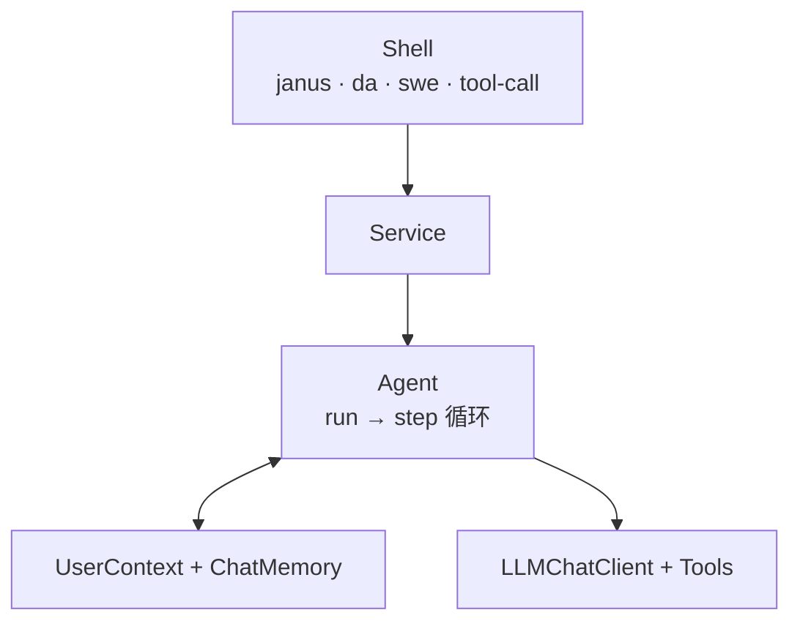
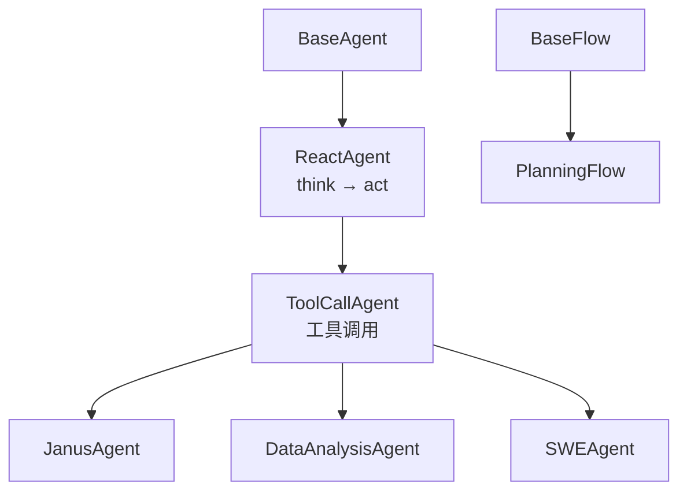
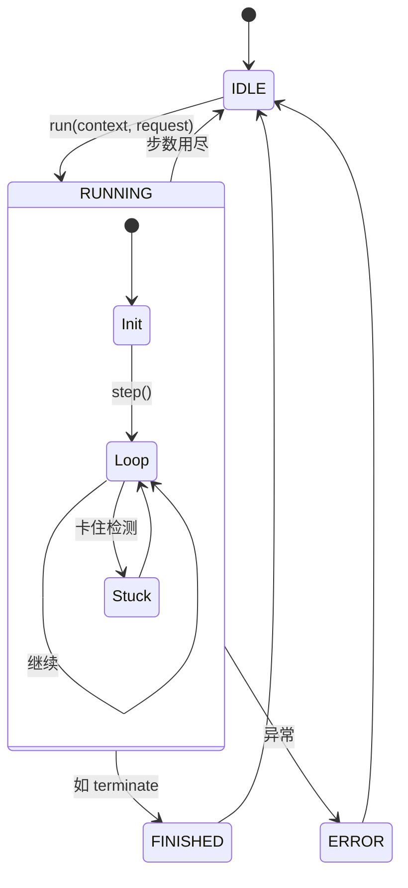
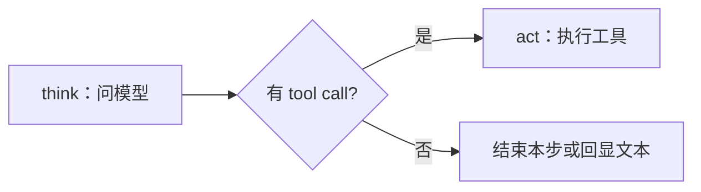
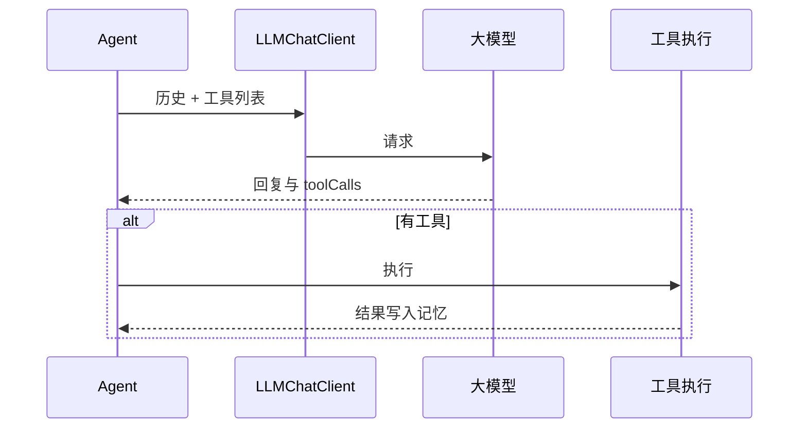
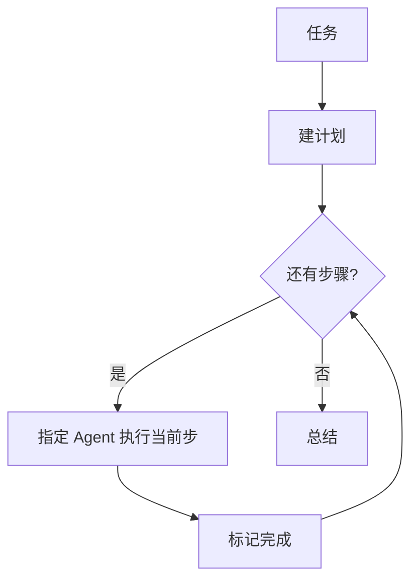

# Agent 框架与流程

> [English](AGENT-FLOW.en.md) · Shell 用法与案例：[shell/docs/SHELL.md](../../shell/docs/SHELL.md) · 排错：[docs/FAQ.md](../../docs/FAQ.md)

Janus **core** 提供 Agent 与 Flow；**shell** 提供命令行入口。下面先说明 Agent 在做什么，再按执行顺序介绍框架结构与流程图。

---

## Agent 是什么

在 Janus 里，**Agent** 是一个会「多步完成任务」的程序组件：你给它一段自然语言需求（`request`），它会在限定步数内反复向大模型提问，并在需要时**调用工具**（执行 Python、改文件、跑 bash、画图等），直到认为任务完成或步数用尽。

可以把它理解成一条固定流水线：

1. **理解当前目标**（结合系统提示与历史对话）；
2. **决定本步做什么**——只说话，还是调用某个工具；
3. **执行并拿到结果**，写进对话记忆，进入下一步。

这种模式通常叫 **ReAct**（Reason + Act）：先想，再动。Janus 里所有面向任务的 Agent 都走这条主线；差别主要在于**配了哪些工具**、**系统提示怎么写**。

一次调用返回多行 `Step 1:`、`Step 2:` …，对应上面的每一轮循环。集成方（例如 Shell 里的 Service）只需调用 `agent.run(context, request)`，不必自己拼模型请求或解析 tool call。

除单 Agent 外，core 还提供 **Flow**：先把大任务拆成计划，再按步骤交给不同的 Agent 执行（见后文 PlanningFlow）。

---

## 在整体中的位置

从外到内，一条用户任务大致经过：**Shell 命令 → Service → Agent → 大模型与工具**。Agent 只负责中间的推理与工具编排；会话怎么缓存、用哪个模型，由外层 Service 决定。

CLI 如何把参数交给 `agent.run`，见 [SHELL.md](../../shell/docs/SHELL.md)。

---

## 代码结构（继承关系）

实现上，Agent 是一条继承链，上层管「跑多少步、何时结束」，下层管「怎么向模型要 tool call、怎么执行工具」。

- **BaseAgent**：`run` 循环、状态（运行中 / 已结束 / 错误）、步数上限。
- **ReactAgent**：把每一步拆成 `think` 和 `act`。
- **ToolCallAgent**：对接 Spring AI 的工具调用；Janus / DA / SWE 在此基础上换不同的工具集与提示词。
- **PlanningFlow**：不替代 Agent，而是在多个 Agent 之上做计划与分步调度。

---

## 几种 Agent

项目里预置了多套 Agent，面向不同场景；Shell 里用不同命令组调用它们。

| Agent | Shell 命令组 | 适合做什么 | 主要工具 |
|-------|--------------|------------|----------|
| **ToolCallAgent** | `tool-call` | 最小对话：作答 + 结束 | `create_chat_completion`、`terminate` |
| **JanusAgent** | `janus` | 通用任务、可拆计划 | `plan`、Python、文件编辑、`ask_human`、`terminate` |
| **DataAnalysisAgent** | `da` | 读表、统计、出图 | Python、`visualization_preparation`、`data_visualization`、`terminate` |
| **SWEAgent** | `swe` | 在终端里改代码、跑命令 | `bash`、`str_replace_editor`、`terminate` |

均可额外挂载 **MCP 工具**。步数上限等参数在配置里按 Agent 分别设置（Shell 侧见 [SHELL.md](../../shell/docs/SHELL.md)）。

---

## 一次 `run` 里发生什么

调用 `agent.run(context, request)` 后，Agent 进入运行状态：若是该会话第一次跑，会先写入系统提示（**S**）和本轮用户话（**U₀**）；然后进入步循环，每步调用 `step`，把结果拼成 `Step N: …`。

正常结束通常是模型调用了 **`terminate`**；也可能跑满 `maxSteps` 仍未结束。若模型连续输出重复内容，框架会注入恢复提示，避免空转。

---

## 每一步：think 与 act

在 **ReactAgent** 里，一步就是先 **think** 再决定是否 **act**。

- **think**：把历史消息和工具定义发给模型；模型返回文字，以及可选的 tool call 列表；结果记入对话（**Aₙ**）。
- **act**：若有 tool call，则执行工具，把结果写回记忆（**Tₙ**）；若调用了 `terminate`，整次 `run` 结束。若没有 tool call 但有文字，有时会把文字当作本步输出。

**ToolCallAgent** 的 think / act 与模型、工具执行器之间的交互如下：

每步 think 前还可注入简短的 **nextStepPrompt**（记作 **Uₙ**），提醒模型「本步该怎么选工具」；具体文案由各 Agent 类配置。

---

## 对话消息符号

阅读日志或排查记忆时，文档里常用缩写指代消息类型：

| 符号 | 含义 |
|------|------|
| **S** | 系统提示 |
| **U₀** | 本轮 `request` |
| **Uₙ** | 每步前的 nextStep 提示 |
| **Aₙ** | 模型助手回复 |
| **Tₙ** | 工具返回 |

有工具时，单步记忆大致是：`… → Uₙ → Aₙ → Tₙ`。

---

## PlanningFlow：先计划，再分派

当任务需要**先拆步骤、再让不同专长的 Agent 各做一段**时，使用 **PlanningFlow**（需在代码里组装，Shell 暂无对应命令）。

流程是：用规划对话生成 **Plan**（步骤列表，可标注 `[agent_name]`）→ 循环取「当前未完成步骤」→ 用 `getExecutor` 选中 Agent → 对该步骤执行一次 `agent.run` → 标记完成 → 全部完成后做总结。

与单次 `run` 的差别在于：**下一步做什么、交给谁**，由 Plan 驱动，而不是由同一个 Agent 在一步里自由连续选工具。

---

## 扩展

| 目标 | 做法 |
|------|------|
| 新工具 | 编写带 `@Tool` 的方法，加入某 Agent 的 `builtinTools` |
| 新 Agent | 继承 `ToolCallAgent`，配置提示词与工具列表 |
| 新 CLI | 新增 `*Service` + `*Command` 调用该 Agent |

相关包：`com.wish.agent`、`com.wish.flow`、`com.wish.tools`、`com.wish.llm`。
