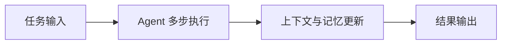
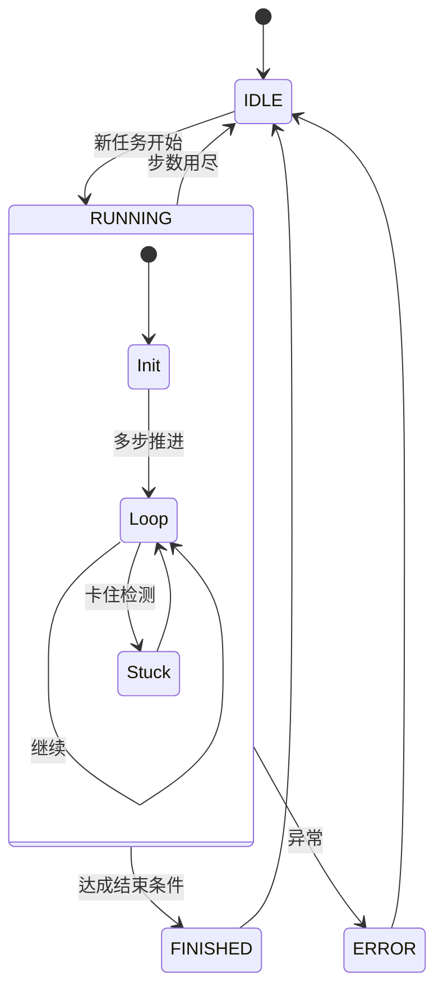
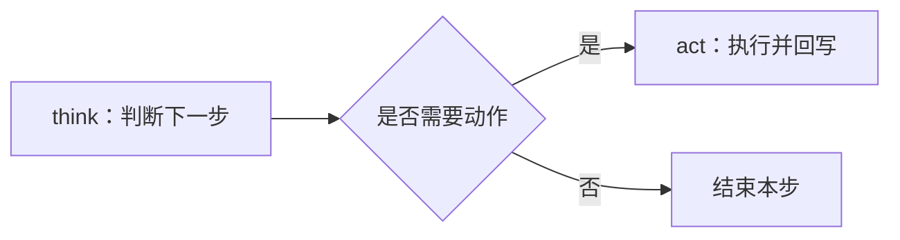
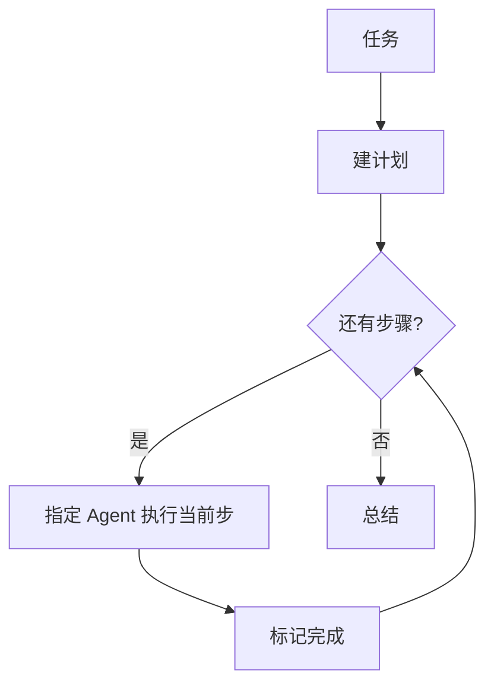
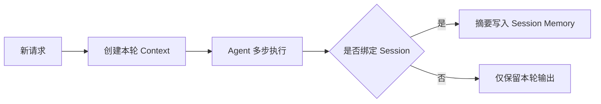

# Agent 框架与流程

> [English](AGENT-FLOW.en.md) · 排错：[docs/FAQ.md](../../docs/FAQ.md)

本文只介绍 Janus **core** 的能力与流程，不涉及 CLI 入口和代码实现细节。

---

## Agent 是什么

在 Janus 里，**Agent** 是一个会「多步完成任务」的能力单元：接收自然语言目标后，在限定步数内持续推进，并在需要时调用能力，直到任务完成或达到上限。

可以把它理解成一条固定流水线：

1. **理解当前目标**（结合系统提示与历史对话）；
2. **决定本步做什么**——只说话，还是调用某个工具；
3. **执行并拿到结果**，写进对话记忆，进入下一步。

这种模式通常叫 **ReAct**（Reason + Act）：先想，再动。Janus 里不同 Agent 共用这条主线，差别主要在任务偏好和能力组合。

除单 Agent 外，core 还提供 **Flow**：先把大任务拆成计划，再按步骤交给不同能力单元执行。

---

## 在整体中的位置

从 core 视角看，一条任务大致经过：**任务输入 → Agent 推理与动作循环 → 结果产出**。

---

## 几种 Agent

core 里预置了多套 Agent，面向不同场景。

| Agent 类型 | 适合做什么 | 典型结果 |
|-----------|------------|----------|
| **基础对话 Agent** | 最小任务闭环 | 直接答复并结束 |
| **通用任务 Agent** | 通用复杂任务 | 拆解后分步完成并汇总 |
| **数据分析 Agent** | 数据读取、统计、可视化 | 分析结论与图表产物 |
| **工程执行 Agent** | 工程与开发任务 | 可执行改动与验证结果 |

不同 Agent 共用同一多步范式，但在决策偏好与能力侧重点上不同。

---

## 一次任务里发生什么

Agent 接收到任务后进入执行状态：先建立当前轮输入，再进入步循环，直到结束或达到步数上限。

正常结束通常是任务目标已满足；也可能达到步数上限而停止。若出现连续重复，系统会增加收敛提示，避免空转。

---

## 每一步：think 与 act

在 ReAct 模式里，一步就是先 **think** 再决定是否 **act**。

- **think**：基于已有上下文判断当前最优动作。
- **act**：执行动作并写回结果，用于下一步继续决策。

---

## 对话消息符号

阅读日志或排查记忆时，文档里常用缩写指代消息类型：

| 符号 | 含义 |
|------|------|
| **S** | 系统提示 |
| **U₀** | 本轮 `request` |
| **Uₙ** | 每步前的 nextStep 提示 |
| **Aₙ** | 模型助手回复 |
| **Tₙ** | 工具返回 |

有工具时，单步记忆大致是：`… → Uₙ → Aₙ → Tₙ`。

---

## 规划编排 Flow：先计划，再分派

当任务需要**先拆步骤、再让不同专长的 Agent 各做一段**时，使用规划编排 Flow。

流程是：先生成计划步骤，再循环执行当前未完成步骤，持续标记进度，直到全部完成并汇总。

与单次 `run` 的差别在于：**下一步做什么、交给谁**，由 Plan 驱动，而不是由同一个 Agent 在一步里自由连续选工具。

---

## Session、Context 与 Memory

这三个概念分别回答三个问题：

- **Session**：跨多轮请求时，任务如何保持连续；
- **Context**：一次请求执行期间，当前可见的信息边界是什么；
- **Memory**：哪些信息会被保留，保留到哪个层级。

### Session（会话）

Session 是跨轮次的连续容器，用于把多次请求串成一条任务线。

- 同一 Session 下，后续请求可以继承前序关键结论；
- 切换 Session id，即开启一条新的任务线，彼此隔离；
- 适合分阶段任务（先分析、再执行、再复盘）。

### Context（上下文）

Context 是“单次请求级”的工作区，服务当前任务执行。

- 每次请求会创建独立 Context；
- 本轮 think/act 的中间状态、工具结果、临时提示都在该分区流转；
- 本轮结束后，Context 可清理，不直接当作跨轮连续记忆。

### Memory（记忆）

Memory 是信息沉淀机制，通常分层使用：

- **步级记忆（step-level）**：服务下一步决策，生命周期最短；
- **轮次记忆（turn-level）**：保留本轮关键输入与输出；
- **会话记忆（session-level）**：保留跨轮继续所需的结论、产物与状态摘要。

核心原则是：**保留结果，不保留噪声**。  
也就是尽量把“可复用结论”沉淀进 Session，把“步骤级引导与临时推理”限制在 Context 内，避免长会话被历史细节污染。
