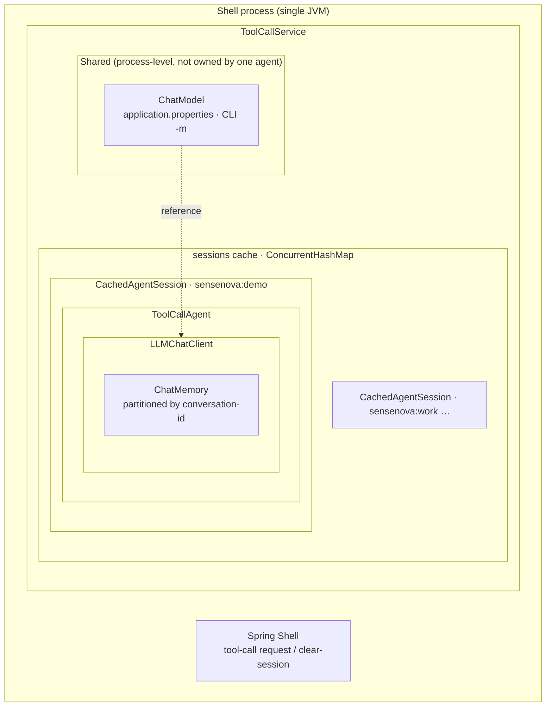
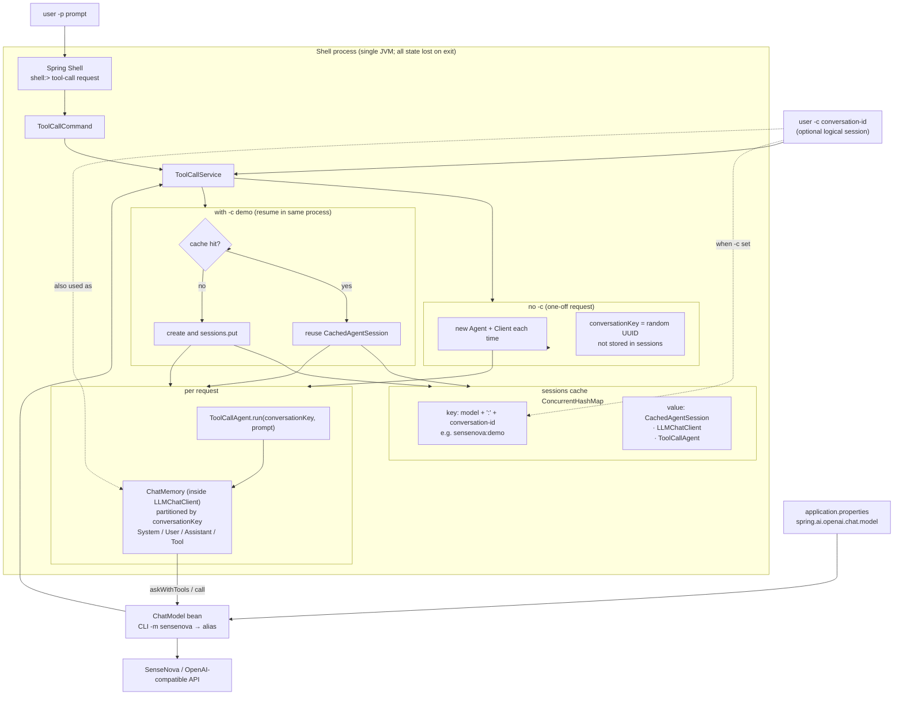

# janus-shell Usage

> [中文](SHELL.md) · Agent internals: [core/docs/AGENT-FLOW.en.md](../../core/docs/AGENT-FLOW.en.md) · FAQ: [docs/FAQ.en.md](../../docs/FAQ.en.md)

The `shell` module is Janus’s CLI entry point. After startup you get a `shell:>` prompt and run the ToolCall agent on SenseNova via `tool-call request`.

---

## Component relationships

### Containment

Who **owns** whom (nesting = composition). **LLM Model** is **shared** at process level; each session’s agent **references** the same `ChatModel` through its own `LLMChatClient`, rather than owning a separate model instance.



| Level | Component | Notes |
|-------|-----------|-------|
| Outermost | **Shell process** | One JVM per `spring-boot:run`; all state gone on exit. |
| In-process | **ToolCallService** | Holds shared `ChatModel` map and `sessions` cache. |
| Shared | **LLM model (`ChatModel`)** | Typically one bean per alias; **not** owned by a single agent. |
| Per session | **sessions slot** | Key `model:conversation-id` (`-c`); value `CachedAgentSession`. |
| In slot | **ToolCallAgent** | Runs think/act; **owns** `LLMChatClient` (`BaseAgent.chatClient`). |
| In agent | **LLMChatClient** | API calls + memory; **owns** `ChatMemory`. |
| In client | **Memory** | Multi-turn System / User / Assistant / Tool messages. |

Without `-c`, the Agent → LLMChatClient → Memory stack is still created per request but **not** stored in `sessions`; `conversation-id` is only the memory partition key.

### Request and cache behavior

Call flow for one `tool-call request` (not containment):



| Term | Meaning |
|------|---------|
| **Shell** | Spring Boot + Spring Shell CLI; one `shell:>` = one JVM. |
| **LLM model** | Injected `ChatModel` (e.g. SenseNova); CLI `-m` is an alias mapped to a bean. |
| **conversation-id (`-c`)** | User-chosen **logical session id**; same id + same `-m` reuses one agent and memory in-process. |
| **conversationKey** | String passed to `agent.run`; equals conversation-id when `-c` is set, else a random UUID for that request only. |
| **Cache (sessions)** | `ToolCallService` map: `(model, conversation-id) → Agent + LLMChatClient`; `clear-session` removes an entry. |
| **Agent** | `ToolCallAgent`: multi-step think/act with `create_chat_completion` / `terminate` tools. |
| **Memory** | `ChatMemory` inside `LLMChatClient`, keyed by **conversationKey**; retained across requests when `-c` hits the cache. |

Notes:

- **Without `-c`**: new agent per request, random memory key, **not** in `sessions`.
- **With `-c`**: cached **agent + memory** on hit; first request creates and stores in `sessions`.
- **Different `-m` or conversation-id** → separate cache slots and memory.
- Everything is **in-process only**; no disk persistence after shell exit.

---

## Requirements

- **JDK 21**
- **Maven 3.6.3+**
- API key and model in `shell/src/main/resources/application.properties`

---

## Start

Run from the **Janus root**. If you changed `core`, install it before starting:

```bash
mvn -pl core install -DskipTests
mvn -f shell/pom.xml spring-boot:run
```

### Linux / macOS (bash / zsh)

```bash
cd /path/to/Janus

export JAVA_HOME=/path/to/jdk-21
export PATH="$JAVA_HOME/bin:$PATH"

mvn -pl core install -DskipTests
mvn -f shell/pom.xml spring-boot:run
```

### Windows (PowerShell)

```powershell
cd C:\path\to\Janus

$env:JAVA_HOME = "C:\path\to\jdk-21"
$env:PATH = "$env:JAVA_HOME\bin;$env:PATH"

mvn -pl core install -DskipTests
mvn -f shell/pom.xml spring-boot:run
```

### Windows (CMD)

```cmd
cd C:\path\to\Janus

set JAVA_HOME=C:\path\to\jdk-21
set PATH=%JAVA_HOME%\bin;%PATH%

mvn -pl core install -DskipTests
mvn -f shell/pom.xml spring-boot:run
```

When you see `shell:>`, the app is ready.

---

## Commands

### tool-call request

```text
tool-call request --prompt "<task>" [--model sensenova] [--conversation-id <id>]
```

| Option | Short | Required | Default | Description |
|--------|-------|----------|---------|-------------|
| `--prompt` | `-p` | yes | — | User message to the agent |
| `--model` | `-m` | no | `sensenova` | CLI model alias (maps to configured ChatModel) |
| `--conversation-id` | `-c` | no | — | Reuse in-process memory across requests in the same shell session |

Examples:

```text
shell:> tool-call request -p "hello"
shell:> tool-call request --prompt "Describe Janus in one sentence" -m sensenova
shell:> tool-call request -p "Tell me about China" -c demo
shell:> tool-call request -p "What did I ask just now" -c demo
```

With `-c`, the first line of output echoes `conversation-id: ...`. Memory lasts only for the **current shell process** (lost after exit).

Clear cached session:

```text
shell:> tool-call clear-session -c demo
```

Output is multi-line text such as `Step 1: ...`, `Step 2: ...` (per-step agent output).

### Other shell commands

```text
shell:> help
shell:> help tool-call
shell:> clear
shell:> exit
```

---

## Non-interactive (scripts / CI)

**Linux / macOS**

```bash
mvn -f shell/pom.xml spring-boot:run \
  -Dspring-boot.run.arguments="tool-call request --prompt hello --spring.shell.interactive.enabled=false"
```

**Windows (PowerShell)**

```powershell
mvn -f shell/pom.xml spring-boot:run `
  "-Dspring-boot.run.arguments=tool-call request --prompt hello --spring.shell.interactive.enabled=false"
```

**Windows (CMD)**

```cmd
mvn -f shell/pom.xml spring-boot:run -Dspring-boot.run.arguments="tool-call request --prompt hello --spring.shell.interactive.enabled=false"
```

---

## Configuration

File: `shell/src/main/resources/application.properties`

| Property | Description |
|----------|-------------|
| `spring.ai.openai.api-key` | SenseNova API key |
| `spring.ai.openai.base-url` | Usually `https://token.sensenova.cn/v1` |
| `spring.ai.openai.chat.model` | Model id, e.g. `sensenova-6.7-flash-lite` |
| `janus.agent.max-steps` | Max steps per run (default 30) |
| `spring.shell.interactive.enabled` | `true` for interactive `shell:>` |

Use `spring.ai.openai.chat.model` on Spring AI 2.x; avoid deprecated `chat.options.model`.

Do not commit real API keys; use `application-local.properties` if gitignored.

---

## API check (optional)

Without starting shell:

```bash
cd model-verify
python3 sensenova-6.7-flash-lite.py
python3 sensenova-6.7-flash-lite.py --prompt "hello"
```

(On Windows, use `python` if `python3` is not available.)

---

## Troubleshooting

| Symptom | What to try |
|---------|-------------|
| `engine is not available temporarily` | Often transient API/model; compare with `model-verify`; check `chat.model` |
| core changes not reflected | `mvn -pl core install -DskipTests`, restart shell |
| Wrong/missing Java | JDK 21 + `JAVA_HOME` |
| Repeated greetings, no stop | Model did not call `terminate`; see [core docs](../../core/docs/AGENT-FLOW.en.md) |
