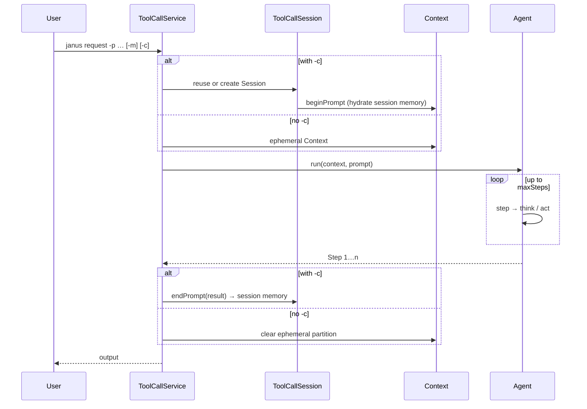

# janus-shell usage

> [中文](SHELL.md) · Framework: [core/docs/AGENT-FLOW.en.md](../../core/docs/AGENT-FLOW.en.md) · FAQ: [docs/FAQ.en.md](../../docs/FAQ.en.md)

**shell** is the Janus CLI. After startup you get `shell:>` and invoke agents by command group.

---

## Setup and start

**Requirements**: JDK 21, Maven 3.6.3+, configured model API (see configuration below).

Start from the **repository root** so `workspace/*` resolves under the project root, not `shell/workspace/*`:

```bash
cd /path/to/Janus
mvn -pl core install -DskipTests
mvn -f shell/pom.xml spring-boot:run
```

---

## Commands

Shared shape for every group:

```text
<group> request -p "<task>" [-m sensenova] [-c <conversation-id>]
<group> clear-session -c <conversation-id> [-m sensenova]
<group> list-models
```

| Group | Purpose | Default workspace |
|-------|---------|-------------------|
| `tool-call` | Minimal tools (answer + terminate) | — |
| `janus` | General assistant | `workspace/janus` |
| `da` | Data analysis and charts | `workspace/da` |
| `swe` | Terminal + file editing | `workspace/swe` |

| Option | Short | Description |
|--------|-------|-------------|
| `--prompt` | `-p` | Task text (required) |
| `--model` | `-m` | Model alias, default `sensenova` |
| `--conversation-id` | `-c` | Reuse **Session** in this process; omit for one-off (no session memory) |

With `-c`, the first output line echoes `conversation-id`. Session is lost after shell exit. Each `request` gets its own **Context**; after `run`, a 2-message summary is stored in session memory. See [AGENT-FLOW.en.md](../../core/docs/AGENT-FLOW.en.md).

---

## What one `request` does

Shell does not implement agent logic; `ToolCallService` manages Session / Context and `agent.run`:



| Point | Notes |
|-------|--------|
| Same `-m`, multiple `-c` | One agent instance; **Session** per `-c` |
| Each `request` | New **Context** partition; summarized then cleared after `run` |
| `swe` + `-c` | One **bash** session per `-c` (scope = sessionId) |
| Inside the agent | [AGENT-FLOW.en.md](../../core/docs/AGENT-FLOW.en.md) |

### Memory and multi-step optimizations (CLI)

With `-c`, session memory stores **two messages per prompt** (original `-p` + summarized outcome), not per-step internal guidance.

| Situation | What to do |
|-----------|------------|
| First continuation after upgrading core | `clear-session -c <id>` to drop stale session partitions |
| One-off question | Omit `-c` (ephemeral: no session extract, context cleared after `run`) |
| Many steps, only `terminate` text visible | Agent should finalize via `create_chat_completion` or main tools — see [AGENT-FLOW.en.md](../../core/docs/AGENT-FLOW.en.md) |
| Next prompt misreads “continue” as a new task | Often old session data; `clear-session` and retry |
| `swe` cwd/env across prompts | Reuse same `-c`; use a new `-c` for unrelated work |

`ToolCallService` wires each agent’s `sessionSummarySystemPrompt()` and `ChatModel` when creating `ToolCallSession`.

---

## Example: janus

```text
shell:> janus request -p "Describe Janus in one sentence" -m sensenova
shell:> janus request -p "Add three more bullet points" -m sensenova -c demo
shell:> janus clear-session -c demo
```

---

## Example: da (data analysis)

1. Put CSV files under `workspace/da/`.
2. One-time chart deps:

```bash
cd core/chart-visualization && npm install
```

3. In shell:

```text
shell:> da request -p "Analyze workspace/da/sales.csv, summarize stats, generate html charts if useful, write a short conclusion." -m sensenova -c sales-1
```

Typical tools: `python_execute` → `visualization_preparation` → `data_visualization` → `terminate`. Charts go under `workspace/da/visualization/`.

---

## Example: swe

```text
shell:> swe request -p "List workspace layout and suggest how to run shell tests" -m sensenova -c swe-1
```

Uses `bash` and `str_replace_editor`; the same `-c` keeps one bash session per conversation.

---

## Example: tool-call

```text
shell:> tool-call request -p "hello" -m sensenova
```

---

## Non-interactive

```bash
mvn -f shell/pom.xml spring-boot:run \
  -Dspring-boot.run.arguments="da request --prompt 'Analyze workspace/da/data.csv' --spring.shell.interactive.enabled=false"
```

---

## Configuration

File: `shell/src/main/resources/application.properties`

| Property | Description |
|----------|-------------|
| `spring.ai.openai.api-key` | API key |
| `spring.ai.openai.base-url` | e.g. `https://token.sensenova.cn/v1` |
| `spring.ai.openai.chat.model` | Model id |
| `janus.agent.<name>.max-steps` | Max steps per run |
| `janus.agent.<name>.workspace-root` | Workspace for `janus` / `da` / `swe` |

Do not commit real keys; use `application-local.properties` if gitignored.

---

## Troubleshooting

| Symptom | Fix |
|---------|-----|
| Files under `shell/workspace/...` | Start from **repo root**, or set absolute `workspace-root` |
| core changes ignored | `mvn -pl core install -DskipTests`, restart shell |
| `da` chart errors | Run `npm install` in `core/chart-visualization` |
| Many duplicate steps | See [FAQ — memory and multi-step](../../docs/FAQ.en.md#memory-and-multi-step-behavior) |

Also: `help`, `help da`, `clear`, `exit`.
