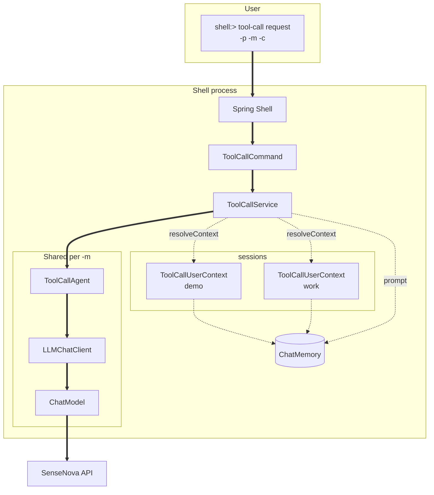
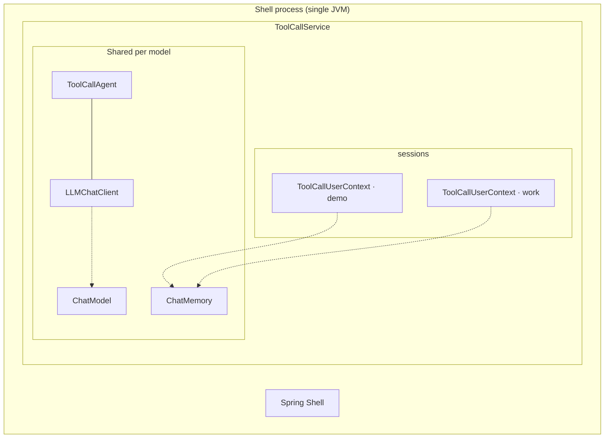
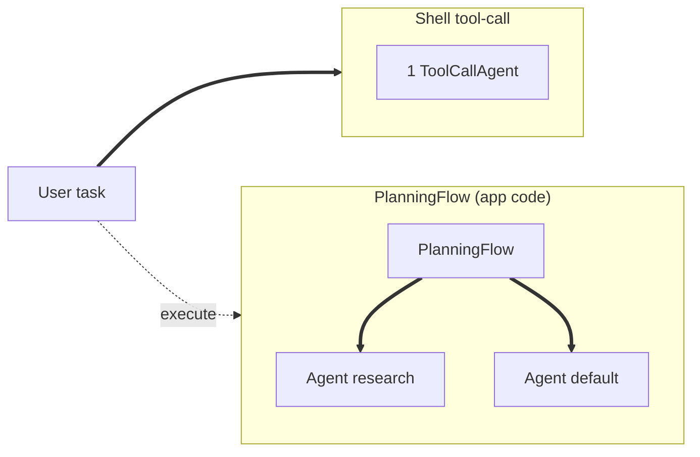
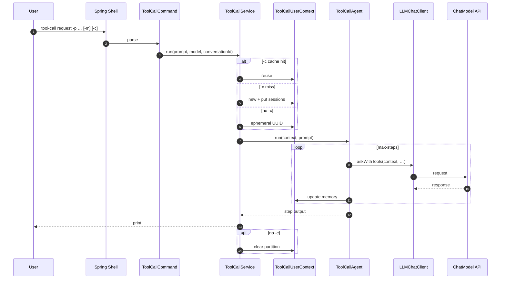
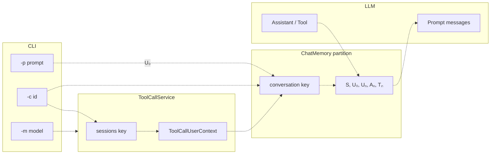
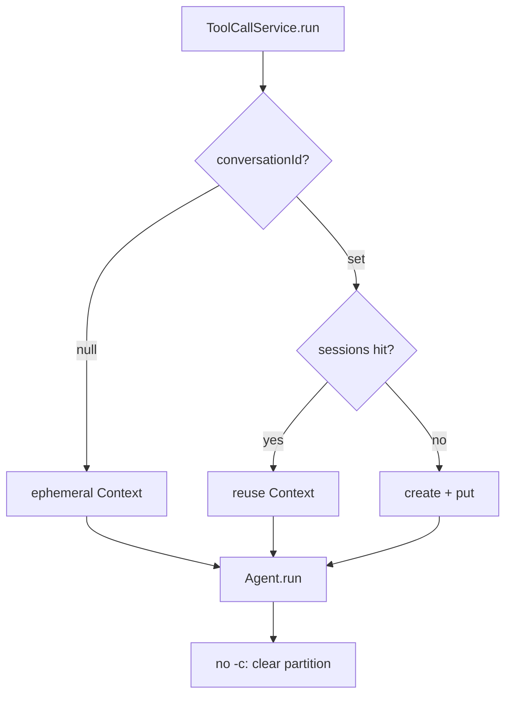

# janus-shell Usage

> [中文](SHELL.md) · Agent internals: [core/docs/AGENT-FLOW.en.md](../../core/docs/AGENT-FLOW.en.md) · FAQ: [docs/FAQ.en.md](../../docs/FAQ.en.md)

The `shell` module is Janus’s CLI entry point. After startup you get a `shell:>` prompt and invoke `ToolCallAgent` via `tool-call request` (SenseNova by default). Each request builds a **UserContext**, then `agent.run(context, prompt)`. Flag `-c` resumes a logical session in the same shell process.

See [core/docs/AGENT-FLOW.en.md](../../core/docs/AGENT-FLOW.en.md) for full agent and message notation.

---

## Terminology

| Term | Definition | In shell |
|------|------------|----------|
| **Agent** | Object that runs `run(context, prompt)`; default `ToolCallAgent`. | One instance per `-m`; shared by all `-c` under that model. |
| **UserContext** | Session carrier for one conversation (partition id, Memory ref, step state). | Usually `ToolCallUserContext`; created by `ToolCallService`. |
| **LLMChatClient** | Stateless accessor for `ChatModel`. | Registered per `-m` with the agent. |
| **ChatModel** | Spring bean for the LLM API. | Selected by `-m` (e.g. `sensenova`). |
| **ChatMemory** | Message store partitioned by `conversation`; holds **S** / **U** / **A** / **T**. | One instance per process; `-c` value = partition key. |
| **conversation-id** | Logical session id (CLI: `-c`). | Equals UserContext.`conversation` and Memory partition. |
| **sessions** | Map `(model, conversation-id) → ToolCallUserContext`. | Context cache only; `clear-session` removes entry and clears partition. |
| **model alias** | CLI `-m`; selects agent/client/model stack. | Default `sensenova`. |
| **prompt** | User text this turn (CLI: `-p`). | Written as **U₀** before the agent loop. |

---

## Notation

Same as [core/docs/AGENT-FLOW.en.md — Notation](../../core/docs/AGENT-FLOW.en.md#notation).

| Symbol | Meaning |
|--------|---------|
| **S** | System message (`SystemMessage`) |
| **U₀** | User message from this `request` (`UserMessage`) |
| **Uₙ** | User message before step `n` think |
| **Aₙ** | Assistant reply at step `n` |
| **Tₙ** | Tool result at step `n` |

CLI output lines `Step 1: …`, `Step 2: …` are per-`step` summaries from `run`; each step may update Memory as **Uₙ → Aₙ → Tₙ**.

---

## Component relationships

### Component topology

**Solid lines**: calls / control. **Dashed lines**: data (prompt, memory partitions, API payload).



### Containment

Nested boxes show ownership (not call order):



| Level | Component | Notes |
|-------|-----------|-------|
| Outermost | **Shell process** | One JVM per `spring-boot:run`; all in-memory sessions vanish on exit (nothing written to disk). |
| In-process | **ToolCallService** | Orchestrates each `request`: resolve `-m` / `-c`, get or create UserContext, call the agent. |
| Shared | **ChatModel** | LLM backend (e.g. SenseNova); `-m` picks the alias mapped to a Spring bean. |
| Shared | **ChatMemory** | One message store for the process; each `-c` thread uses one partition (name = conversation id). |
| Per model | **ToolCallAgent + LLMChatClient** | One executor + client per model alias; many `-c` threads share them. |
| Per session (`-c`) | **sessions slot** | Key `model:conversation-id`, value **`ToolCallUserContext`** for resume. |
| Per run | **`agent.run(context, prompt)`** | User text goes into the context’s partition; agent runs steps; client calls the model. |

**Without `-c`**: a temporary UserContext (random partition) per request; partition cleared after the run; not stored in `sessions`.

### One-to-one correspondence

In the **current shell implementation**:

#### With `-c` (cached in `sessions`)

| A | Relation | B | Notes |
|---|----------|---|-------|
| Shell process | **1 : N** | ToolCallUserContext | Multiple `-c` → multiple context slots. |
| `(model, conversation-id)` | **1 : 1** | ToolCallUserContext | e.g. cache key `sensenova:demo`. |
| conversation-id (`-c`) | **1 : 1** | ChatMemory partition | `context.conversation` equals `-c`. |
| model alias (`-m`) | **1 : 1** | ToolCallAgent | All `-c` under same model **share** one agent. |
| ToolCallAgent | **1 : 1** | LLMChatClient | Bound at registration; no session state. |
| Many conversation-ids | **N : 1** | ChatMemory instance | One memory, many partitions. |
| ChatModel | **N : 1** | Agent / Client | Many contexts share one client per model. |

```text
Shell(1)
 ├── ChatMemory(1) ──partition demo ──► ToolCallUserContext(demo)  ◄── sessions["sensenova:demo"]
 │              └──partition work ──► ToolCallUserContext(work)   ◄── sessions["sensenova:work"]
 └── sensenova ──1:1──► ToolCallAgent + LLMChatClient ──► ChatModel(sensenova)
         └── each request: agent.run(context, prompt)
```

#### Without `-c` (ephemeral)

| A | Relation | B |
|---|----------|---|
| One `request` | **1 : 1** | ephemeral `ToolCallUserContext` (UUID partition) |
| After run | — | `chatMemory.clear(partition)` in `finally` |
| Agent / Client | **N : 1** | reuse registered agent for that model |

#### Terminology notes

| Common misconception | What actually happens |
|----------------------|------------------------|
| “Each `-c` creates a new agent” | Same `-m` **shares** one `ToolCallAgent`; `-c` only changes UserContext and memory partition. |
| “History lives in LLMChatClient” | History is in the **ChatMemory** partition; the client reads it through Context each call. |
| “sessions caches a full agent stack” | sessions stores **UserContext** only; agents are registered once per model. |
| “Changing `-c` changes the model” | `-c` changes the thread; **`-m`** changes the model and agent. |

#### Cardinality summary

| Relation | Description |
|----------|-------------|
| Shell : UserContext | 1 : N (multiple `-c`) |
| `(model, conversation-id)` : UserContext | 1 : 1 |
| model : Agent | 1 : 1 (shared across `-c` under same `-m`) |
| ChatMemory : partitions | 1 : N (one store, many `conversation` keys) |
| Clear resumed thread | `clear-session -c <id>` drops sessions entry and `chatMemory.clear(id)` |

### Flow (planning, core)

Shell does not expose Flow yet. See [AGENT-FLOW.en.md — Flow](../../core/docs/AGENT-FLOW.en.md#flow-multi-agent-orchestration) for **multi-agent topology**, **control flow**, and **data flow** diagrams.



| | Shell `tool-call` | `PlanningFlow` |
|---|-------------------|----------------|
| Entry | `tool-call request` | `PlanningFlow.execute(ctx, input)` |
| Agents | One box per `-m` | **Multiple** boxes in `agents` Map |
| Steps | `max-steps` loop | `Plan` list + `getExecutor` |
| Session / Memory | Single agent, one partition (`-c`) | Per-executor **sub-session partition**; planning uses separate `planningChatMemory` (core doc) |
| Diagrams | [Control flow](#control-flow-tool-call-request) below | [AGENT-FLOW — executor sub-sessions](../../core/docs/AGENT-FLOW.en.md#context-and-executor-sub-sessions-memory) |

### Control flow (tool-call request)



### Data flow (tool-call request)



### Cache branches (-c / sessions)



### Resume and cache

| Scenario | Behavior |
|----------|----------|
| No `-c` | Ephemeral UserContext (random `conversation`); partition cleared after `run`; not in `sessions`. |
| With `-c` | Reuse or create `sessions[model:id]`; same partition accumulates **S/U/A/T**. |
| Change `-m` | Switch ChatModel and agent/client stack. |
| Change `-c` | Switch independent session partition. |
| Exit shell | No disk persistence for `sessions` or ChatMemory. |

---

## Requirements

- **JDK 21**
- **Maven 3.6.3+**
- API key and model in `shell/src/main/resources/application.properties`

---

## Start

Run from the **Janus root**. If you changed `core`, install it before starting:

```bash
mvn -pl core install -DskipTests
mvn -f shell/pom.xml spring-boot:run
```

### Linux / macOS (bash / zsh)

```bash
cd /path/to/Janus

export JAVA_HOME=/path/to/jdk-21
export PATH="$JAVA_HOME/bin:$PATH"

mvn -pl core install -DskipTests
mvn -f shell/pom.xml spring-boot:run
```

### Windows (PowerShell)

```powershell
cd C:\path\to\Janus

$env:JAVA_HOME = "C:\path\to\jdk-21"
$env:PATH = "$env:JAVA_HOME\bin;$env:PATH"

mvn -pl core install -DskipTests
mvn -f shell/pom.xml spring-boot:run
```

### Windows (CMD)

```cmd
cd C:\path\to\Janus

set JAVA_HOME=C:\path\to\jdk-21
set PATH=%JAVA_HOME%\bin;%PATH%

mvn -pl core install -DskipTests
mvn -f shell/pom.xml spring-boot:run
```

When you see `shell:>`, the app is ready.

---

## Commands

### tool-call request

```text
tool-call request --prompt "<task>" [--model sensenova] [--conversation-id <id>]
```

| Option | Short | Required | Default | Description |
|--------|-------|----------|---------|-------------|
| `--prompt` | `-p` | yes | — | User message to the agent |
| `--model` | `-m` | no | `sensenova` | CLI model alias (maps to configured ChatModel) |
| `--conversation-id` | `-c` | no | — | Reuse `ToolCallUserContext` and ChatMemory partition in-process; omit for ephemeral context |

Examples:

```text
shell:> tool-call request -p "hello"
shell:> tool-call request --prompt "Describe Janus in one sentence" -m sensenova
shell:> tool-call request -p "Tell me about China" -c demo
shell:> tool-call request -p "What did I ask just now" -c demo
```

With `-c`, the first line of output echoes `conversation-id: ...`. Memory lasts only for the **current shell process** (lost after exit).

Clear cached session:

```text
shell:> tool-call clear-session -c demo
```

Output is multi-line text such as `Step 1: ...`, `Step 2: ...` (per-step agent output).

### Other shell commands

```text
shell:> help
shell:> help tool-call
shell:> clear
shell:> exit
```

---

## Non-interactive (scripts / CI)

**Linux / macOS**

```bash
mvn -f shell/pom.xml spring-boot:run \
  -Dspring-boot.run.arguments="tool-call request --prompt hello --spring.shell.interactive.enabled=false"
```

**Windows (PowerShell)**

```powershell
mvn -f shell/pom.xml spring-boot:run `
  "-Dspring-boot.run.arguments=tool-call request --prompt hello --spring.shell.interactive.enabled=false"
```

**Windows (CMD)**

```cmd
mvn -f shell/pom.xml spring-boot:run -Dspring-boot.run.arguments="tool-call request --prompt hello --spring.shell.interactive.enabled=false"
```

---

## Configuration

File: `shell/src/main/resources/application.properties`

| Property | Description |
|----------|-------------|
| `spring.ai.openai.api-key` | SenseNova API key |
| `spring.ai.openai.base-url` | Usually `https://token.sensenova.cn/v1` |
| `spring.ai.openai.chat.model` | Model id, e.g. `sensenova-6.7-flash-lite` |
| `janus.agent.max-steps` | Max steps per run (default 30) |
| `spring.shell.interactive.enabled` | `true` for interactive `shell:>` |

Use `spring.ai.openai.chat.model` on Spring AI 2.x; avoid deprecated `chat.options.model`.

Do not commit real API keys; use `application-local.properties` if gitignored.

---

## API check (optional)

Without starting shell:

```bash
cd model-verify
python3 sensenova-6.7-flash-lite.py
python3 sensenova-6.7-flash-lite.py --prompt "hello"
```

(On Windows, use `python` if `python3` is not available.)

---

## Troubleshooting

| Symptom | What to try |
|---------|-------------|
| `engine is not available temporarily` | Often transient API/model; compare with `model-verify`; check `chat.model` |
| core changes not reflected | `mvn -pl core install -DskipTests`, restart shell |
| Wrong/missing Java | JDK 21 + `JAVA_HOME` |
| Repeated greetings, no stop | Model did not call `terminate`; see [core docs](../../core/docs/AGENT-FLOW.en.md) |
