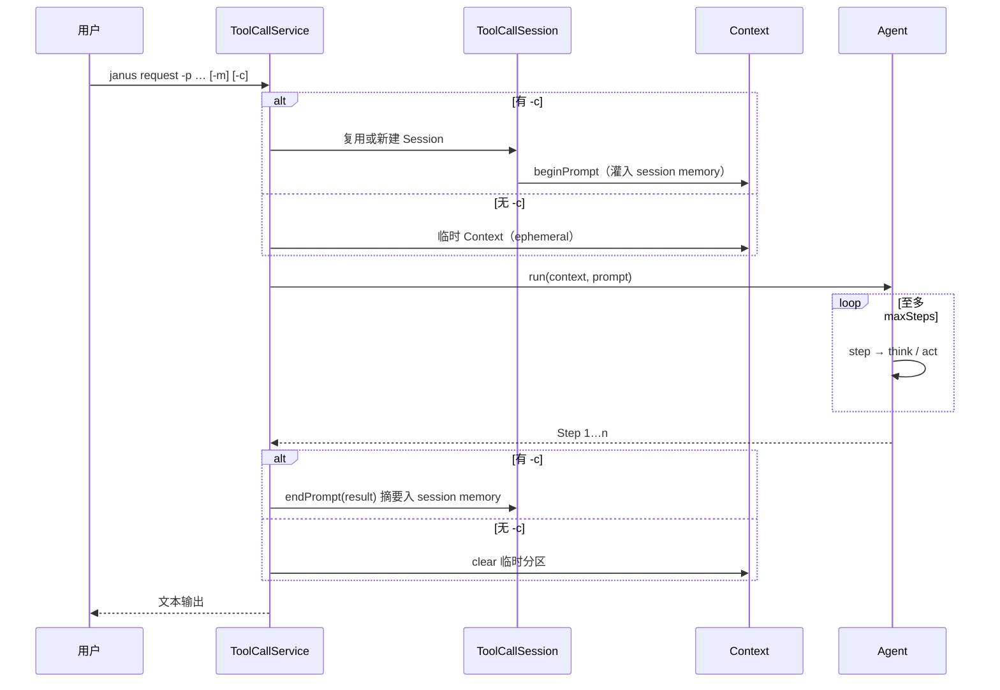

# janus-shell 用法

> [English](SHELL.en.md) · 框架说明：[core/docs/AGENT-FLOW.md](../../core/docs/AGENT-FLOW.md) · 排错：[docs/FAQ.md](../../docs/FAQ.md)

`shell` 是 Janus 的命令行入口。启动后出现 `shell:>`，通过不同命令组调用对应 Agent。

---

## 环境与启动

**要求**：JDK 21、Maven 3.6.3+、已配置模型 API（见下方配置）。

在 **仓库根目录** 启动（保证 `workspace/*` 落在项目根下，而不是 `shell/workspace/*`）：

```bash
cd /path/to/Janus
mvn -pl core install -DskipTests
mvn -f shell/pom.xml spring-boot:run
```

---

## 命令一览

各命令组参数相同：

```text
<group> request -p "<任务>" [-m sensenova] [-c <会话id>]
<group> clear-session -c <会话id> [-m sensenova]
<group> list-models
```

| 命令组 | 说明 | 默认 workspace |
|--------|------|----------------|
| `tool-call` | 最小工具集（作答 + 结束） | — |
| `janus` | 通用助手（规划、Python、文件、人工） | `workspace/janus` |
| `da` | 数据分析与可视化 | `workspace/da` |
| `swe` | 终端 + 文件编辑编程 | `workspace/swe` |

| 参数 | 简写 | 说明 |
|------|------|------|
| `--prompt` | `-p` | 本轮任务（必填） |
| `--model` | `-m` | 模型别名，默认 `sensenova` |
| `--conversation-id` | `-c` | 同进程内续聊（**Session** id）；不传则单次临时请求，不写入 session memory |

带 `-c` 时输出首行会回显 `conversation-id`；退出 Shell 后 Session 不保留。每个 `-c` 下可多次 `request`；每次 `request` 使用独立 **Context**，结束后摘要为 2 条消息写入 session memory。详见 [AGENT-FLOW.md](../../core/docs/AGENT-FLOW.md)。

---

## 一次 `request` 怎么走

Shell 不实现 Agent 逻辑；`ToolCallService` 负责 Session / Context 与 `agent.run`：



| 要点 | 说明 |
|------|------|
| 同 `-m` 多 `-c` | 共用同一 Agent 实例；**Session** 按 `-c` 隔离 |
| 每次 `request` | 新建 **Context** 分区；`run` 结束后摘要进 session，context 分区清空 |
| `swe` + `-c` | 同一 `-c` 共用一条 **bash** 会话（`cd` 等会保留，scope = sessionId） |
| Agent 内部流程 | 见 [AGENT-FLOW.md](../../core/docs/AGENT-FLOW.md) |

### 记忆与多步优化（与 CLI 相关）

框架在带 `-c` 时**不会**把每步内部引导写入 session，只写入「本轮 `-p` 原文 + 摘要结果」两条。Shell 侧只需理解下列用法：

| 场景 | 建议 |
|------|------|
| 首次续聊 / 升级 core 后测试 | 对旧 `-c` 执行 `clear-session -c <id>`，避免优化前写入的脏 session 分区 |
| 单次问答、不需跨 prompt 记忆 | **不要**传 `-c`（`runEphemeral`：不摘要、结束即清 context） |
| 多步只 `terminate`、看不到正文 | 该 Agent 应通过 `create_chat_completion`（或主工具）交付答案；见 [AGENT-FLOW.md](../../core/docs/AGENT-FLOW.md) |
| 第二步把「系统/继续」当新任务 | 多为旧 session 含步内引导；`clear-session` 后重试 |
| `swe` 目录/环境要跨轮保留 | 同一 `-c` 复用 bash；换任务用新 `-c` |

`ToolCallService` 创建 `ToolCallSession` 时注入当前 Agent 的 `sessionSummarySystemPrompt()` 与 `ChatModel`（`janus` / `da` / `swe` 各自摘要结构不同，定义在对应 Agent 类中）。

---

## 案例：通用助手（janus）

```text
shell:> janus request -p "用一句话介绍 Janus 项目" -m sensenova
shell:> janus request -p "继续补充三点特性" -m sensenova -c demo
shell:> janus clear-session -c demo
```

---

## 案例：数据分析（da）

1. 把 CSV 放到 `workspace/da/`（或让 Agent 用 Python 生成测试数据）。
2. 首次出图前安装 chart 依赖（一次性）：

```bash
cd core/chart-visualization && npm install
```

3. 在 Shell 中：

```text
shell:> da request -p "读取 workspace/da/sales.csv，做概览统计；需要时生成图表（html）并写简短结论。" -m sensenova -c sales-1
```

典型工具链：`python_execute` → `visualization_preparation` → `data_visualization` → `terminate`。图表输出在 `workspace/da/visualization/`。

---

## 案例：编程（swe）

```text
shell:> swe request -p "在 workspace 下查看目录结构，并说明如何运行 shell 模块测试" -m sensenova -c swe-1
```

使用 `bash` 与 `str_replace_editor`；同一 `-c` 下共用独立 bash 会话（`cd`、环境变量会保留）。

---

## 案例：最小 tool-call

```text
shell:> tool-call request -p "你好" -m sensenova
```

---

## 非交互运行

```bash
mvn -f shell/pom.xml spring-boot:run \
  -Dspring-boot.run.arguments="da request --prompt '分析 workspace/da/data.csv' --spring.shell.interactive.enabled=false"
```

---

## 配置

文件：`shell/src/main/resources/application.properties`

| 配置项 | 说明 |
|--------|------|
| `spring.ai.openai.api-key` | API Key |
| `spring.ai.openai.base-url` | 如 `https://token.sensenova.cn/v1` |
| `spring.ai.openai.chat.model` | 模型 ID |
| `janus.agent.<name>.max-steps` | 步数上限（`tool-call` / `janus` / `da` / `swe`） |
| `janus.agent.<name>.workspace-root` | 工作目录（`janus` / `da` / `swe`） |

示例：

```properties
janus.agent.da.max-steps=30
janus.agent.da.workspace-root=workspace/da
janus.agent.swe.workspace-root=workspace/swe
```

勿提交真实 Key；可用 `application-local.properties`。

---

## 常见问题

| 现象 | 处理 |
|------|------|
| 文件生成在 `shell/workspace/...` | 从 **Janus 根目录** 启动，或把 `workspace-root` 改为绝对路径 |
| 修改 core 未生效 | `mvn -pl core install -DskipTests` 后重启 shell |
| `da` 出图失败 | 在 `core/chart-visualization` 执行 `npm install` |
| 多步重复、不结束 | 见 [FAQ — 记忆与多步行为](../../docs/FAQ.md#记忆与多步行为) |

其它 Shell 命令：`help`、`help da`、`clear`、`exit`。
