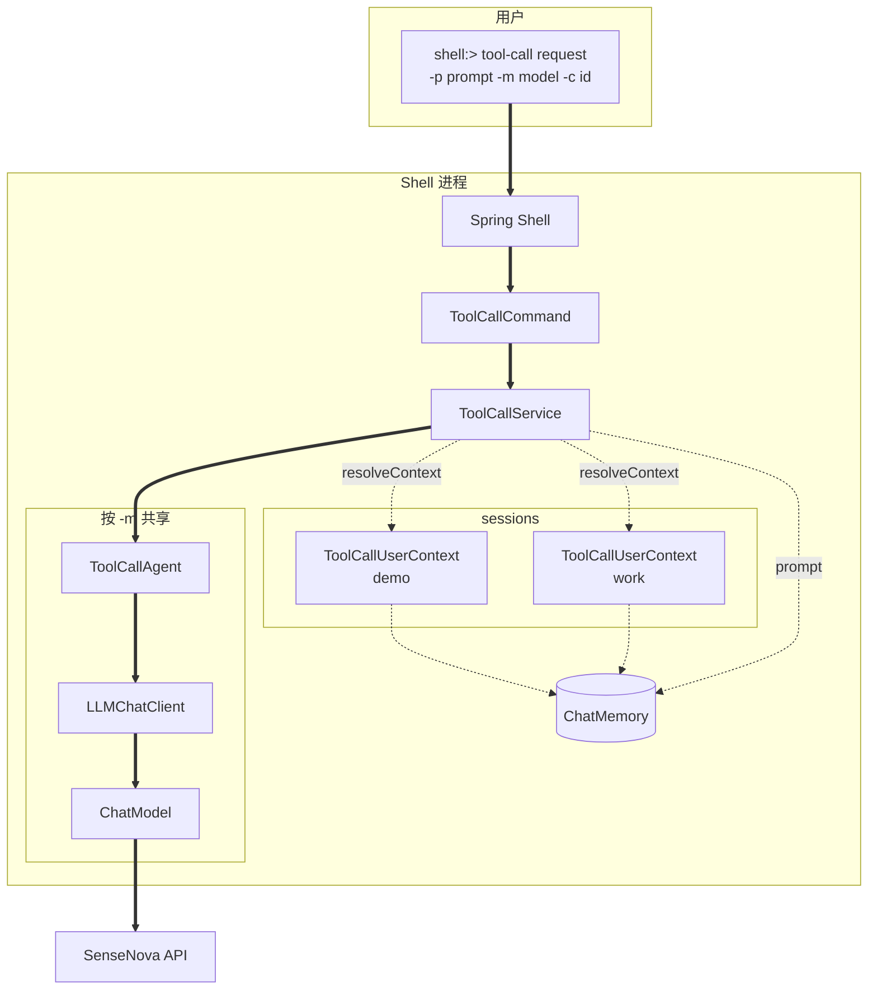
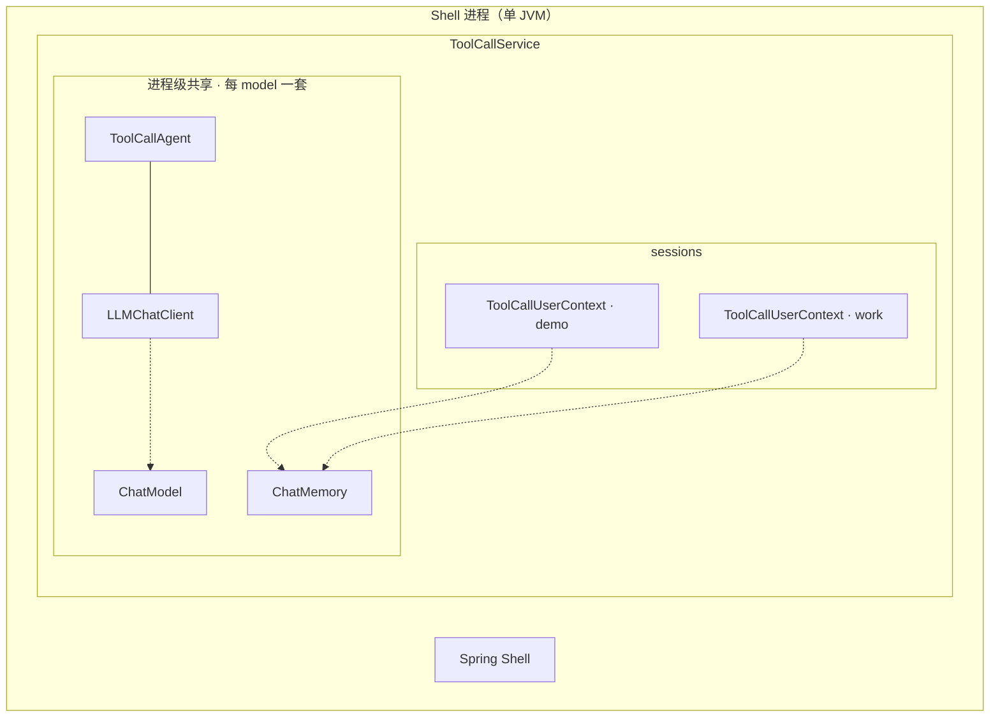
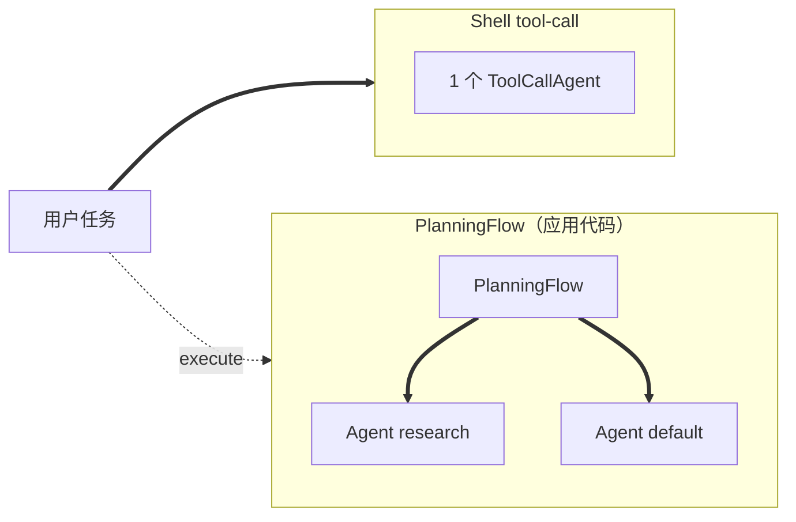
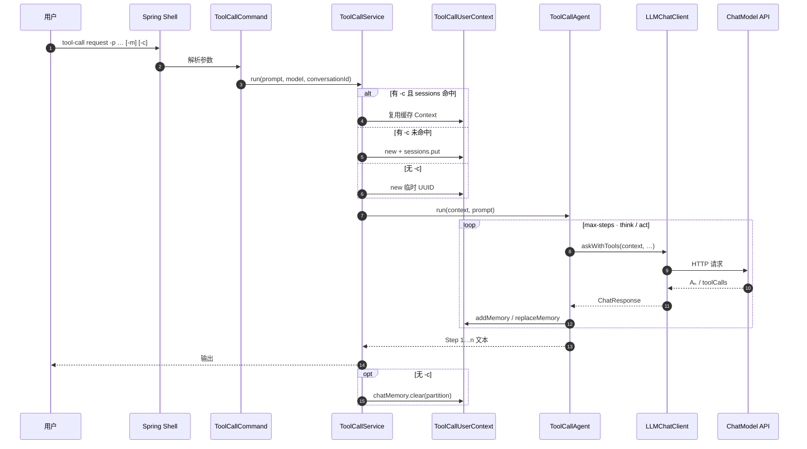
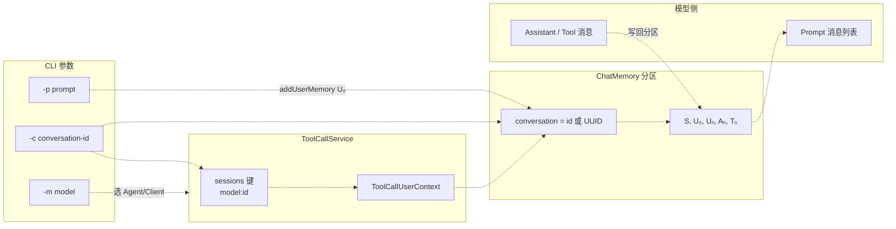
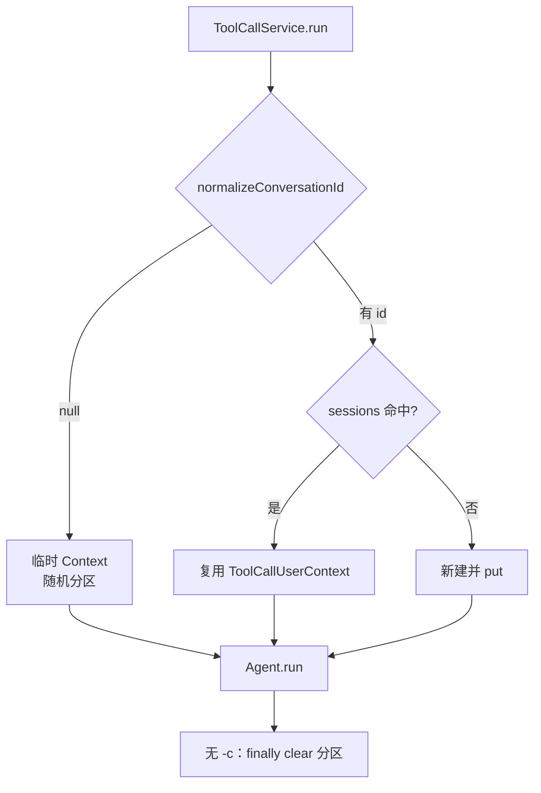

# janus-shell 用法

> [English](SHELL.en.md) · Agent 原理见 [core/docs/AGENT-FLOW.md](../../core/docs/AGENT-FLOW.md) · 常见问题见 [docs/FAQ.md](../../docs/FAQ.md)

`shell` 是 Janus 的命令行入口：启动后进入 `shell:>`，通过 `tool-call request` 调用 `ToolCallAgent`（默认对接 SenseNova）。每次请求由 `ToolCallService` 构造 **UserContext** 后执行 `agent.run(context, prompt)`；参数 `-c` 用于在同一 Shell 进程内续聊。

Agent 与消息符号的完整说明见 [core/docs/AGENT-FLOW.md](../../core/docs/AGENT-FLOW.md)。

---

## 术语

| 术语 | 定义 | Shell 中的体现 |
|------|------|----------------|
| **Agent** | 执行 `run(context, prompt)` 的多步推理对象；本模块默认为 `ToolCallAgent`。 | 每个 `-m` 在进程内注册一个实例，多条 `-c` 共用。 |
| **UserContext** | 单条逻辑对话的会话载体（分区 id、Memory 引用、步状态）。 | 多为 `ToolCallUserContext`；由服务层创建，调用方通常不直接 new。 |
| **LLMChatClient** | 访问 `ChatModel` 的无状态客户端。 | 与 Agent 一并按 `-m` 注册。 |
| **ChatModel** | 大模型 API 的 Spring Bean。 | `-m sensenova` 等别名映射到配置中的模型。 |
| **ChatMemory** | 按 `conversation` 分区保存 **S** / **U** / **A** / **T** 消息。 | 全进程一块；`-c` 的值即分区名。 |
| **conversation-id** | 用户指定的逻辑会话标识（CLI：`-c`）。 | 等于 UserContext.`conversation` 与 Memory 分区 key。 |
| **sessions** | `(model, conversation-id) → ToolCallUserContext` 的进程内 Map。 | 仅缓存 UserContext；`clear-session` 删除条目并清空分区。 |
| **model 别名** | CLI 参数 `-m`，选择使用哪一套 Agent/Client/ChatModel。 | 默认 `sensenova`。 |
| **prompt** | 本轮用户输入（CLI：`-p` / `--prompt`）。 | 写入 **U₀** 后进入 Agent 循环。 |

---

## 符号

与 [core/docs/AGENT-FLOW.md — 符号](../../core/docs/AGENT-FLOW.md#符号) 一致，用于阅读 Agent 文档与多步输出。

| 符号 | 含义 |
|------|------|
| **S** | 系统消息（`SystemMessage`） |
| **U₀** | 本轮 `request` 对应的用户消息（`UserMessage`） |
| **Uₙ** | 第 n 步 think 前追加的用户侧消息 |
| **Aₙ** | 第 n 步模型助手回复（`AssistantMessage`） |
| **Tₙ** | 第 n 步工具执行结果（`ToolResponseMessage`） |

命令行返回的 `Step 1: …`、`Step 2: …` 对应 Agent `run` 循环中各 `step` 的汇总输出，每一步内部可包含 **Uₙ → Aₙ → Tₙ** 的 Memory 更新。

---

## 组件关系

### 组件拓扑

**实线**：调用/命令；**虚线**：数据（prompt、消息分区、API 载荷）。



### 包含关系

嵌套表示进程内的归属（非调用顺序）：



说明：

| 层级 | 组件 | 说明 |
|------|------|------|
| 最外层 | **Shell 进程** | 一次 `spring-boot:run` 即一个 JVM；退出后内存中的会话与缓存全部消失（未写入磁盘）。 |
| 进程内 | **ToolCallService** | 协调一次 `request`：解析 `-m` / `-c`，取得或创建 UserContext，再调用 Agent。 |
| 共享 | **ChatModel** | 大模型接入（如 SenseNova）；由 `-m` 选择别名，对应 Spring 容器里的一个 Bean。 |
| 共享 | **ChatMemory** | 全进程一块消息仓库；每条 `-c` 会话占用其中一个分区（分区名即 conversation id）。 |
| 按 model | **ToolCallAgent + LLMChatClient** | 每个模型别名注册一套执行器 + 客户端；多条 `-c` 会话共用这一套。 |
| 按会话（`-c`） | **sessions 槽位** | 键为 `model:conversation-id`，值为该会话的 **`ToolCallUserContext`**，便于下次 `-p` 续聊。 |
| 单次 run | **`agent.run(context, prompt)`** | 本轮用户话写入 Context 对应分区，Agent 多步执行；模型调用经 LLMChatClient 完成。 |

**不带 `-c`**：每次请求临时创建一个 UserContext（随机分区名），跑完后清空该分区，也不会放进 sessions。

### 一一对应关系

在 **Shell 当前实现**下，各组件数量关系如下（「1:1」= 生命周期内固定配对；「N:1」= 多个实例共用一份）。

#### 带 `-c`（续聊，写入 `sessions`）

| A | 关系 | B | 说明 |
|---|------|---|------|
| Shell 进程 | **1 : N** | ToolCallUserContext | 多个 `-c` → 多个 Context 槽位。 |
| `(model, conversation-id)` | **1 : 1** | ToolCallUserContext | 缓存键如 `sensenova:demo`。 |
| conversation-id（`-c`） | **1 : 1** | ChatMemory 分区名 | `context.conversation` 等于 `-c`，消息存在该 key 下。 |
| model 别名（`-m`） | **1 : 1** | ToolCallAgent | 同 model 下所有 `-c` **共用**同一 Agent 实例。 |
| ToolCallAgent | **1 : 1** | LLMChatClient | 按 model 注册时绑定，无会话状态。 |
| 多个 conversation-id | **N : 1** | ChatMemory 实例 | 一块 Memory，多分区（`demo`、`work`…）。 |
| ChatModel | **N : 1** | Agent / Client | 多 Context 共用同一 model 的 Client。 |

```text
Shell(1)
 ├── ChatMemory(1) ──分区 demo ──► ToolCallUserContext(demo)  ◄── sessions["sensenova:demo"]
 │              └──分区 work ──► ToolCallUserContext(work)   ◄── sessions["sensenova:work"]
 └── sensenova ──1:1──► ToolCallAgent + LLMChatClient ──引用──► ChatModel(sensenova)
         │
         └── 每次 request：agent.run(对应 context, prompt)
```

#### 不带 `-c`（一次性）

| A | 关系 | B | 说明 |
|---|------|---|------|
| 单次 `request` | **1 : 1** | 临时 ToolCallUserContext | `UUID` 作 conversation 分区，**不**进 `sessions`。 |
| 单次 `request` 结束 | — | `chatMemory.clear(分区)` | finally 中清掉该分区，不留历史。 |
| Agent / Client | **N : 1** | 仍用该 model 已注册的 Agent。 |

#### 术语辨析

| 常见误解 | 实际情况 |
|----------|----------|
| 「每个 `-c` 会新建一个 Agent」 | 同 `-m` 下多个 `-c` **共用**一个 `ToolCallAgent`；区别在各自的 UserContext 与 ChatMemory 分区。 |
| 「历史存在 LLMChatClient 里」 | 历史在 **ChatMemory** 的对应分区；Client 每次从 Context 取出消息再请求模型。 |
| 「sessions 里缓存了整套 Agent」 | sessions 只保存 **UserContext**（对话工作区），Agent 始终在进程级按 model 注册一份。 |
| 「换 `-c` 就要换模型」 | `-c` 只换会话；`-m` 才换模型与 Agent。 |

#### 数量关系摘要

| 关系 | 说明 |
|------|------|
| Shell : UserContext | 1 : N（多个 `-c`） |
| `(model, conversation-id)` : UserContext | 1 : 1 |
| model : Agent | 1 : 1（同 `-m` 下各 `-c` 共用） |
| ChatMemory : 会话分区 | 1 : N（一块 Memory，多个 `conversation` key） |
| 清除续聊 | `clear-session -c <id>` 移除 sessions 条目并 `chatMemory.clear(id)` |

### Flow（规划编排，core 层）

Shell 当前**未**接入 Flow；多 Agent 规划见 [core/docs/AGENT-FLOW.md — Flow](../../core/docs/AGENT-FLOW.md#flow多-agent-编排)（含**多 Agent 方块拓扑**、**命令流**、**数据流**图）。



| 对比 | Shell `tool-call` | `PlanningFlow` |
|------|-------------------|----------------|
| 入口 | `tool-call request` | `PlanningFlow.execute(ctx, input)` |
| Agent 数量 | 每 `-m` 一个方块 | `agents` Map 中**多个** Agent 方块 |
| 步骤来源 | Agent 内 `max-steps` | `Plan` 步骤列表 + `getExecutor` 分发 |
| 会话 / Memory | 单 Agent 单分区（`-c`） | 每 executor **独立子会话分区**；规划阶段另用 `planningChatMemory`（见 core 文档） |
| 命令/数据图 | 见上文 [命令流](#命令流tool-call-request) | 见 [AGENT-FLOW — 子 Agent 会话](../../core/docs/AGENT-FLOW.md#context-与子-agent-会话memory) |

### 命令流（tool-call request）



### 数据流（tool-call request）



### 缓存分支（-c 与 sessions）



### 续聊与缓存

| 场景 | 行为 |
|------|------|
| 无 `-c` | 临时 UserContext（随机 `conversation`）；`run` 结束后清空该 Memory 分区；不写入 `sessions`。 |
| 有 `-c` | 复用或创建 `sessions[model:id]` 中的 UserContext；同一分区累积 **S/U/A/T**。 |
| 更换 `-m` | 切换 ChatModel 与 Agent/Client 实例。 |
| 更换 `-c` | 切换独立会话分区（同一 `-m` 下可并存多个 id）。 |
| 退出 Shell | `sessions` 与 ChatMemory 内容均不持久化到磁盘。 |

---

## 环境

- **JDK 21**
- **Maven 3.6.3+**
- 在 `shell/src/main/resources/application.properties` 中配置 API Key 与模型

---

## 启动

在 **Janus 根目录** 执行。若修改过 `core`，先安装再启动：

```bash
mvn -pl core install -DskipTests
mvn -f shell/pom.xml spring-boot:run
```

### Linux / macOS（bash / zsh）

```bash
cd /path/to/Janus

export JAVA_HOME=/path/to/jdk-21
export PATH="$JAVA_HOME/bin:$PATH"

mvn -pl core install -DskipTests
mvn -f shell/pom.xml spring-boot:run
```

### Windows（PowerShell）

```powershell
cd C:\path\to\Janus

$env:JAVA_HOME = "C:\path\to\jdk-21"
$env:PATH = "$env:JAVA_HOME\bin;$env:PATH"

mvn -pl core install -DskipTests
mvn -f shell/pom.xml spring-boot:run
```

### Windows（CMD）

```cmd
cd C:\path\to\Janus

set JAVA_HOME=C:\path\to\jdk-21
set PATH=%JAVA_HOME%\bin;%PATH%

mvn -pl core install -DskipTests
mvn -f shell/pom.xml spring-boot:run
```

看到 `shell:>` 即表示就绪。

---

## 命令

### tool-call request

```text
tool-call request --prompt "<用户任务>" [--model sensenova] [--conversation-id <id>]
```

| 参数 | 简写 | 必填 | 默认 | 说明 |
|------|------|------|------|------|
| `--prompt` | `-p` | 是 | — | 发给 agent 的内容 |
| `--model` | `-m` | 否 | `sensenova` | CLI 模型别名（当前对应 Spring 配置的 ChatModel） |
| `--conversation-id` | `-c` | 否 | — | 同进程内复用 `ToolCallUserContext` 与 ChatMemory 分区；不传则每次临时 Context |

示例：

```text
shell:> tool-call request -p "你好"
shell:> tool-call request --prompt "用一句话介绍 Janus" -m sensenova
shell:> tool-call request -p "Tell me about China" -c demo
shell:> tool-call request -p "我刚才问了什么" -c demo
```

带 `-c` 时输出首行会回显 `conversation-id: ...`，便于确认会话 id。memory 仅在**当前 JVM / shell 进程**内有效，退出 shell 后丢失。

清除缓存：

```text
shell:> tool-call clear-session -c demo
```

返回为多行文本，形如 `Step 1: ...`、`Step 2: ...`（每步 agent 的输出）。

### 其它 Shell 命令

```text
shell:> help
shell:> help tool-call
shell:> clear
shell:> exit
```

---

## 非交互运行（脚本/CI）

**Linux / macOS**

```bash
mvn -f shell/pom.xml spring-boot:run \
  -Dspring-boot.run.arguments="tool-call request --prompt 你好 --spring.shell.interactive.enabled=false"
```

**Windows（PowerShell）**

```powershell
mvn -f shell/pom.xml spring-boot:run `
  "-Dspring-boot.run.arguments=tool-call request --prompt 你好 --spring.shell.interactive.enabled=false"
```

**Windows（CMD）**

```cmd
mvn -f shell/pom.xml spring-boot:run -Dspring-boot.run.arguments="tool-call request --prompt 你好 --spring.shell.interactive.enabled=false"
```

---

## 配置说明

文件：`shell/src/main/resources/application.properties`

| 配置项 | 说明 |
|--------|------|
| `spring.ai.openai.api-key` | SenseNova API Key |
| `spring.ai.openai.base-url` | 一般为 `https://token.sensenova.cn/v1` |
| `spring.ai.openai.chat.model` | 实际模型 ID，如 `sensenova-6.7-flash-lite` |
| `janus.agent.max-steps` | 单轮最多执行步数（默认 30） |
| `spring.shell.interactive.enabled` | `true` 保持交互式 `shell:>` |

注意：Spring AI 2.x 使用 `spring.ai.openai.chat.model`，不要用已废弃的 `chat.options.model`。

本地勿提交真实 Key；可用 `application-local.properties`（若项目已 gitignore）。

---

## 验证 API（可选）

不启动 shell，可先测模型是否通：

```bash
cd model-verify
python3 sensenova-6.7-flash-lite.py
python3 sensenova-6.7-flash-lite.py --prompt "你好"
```

（Windows 上若无 `python3`，用 `python`。）

---

## 常见问题

| 现象 | 处理 |
|------|------|
| `engine is not available temporarily` | 多为 API/模型临时不可用；可用 `model-verify` 对比；确认 `chat.model` 配置正确 |
| 修改 core 后行为未变 | 执行 `mvn -pl core install -DskipTests` 后重启 shell |
| 找不到 `java` / 版本不对 | 使用 JDK 21 并设置 `JAVA_HOME` |
| 多步重复寒暄、不结束 | 模型未调用 `terminate`；见 [core 文档](../../core/docs/AGENT-FLOW.md) |
