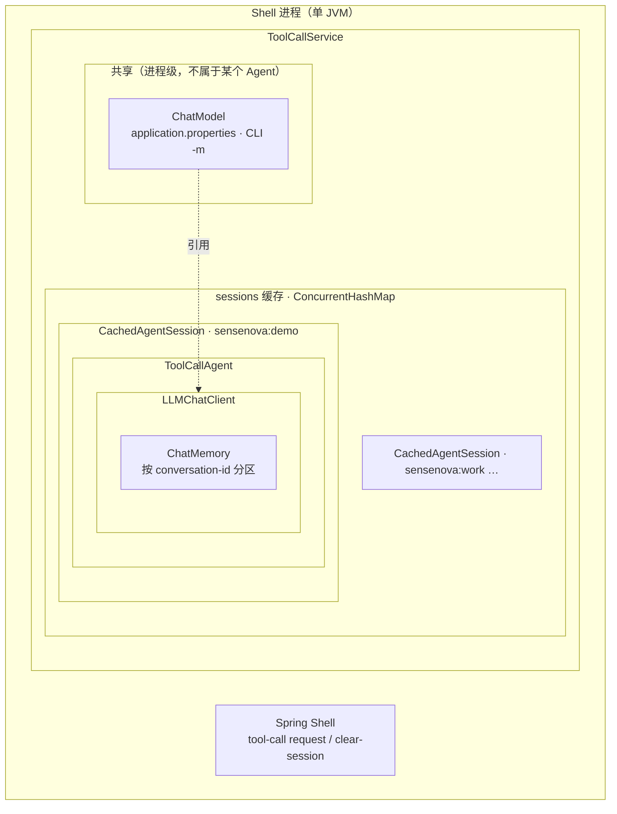
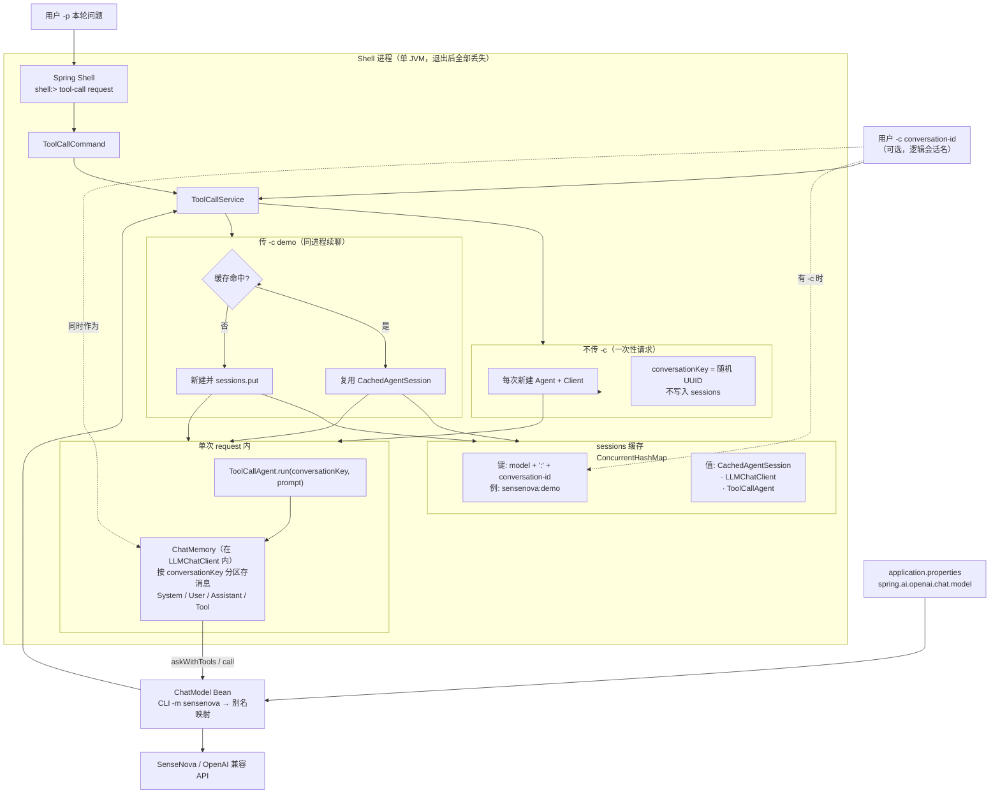

# janus-shell 用法

> [English](SHELL.en.md) · Agent 原理见 [core/docs/AGENT-FLOW.md](../../core/docs/AGENT-FLOW.md) · 常见问题见 [docs/FAQ.md](../../docs/FAQ.md)

`shell` 是 Janus 的命令行入口：启动后进入 `shell:>`，通过 `tool-call request` 调用 SenseNova 上的 ToolCall Agent。

---

## 组件关系

### 包含结构

下图表示**谁装在谁里面**（嵌套 = 拥有/组成）。**LLM Model** 在进程级**共享**，各会话的 Agent 通过各自的 `LLMChatClient` **引用**同一份 `ChatModel`，而不是每个 Agent 各持有一份模型实例。



说明：

| 层级 | 组件 | 说明 |
|------|------|------|
| 最外层 | **Shell 进程** | 一次 `spring-boot:run` 即一个 JVM；退出后其下对象全部销毁。 |
| 进程内 | **ToolCallService** | 管理共享 `ChatModel` 与 `sessions` 缓存。 |
| 共享 | **LLM Model（ChatModel）** | 全进程通常一份（按 `-m` 别名索引）；**不**属于某个 Agent。 |
| 按会话 | **sessions 槽位** | 键 `model:conversation-id`（`-c`）；值为 `CachedAgentSession`。 |
| 槽位内 | **ToolCallAgent** | 执行 think/act；**持有** `LLMChatClient`（`BaseAgent.chatClient`）。 |
| Agent 内 | **LLMChatClient** | 封装调用与记忆；**持有** `ChatMemory`。 |
| Client 内 | **Memory** | 多轮 System / User / Assistant / Tool 消息。 |

无 `-c` 时仍会临时构造「Agent → LLMChatClient → Memory」这一整条，但**不写入** `sessions` 缓存；`conversation-id` 仅作为 `ChatMemory` 的分区键使用。

### 请求与缓存行为

下图说明一次 `tool-call request` 的**调用与复用路径**（非包含关系）。



| 概念 | 含义 |
|------|------|
| **Shell** | Spring Boot + Spring Shell 的 CLI 进程；一个 `shell:>` 对应一个 JVM。 |
| **LLM Model** | Spring 注入的 `ChatModel`（如 SenseNova）；CLI `-m` 是别名，须与 Bean 映射一致。 |
| **conversation-id（`-c`）** | 用户指定的**逻辑会话名**；同进程、同 `-m` 下相同 id 复用同一 Agent 与 Memory。 |
| **conversationKey** | 传入 `agent.run` 的字符串；有 `-c` 时等于 conversation-id，无 `-c` 时为随机 UUID（仅本轮有效）。 |
| **Cache（sessions）** | `ToolCallService` 内 Map：`(model, conversation-id) → Agent + LLMChatClient`；`clear-session` 删除条目。 |
| **Agent** | `ToolCallAgent`：多步 think/act，调工具 `create_chat_completion` / `terminate`。 |
| **Memory** | `LLMChatClient` 内的 `ChatMemory`，按 **conversationKey** 保存多轮消息；续聊时下一轮仍用同一 key。 |

要点：

- **无 `-c`**：每次请求新建 Agent，Memory 用随机 key，**不进入 sessions**，进程内也不保留历史。
- **有 `-c`**：命中缓存则 **Agent + Memory 延续**；首次请求创建并放入 sessions。
- **换 `-m` 或换 conversation-id** 视为不同缓存槽，Memory 互不相通。
- 以上均在 **当前 shell 进程** 内有效；`exit` 后 sessions 与 Memory 一并销毁（未落盘）。

---

## 环境

- **JDK 21**
- **Maven 3.6.3+**
- 在 `shell/src/main/resources/application.properties` 中配置 API Key 与模型

---

## 启动

在 **Janus 根目录** 执行。若修改过 `core`，先安装再启动：

```bash
mvn -pl core install -DskipTests
mvn -f shell/pom.xml spring-boot:run
```

### Linux / macOS（bash / zsh）

```bash
cd /path/to/Janus

export JAVA_HOME=/path/to/jdk-21
export PATH="$JAVA_HOME/bin:$PATH"

mvn -pl core install -DskipTests
mvn -f shell/pom.xml spring-boot:run
```

### Windows（PowerShell）

```powershell
cd C:\path\to\Janus

$env:JAVA_HOME = "C:\path\to\jdk-21"
$env:PATH = "$env:JAVA_HOME\bin;$env:PATH"

mvn -pl core install -DskipTests
mvn -f shell/pom.xml spring-boot:run
```

### Windows（CMD）

```cmd
cd C:\path\to\Janus

set JAVA_HOME=C:\path\to\jdk-21
set PATH=%JAVA_HOME%\bin;%PATH%

mvn -pl core install -DskipTests
mvn -f shell/pom.xml spring-boot:run
```

看到 `shell:>` 即表示就绪。

---

## 命令

### tool-call request

```text
tool-call request --prompt "<用户任务>" [--model sensenova] [--conversation-id <id>]
```

| 参数 | 简写 | 必填 | 默认 | 说明 |
|------|------|------|------|------|
| `--prompt` | `-p` | 是 | — | 发给 agent 的内容 |
| `--model` | `-m` | 否 | `sensenova` | CLI 模型别名（当前对应 Spring 配置的 ChatModel） |
| `--conversation-id` | `-c` | 否 | — | 同一次 shell 进程内复用对话 memory；不传则每次请求独立 |

示例：

```text
shell:> tool-call request -p "你好"
shell:> tool-call request --prompt "用一句话介绍 Janus" -m sensenova
shell:> tool-call request -p "Tell me about China" -c demo
shell:> tool-call request -p "我刚才问了什么" -c demo
```

带 `-c` 时输出首行会回显 `conversation-id: ...`，便于确认会话 id。memory 仅在**当前 JVM / shell 进程**内有效，退出 shell 后丢失。

清除缓存：

```text
shell:> tool-call clear-session -c demo
```

返回为多行文本，形如 `Step 1: ...`、`Step 2: ...`（每步 agent 的输出）。

### 其它 Shell 命令

```text
shell:> help
shell:> help tool-call
shell:> clear
shell:> exit
```

---

## 非交互运行（脚本/CI）

**Linux / macOS**

```bash
mvn -f shell/pom.xml spring-boot:run \
  -Dspring-boot.run.arguments="tool-call request --prompt 你好 --spring.shell.interactive.enabled=false"
```

**Windows（PowerShell）**

```powershell
mvn -f shell/pom.xml spring-boot:run `
  "-Dspring-boot.run.arguments=tool-call request --prompt 你好 --spring.shell.interactive.enabled=false"
```

**Windows（CMD）**

```cmd
mvn -f shell/pom.xml spring-boot:run -Dspring-boot.run.arguments="tool-call request --prompt 你好 --spring.shell.interactive.enabled=false"
```

---

## 配置说明

文件：`shell/src/main/resources/application.properties`

| 配置项 | 说明 |
|--------|------|
| `spring.ai.openai.api-key` | SenseNova API Key |
| `spring.ai.openai.base-url` | 一般为 `https://token.sensenova.cn/v1` |
| `spring.ai.openai.chat.model` | 实际模型 ID，如 `sensenova-6.7-flash-lite` |
| `janus.agent.max-steps` | 单轮最多执行步数（默认 30） |
| `spring.shell.interactive.enabled` | `true` 保持交互式 `shell:>` |

注意：Spring AI 2.x 使用 `spring.ai.openai.chat.model`，不要用已废弃的 `chat.options.model`。

本地勿提交真实 Key；可用 `application-local.properties`（若项目已 gitignore）。

---

## 验证 API（可选）

不启动 shell，可先测模型是否通：

```bash
cd model-verify
python3 sensenova-6.7-flash-lite.py
python3 sensenova-6.7-flash-lite.py --prompt "你好"
```

（Windows 上若无 `python3`，用 `python`。）

---

## 常见问题

| 现象 | 处理 |
|------|------|
| `engine is not available temporarily` | 多为 API/模型临时不可用；可用 `model-verify` 对比；确认 `chat.model` 配置正确 |
| 修改 core 后行为未变 | 执行 `mvn -pl core install -DskipTests` 后重启 shell |
| 找不到 `java` / 版本不对 | 使用 JDK 21 并设置 `JAVA_HOME` |
| 多步重复寒暄、不结束 | 模型未调用 `terminate`；见 [core 文档](../../core/docs/AGENT-FLOW.md) |
